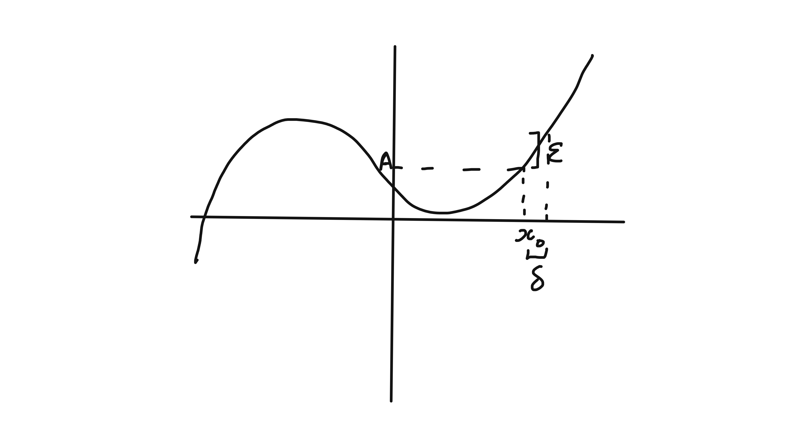

--- 
title: "Differential Equations"
author: ""
date: "`r Sys.Date()`"
site: bookdown::bookdown_site
documentclass: book
# url: your book url like https://bookdown.org/yihui/bookdown
# cover-image: path to the social sharing image like images/cover.jpg
description: |
  Notes
link-citations: yes
---

Anthony Chailinor
24 lecture course

# Introduction Video {-}

Full notes will be provided on moodle, small typefont indicates an aside, either because the material is non examinable or will be covered in greater detail in a later course.

Four example sheets.

## Schedule 

1. Basic Calculus    (5 lectures)
2. First-order linear differential equations (2)
3. Nonlinear first-order differential equations (4)
4. Higher-order linear differential equations (8)
5. Multivariate functions: applications (5)

## Introduction

They describe the rate of change of the [dependant variable]{colour="red"} wrt the [independent variable]{colour="red"}.

:::{.example name="Newton's 2nd law"}
\begin{align*}
  m \frac{d^2 x}{d t^2} = F
\end{align*} 
If $F$ depends only on $t$, then we can simply integrate twice. However, if $F$ is a function of $x$ (such as a charged particle in a electric field which varied over space).
:::

**Applied course** - emphasises [methods]{colour="red"} and [results]{colour="red"} rather than [proof]{colour="red"} or [existence]{colour="red"}.

## Limits

- Informally, if $\lim_{x \to x_0} f(x) = A$, then $f(Px)$ can be made arbitrarily close to $A$ by making $x$ sufficiently close to $x_0$
  - Note, does not require $f(x_0)$ to equal $A$ (or even to exist) -- a limit is a statement about the behaviour of a function in the vicinity of $x_0$, but not at that point.

- More formally, for a function $f(x)$ defined on some open interval containing $x_0$ (but not necessarily at $x_0$), $\lim_{x \to x_0} f(x) = A$ means that
  - for any $\epsilon > 0$, there exists $\delta >0$ such that $|f(x) - A| < \epsilon$ for all $0 < |x - x_0| < \delta$.
  - Right hand limit, for example, defined similarly but with $0 < |x - x_0| < \delta$ replaced with $0 < x - x_0 < \delta$. A similar procedure can be done for left hand Limits
  ```{r 1, echo = FALSE, fig.cap = "Right hand limit", fig.align="center"} 
   
  ```

- We can also define limits at infinity, e.g.  $\lim_{x \to x_0} f(x) = A$ means that
  - for any $\epsilon > 0$, there exists $X >0$ such that $|f(x) - A| < \epsilon$ for all $x > X$.

### Properties
- if $f(x)$ has a limit at a point, it is unique
- If $\lim_{x \to x_0} f(x) = A$ and $\lim_{x \to x_0} g(x) = B$, then:
  - $\lim_{x \to x_0} [f(x) + g(x)] = A + B$  
  - $\lim_{x \to x_0} [f(x)g(x)] = AB$  
  - $\lim_{x \to x_0} [f(x) / g(x)] = A / B$. If $B = 0$, the limit of the quotient does not exist if $A \neq 0$, but [may]{colour="red"} exist in the [indeterminate]{colour="red"} case $A = B = 0$

These properties will be proved carefully in the Analysis 1 course next term, but will be used as without proof in this course.

### Proof of uniqueness of limits
Suppose that $\lim_{x \to x_0} f(x) = A$ [and]{colour="red"} $\lim_{x \to x_0} f(x) = B$.

In terms of our epsilon-delta definition, this means that for any $\epsilon > 0$h there exists $\delta_A > 0$ and $\delta_B > 0$ such that

\begin{align*}
  &\text{for }0 < |x -x_0| < \delta_A,\ |f(x) - A| < \epsilon / 2 \text{, where } \epsilon / 2 \text{ is an arbitrary positive quantity.} \\
  \color{red}{and} &\text{ for } 0 < |x -x_0| < \delta_A, |f(x) - B| < \epsilon / 2
\end{align*} 

Now let $\delta = min(\delta_A, \delta_B)$ and consider $0 < |x -x_0| < \delta$ - follows that
\begin{align*}
  |A - B| &= |[A - f(x)] - [B - f(x)]| \\
  &\leq |A - f(x)| + |B - f(x)| \\
  &\leq \epsilon
\end{align*} 

Since this holds [for all]{colour="red"} $\epsilon > 0$, we must have $A = B$.