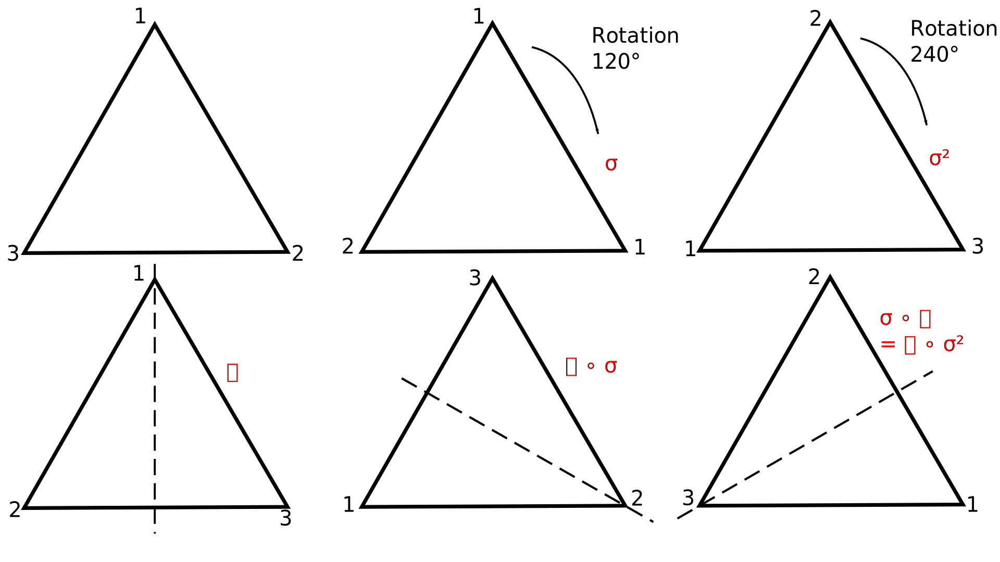

# Lecture 1

## Motivation 

Groups are the abstractions of symmetries, a unified way to investigate symmetries.

## Basic Definitions and Examples

A binary operation, *, on a set $X$ is a way of combining two elements of $X$ to unambiguously give another element of $X$,
i.e. $*: X \times X \to X$.

:::{.definition}
If $G$ is a set and $*$ is a binary operation on $G$ then $(G, *)$ is a *group* if the following four axioms hold:

1. $x, y \in G \implies x * y \in G$ \hfill [(closure)]{style="float:right"}
2. $\exists$ an element $e \in G \text{ satisfying } x * e = x = e * x$ \hfill [(existence of an identity)]{style="float:right"}
3. for every $x \in G$ there is a $y \in G$ s.t. $x * y = e = y * x$ \hfill [(existence of inverses)]{style="float:right"}
4. for every $x, y, z \in G$, $x * (y * z) = (x * y) * z$ \hfill [(the associative law)]{style="float:right"}
:::

:::{.remark} 
$e$ is called the identity of $G$ - see \@ref(lem:one) for why it is unique.
We will show in \@ref(lem:one) that inverses are unique and we will write $x^{-1}$ for the inverse of $x$.
:::

:::{.example}
$(\mathbb{Z}, +)$, $e = 0$, $x^{-1} = -x$
:::

:::{.example}
$(\mathbb{Q}, +)$, $(\mathbb{R}, +)$
::: 

:::{.example}
$(\mathbb{Q} \setminus \{ 0 \}, *)$
:::

**Non Example 1.1** $(\mathbb{Z}, -)$ - associativity fails

**Non Example 1.2** $(\mathbb{Z}, *)$ - no inverses

**Non Example 1.3** $(\mathbb{Q}, *)$ - $0^{-1}$ does not exist
 
These have all had an infinite number of elements, so onto some finite groups.

:::{.example name="The trivial group"}
$(e, *)$
:::

:::{.example}
$(\{\pm 1\}, \times)$. A nice way to look at a group is to look at a multiplication table.

\begin{array}{c|cc}
    \times & 1 & -1 \\
    \hline
    1 & 1 & -1 \\
    -1 & -1 & 1 
\end{array} 

We can see $e = 1$ and $(-1)^{-1} = -1$
::: 

:::{.example}
$(\{0, 1, 2\}, +_3)$. $+_3$ is addition modulo 3.

\begin{array}{c|ccc}
    +_3 & 0 & 1 & 2 \\
    \hline
    0 & 0 & 1 & 2\\
    1 & 1 & 2 & 0 \\
    2 & 2 & 0 & 1
\end{array} 

We can see $e = 0$ and $1^{-1} = 2$
::: 

:::{.example}
$(\{e, a, b, c\}, *)$

\begin{array}{c|cccc}
    * & e & a & b & c \\
    \hline
    e & e & a & b & c \\
    a & a & e & c & b \\
    b & b & c & e & a \\
    c & c & b & a & e
\end{array} 

You may notice in any row no element is repeated, this is due to the cancellation law (bottom of page).
::: 

```

:::{.example #triangle}
Rotations and reflections of an equilateral triangle.

```{r 01-triangle, echo = FALSE, fig.cap = "", fig.align="center"} 
 
```

operation $\circ =$ do right transformation then left transformation

**Claim**: This defines a group with 6 elements
:::


:::{.example} 
\begin{align*}
    M_2(\mathbb{R}) &= \{ 2 \times 2 \text{ matrices with entries in } \mathbb{R} \} \\
    &= \left[ \begin{pmatrix} a & b \\ c & d \end{pmatrix} : a, b, c, d \in \mathbb{R} \right] \\
    \text{under addition} \\
    \begin{pmatrix}
    a & b \\
    c & d
    \end{pmatrix} + 
    \begin{pmatrix}
    \alpha & \beta \\
    \gamma & \delta
    \end{pmatrix} &=
    \begin{pmatrix}
    a + \alpha & b + \beta \\
    c + \gamma & d + \delta
    \end{pmatrix}
\end{align*} 
:::

A more interesting example is

:::{.example #glg}
\begin{align*}
    GL_2 (\mathbb{R}) &= \{ \text{ invertible $2 \times 2$ matrices with entries in } \mathbb{R}. \\
    A &= \begin{pmatrix}
    a & b \\
    c & d
    \end{pmatrix},\ \det A = ad - bc \neq 0  \\
    A^{-1} &= \frac{1}{\det A} \begin{pmatrix}
    d & -b \\
    -c & -a
    \end{pmatrix}
\end{align*}

Under multiplication this is a group. $GL$ stands for general linear group.
:::

::: {.lemma #one}
Let $(G, *)$ be a group. 

i. The identity element is unique.
ii. Inverses are unique.
:::

:::{.proof name="i"}
Suppose $e$ and $\hat{e}$ are both identities, so
\begin{align*}
    a * e = a = e * a,\ \ a * \hat{e} = a = \hat{e} * a \hspace{0.4cm }\forall a \in G \\
\end{align*} 
In particular \begin{align*}
    e = e * \hat{e} = \hat{e}
\end{align*}. 
:::

:::{.proof name="ii"}
Suppose both $y$ and $z$ are inverses for $x$, so 
\begin{align*}
    x * y &= e = y * x,\ \ x * z = e = z * x \\
    \text{Then, } y &= y * e \\
    &= y * (x * z) \\
    &= (y * x) * z \hspace{2cm} \text{(associative law)} \\
    &= e * z \\
    &= z
\end{align*} 
:::

:::{.remark name="i"} 
Associativity means we don't need brackets, $x * y * z$ is unambiguous.
Furthermore, by induction, $x_1 * x_2 * \ldots * x_n$ is unambiguous.

We know the statement is true for the case $n = 3$.

\begin{align*}
    x_1 * (x_2 * \ldots * x_n) &= (x_1 * x_2) * (x_3 * \ldots * x_n) \\
    &= (x_1 * x_2 * x_3) * (x_4 * \ldots * x_n) \\
    &= \ldots \\
    &= (x_1 * x_2 * \ldots * x_{n-1}) * x_n
\end{align*} 
:::

:::{.remark name="ii"} 
We often omit '$*$' and write $x y$ for $x * y$ and $G$ for $(G, *)$.
:::

:::{.remark name="iii"} 
$(xy)^{-1}  = y^{-1} x^{-1}$. Since it works: 
\begin{align*}
    (xy)y^{-1}x^{-1} &= x(y y^{-1})x^{-1} \\
    &= x e x^{-1} \\
    &= x x^{-1} \\
    &= e
\end{align*} 
:::

Note, inverses are unique

:::{.remark name="iv"} 
$(x^{-1})^{-1} = x$
::::

:::{.remark name="v" #one} 
\begin{align*}
    x, y, z \in G &\text{ and } xy = xz \\
    \implies x^{-1} x y &= x^{-1} x z \\
    \implies \hspace{1cm} y &= z \hspace{3cm} \text{(cancellation law)}
\end{align*} 
:::

Lecture 2

::: {.definition}
A group $G$ is *abelian* (or commutative) if $xy = yx$ for all $x, y \in G$.
:::

Note all our examples above are abelian except \@ref(exm:triangle) and \@ref(exm:glg).

::: {.definition}
Let $G$ be a group. If the number of elements in the set $G$ is finite, then $G$ is called a *finite group*. Otherwise, $G$ is called an *infinite group*. If $G$ is a finite group denote the number of elements in the set $G$ by $|G|$ and call this the *order* of $G$.
:::

::: {.definition}
Let $(G, *)$ be a group and $H$ a subset of $G$ ($H \subseteq G$ i.e. $h \in H \implies h \in G$). Then $(H, *)$ is a *subgroup* of $(G, *)$ if $(H, *)$ is a group (with same operation) i.e. if

a) $h, k \in H \implies h * k \in H$
b) $e_G \in H$
c) $h \in H \implies h^{-1} \in H$

(Note associativity is inherited)

i.e restricting operation to $H$ still gives a group. We write $H \leq G$.
:::

::: {.example}
\begin{align*}
    (\mathbb{Z}, +) \leq (\mathbb{Q}, +) \leq (\mathbb{R}, +)
\end{align*} 
:::

::: {.example}
\begin{align*}
    (\{\pm 1\}, \times) \leq (\mathbb{Q} \setminus \{ 0 \}, \times) 
\end{align*} 
:::

::: {.example}
In \@ref(exm:triangle) if we just take the rotations we get a subgroup, $\{ 1, \sigma, \sigma^2 \}$ is a subgroup.
:::

::: {.example}
In \@ref(exm:glg), we can take the matrices with determinant 1 which is $SL_2(\mathbb{R})$ ($SL$ stands for the special linear group).
\begin{align*}
    SL_2(\mathbb{R}) &= \{ A \in GL_2(\mathbb{R}) : \det A = 1 \} \\
    &\leq GL_2(\mathbb{R})
\end{align*} 
:::

We always have identity subgroup and whole thing.

::: {.example}
If $G$ is a group then $\{ e \} \leq G$ is the trivial subgroup.
:::

::: {.example}
If $G$ is a group then $G \leq G$ is the improper subgroup.
:::

::: {.proposition #nZ} 
Subgroups of $\mathbb{Z}$ are exactly $n \mathbb{Z} = {nk : k \in \mathbb{Z}}$ where $n \in \mathbb{Z}_{\geq 0}$ (under addition).
:::

::: {.proof}
First note $n \mathbb{Z}$ is a subgroup of $\mathbb{Z}$.

a. If $a, b \in n \mathbb{Z}$ then $a = na'$ and $b = nb'$ for some $a', b' \in \mathbb{Z}$.
Then $a + b = na' + nb' = n (a' + b') \in n \mathbb{Z}$

b. $0 \in n \mathbb{Z}$.

c. If we have $a = na' \in n \mathbb{Z}$ then $a^{-1} = -a = n(-a') \in n \mathbb{Z}$.

Conversely assume $H \leq \mathbb{Z}$. 

If $H = \{ 0 \} = 0 \mathbb{Z}$.

Otherwise choose $0 < n \in H$ with $n$ minimal (smallest positive element of $H$).
Then $n \mathbb{Z} \in H$ by closure and inverses. We show $H = n \mathbb{Z}$. Suppose $\exists h \in H \setminus n \mathbb{Z}$, then we can write $h = nk + h'$ with $h' \in \{ 1, 2, \ldots, n -1 \}$. But $h' = h - nk \in H$, contradicting minimality of $n$. Thus $H = n \mathbb{Z}$.
:::

*Aside*: We need the notion of functions. 
$f$ is a *function* between sets $A$ and $B$ if it assigns each element of $A$ a unique element of $B$.
\begin{align*}
    f: A &\to B \\
    a &\mapsto f(a)
\end{align*} 
\begin{align*}
    \text{eg: }\ f: \mathbb{Z} &\to \mathbb{Z} & g: \mathbb{Z} &\to \mathbb{Z} \\
    x &\mapsto x + 1 & x &\mapsto 2x.
\end{align*} 

*composition of functions*:
suppose $g: A \to B$ and $f: B \to C$, define $f \circ g: A \to C$ $a \mapsto (f \circ g)(a) = f(g(a))$.

e.g. $(f \circ g)(x) = 2x + 1$ and $(g \circ f)(x) = 2x + 2$.

Suppose $f_1: A \to B$ and $f_2: A \to B$ then $f_1 = f_2$ if $f_1(a) = f_2(a) \; \forall \; a \in A$.

$f: A \to B$ is a *bijection* if it defines a paring between elements of $A$ and elements of $B$. That is given $b \in B \ \exists$ unique $a \in A$ s.t. $f(a) = b$.

\begin{align*}
    \text{eg: }\ f: \mathbb{Z} &\to \mathbb{Z} \\
    x &\mapsto x + 1
\end{align*} 

If we have a bijection we can define 
\begin{align*}
    f^{-1}: B &\to A \\
    b &\mapsto A \text{ where } f(a) = b. \\
    \text{Then } f \circ f^{-1} &= id_B & f^{-1} \circ f &= id_A\\
    id_B(b) &= b
\end{align*}

::: {.lemma}
If $g: A \to B$ and $f: B \to C$ are bijections then so is $f \circ g: A \to C$. 
:::

::: {.proof}
See Numbers and Sets
:::

::: {.definition}
Let $(G, *G)$ and $(H, *_H)$ be groups. Then the function
\begin{align*}
    \theta : G \to H
\end{align*} is a *homomorphism* if
\begin{align*}
    \theta(x *_G y) = \theta(x) *_H \theta(y) \; \forall \; x, y \in G.
\end{align*}
'A map which respects the group operation'.
:::

::: {.example #isomorphism}
$G = (\{ 0, 1, 2, 3 \}, +_4)$, $H = (\{1, e^{\pi i/2}, e^{\pi i}, e^{3\pi i/2}, \times)$ (the 4th roots of unity).

\begin{align*}
    \theta: G &\to H \\
    n &\mapsto e^{n \pi i /2} \\
    \theta(n +_4 m) &= e^{(n +_4 m) \pi i /2} \\
    &= e^{(n +_4 m) \pi i /2} \text{ since $n + m = n +_4 m + 4k$ and $e^{4k \pi i /2} = 1$} \\
    &= e^{n \pi i /2} \times e^{m \pi i /2} \\
    &= \theta(n) \times \theta(m)
\end{align*} 
:::

::: {.lemma}
Let $G$ and $H$ be groups and suppose we have a homomorphism $\theta : G \to H$. Then $\theta(G) = \{ \theta(g) : g \in G\}$, the *image* of $\theta$, is a subgroup of $H$, written $\theta(G) \leq H$.
:::

::: {.proof}
$\theta(G) \subseteq H$ by definition of $\theta$.

*Closure*: Let $x, y \in \theta(G)$. Then $x = \theta(g)$ and $y = \theta(h)$ for some $h, g \in G$.
\begin{align*}
    x *_H y &= \theta(g) *_H \theta(h) \\
    &= \theta(g *_G h) \text{ as } \theta \text{ is a homomorphism} \\
    &= \theta(G).
\end{align*} 

*Identity*:
\begin{align*}
    \theta(e_G) &= \theta(e_G *_G e_G) \\
    &= \theta(e_G) *_H \theta(e_G) \\
    \text{premultiplying by } &\theta(e_G)^{-1} \in H \\
    \boldsymbol{e_H} &\boldsymbol = \boldsymbol{\theta(e_G)} \in \theta{G}
\end{align*} 

*Inverses*:
\begin{align*}
    \text{Let } x &= \theta(g) \in \theta(G) \\
    e_H = \theta(e_G) &= \theta(g *_G g^{-1}) \\
    &= \theta(g) *_H \theta(g^{-1}) \\
    &= x *_H \theta(g^{-1}) \\
    \text{also } \hspace{1cm} &= \theta(g^{-1} *_G g) \\
    &= \theta(g^{-1}) *_H x \\
    \text{Inverses }&\text{are unique} \\
    \implies \boldsymbol{\theta(g)^{-1}} &\boldsymbol{= \theta(g^{-1})} \in \theta(G)
\end{align*} 

Associativity is inherited.
:::

::: {.definition}
A bijective homomorphism is called an isomorphism. If $G$ and $H$ are groups and $\theta : G \to H$ is an isomorphism we say $G$ and $H$ are isomorphic and write $G \cong H$. The bijective part tells us the sets are the same and the homomorphism tells us the group operation is the same so an isomorphism tells us the groups are the "essentially the same".
:::

See Example \@ref(exm:isomorphism)
\begin{align*}
    G = (\{ 0, 1, 2, 3 \}, +_4) &\cong \{1, e^{\pi i/2}, e^{\pi i}, e^{3\pi i/2}, \times) = H \\
    \theta: G &\to H \\
    n &\mapsto e^{n \pi i /2} \\
\end{align*} 
$\theta$ is an isomorphism.

::: {.lemma}
\ i. The composition of two homomorphisms is a homomorphism, similarly for isomorphisms, thus if $G_1 \cong G_2$ and $G_2 \cong G_3$ then $G_1 \cong G_3$.

ii. If $\theta : G_1 \to G_2$ is an isomorphism then so is its inverse $\theta^{1} : G_2 \to G_1$.
So $G_1 \cong G_2 \implies G_2 \cong G_1$.
:::

::: {.proof}
\ 
i. Suppose
\begin{align*}
    \theta_1 : (G_1, *_1) &\to (G_2, *_2) \\
    \theta_2 : (G_2, *_2) &\to (G_3, *_3) \\
\end{align*} 
are isomorphisms.
Thus $\theta_2 \circ \theta_1$ is a function from $G_1$ to $G_3$, we need to check if its a homomorphism.
\begin{align*}
    \text{Let } x, y &\in G_1 && \\
    \theta_2 \circ \theta_1 (x *_1 y) &= \theta_2(\theta_1(x) *_2 \theta_1(y)) & &\text{ since $\theta_1$ is a homomorphism} \\
    &= \theta_2(\theta_1(x)) *_3 \theta_2(\theta_1(y)) & &\text{ since $\theta_2$ is a homomorphism} \\
    &= (\theta_2 \circ \theta_1)(x) *_3 (\theta_2 \circ \theta_1)(y) &&
\end{align*} 

ii. $\theta$ is a bijection so $\theta^{-1}$ exists, we need to show its a homomorphism. 
\begin{align*}
    \text{Let } y, z &\in G_2. \\
    \text{Then } \exists \; x, k &\in G_1, \text{ s.t.} \\
    \theta^{-1}(y) = x,\ &\theta^{-1}(z) = k \\
    \text{Note, } \theta(x *_1 k) &= \theta(x) *_2 \theta(k) \\
    &= y *_2 z \\
    \implies \theta^{-1}(y *_2 z) &= x *_1 k \\
    &= \theta^{-1}(y) *_1 \theta^{-1}(z)
\end{align*} 
:::

Notation: If $x \in (G, *)$, $n \in \mathbb{Z}$.
Then 
\begin{align*}
    x^n &= \begin{cases}
        x * x * \ldots * x & n > 0 \\
        e & n = 0 \\
        x^{-1} * x^{-1} * \ldots * x^{-1} & n < 0 \\
    \end{cases}
\end{align*} 

::: {.definition}
A group $H$ is *cyclic* if $\exists \; h \in H$ such that each element of $H$ is a power of $h$, i.e. for each $x \in H \; \exists m \in \mathbb{Z}$ s.t. $x = h^m$.
Then $h$ is called a *generator* of $H$ and we write $H = \left\langle h \right\rangle$. 
:::

::: {.example}
$(\mathbb{Z}, +) = \left\langle 1 \right\rangle = \left\langle -1 \right\rangle$, the infinite cyclic group.
We showed all subgroups of $(\mathbb{Z}, +)$ are cyclic in \@ref(prp:nZ).
:::

::: {.example}
$(\{ \pm 1 \}, +) = \left\langle -1 \right\rangle$
:::

::: {.example}
$(\{ 0, 1, 2, 3\}, +_4) = \left\langle 1 \right\rangle = \left\langle 3 \right\rangle$
:::

Note a cyclic group is abelian.

::: {.definition}
Let $G$ be a group and $g \in G$. The *order* of $g$, written as $o(g)$, is the least positive integer $n$ such that $g^n = e$, if it exists. Otherwise $g$ has infinite order.
:::

::: {.lemma}
Suppose $G$ is a group, $g \in G$ and $o(g) = m$. Let $n \in \mathbb{N}_{>0}$. Then
\begin{align*}
    g^n = e \iff m \mid n
\end{align*} 
:::

::: {.proof}
($\Longleftarrow$) Suppose $m \mid n$, then $n = qm$ for some $q \in \mathbb{N}$.
\begin{align*}
    \implies g^n = g^{qm} = (g^m)^q = e^q = e
\end{align*} 
($\implies$) Suppose $g^n = e$. Write $n = qm + r$ with $0 \leq r < m$, $q \in \mathbb{N}$.
\begin{align*}
    &\implies & e = g^n &= g^{qm + r} \\
    && &= (g^m)^q + g^r \\
    && &= e^q g^r \\
    && &= e g^r \\
    && &= g^r \\
    &\implies & r &= 0 \text{ by minimality of m} \implies n = qm \text{ as required.} 
\end{align*} 
:::

::: {.remark}
\ 

i. Suppose $g \in G$. Then $\{ g^n : n \in \mathbb{Z} \}$ is a subgroup of $G$, in fact it is the smallest subgroup of $G$ containing $g$.
We call it the subgroup of $G$ generated by $g$ and write $\left\langle g \right\rangle = \{ g^n : n \in \mathbb{Z} \}$. Also $|\left\langle g \right\rangle| = o(g)$ if finite.
Since if $o(g) = m$, $\left\langle g \right\rangle = \{ e, g, g^2, \ldots, g^{n-1} = g^{-1 }\}$.
Otherwise both infinite.

ii. We can define the abstract cyclic group of order $n$
\begin{align*}
    C_n = \left\langle x \right\rangle,\ \text{ where } o(x) = n.
\end{align*} 
Then $( \{ 0, 1, \ldots, n-1 \}, +_n)$ and $( \{ n^{\text{th}} \text{ roots of unity}\}, \times)$ are realisations of this group, they are all isomorphic.

iii. Let $G$ be a group and $g_1 \to g_k \in G$. Then the subgroup of $G$ generated by $g_1 \to g_k$ denoted $\left\langle g_1 \to g_k \right\rangle$ is the smallest subgroup of $G$ containing all the $g_i$'s. It is the intersection of all the subgroups of $G$ containing all the $g_i$'s.
:::