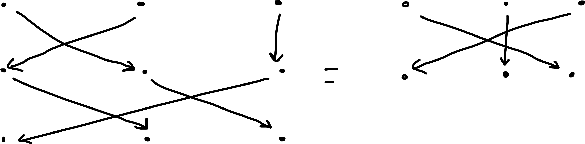
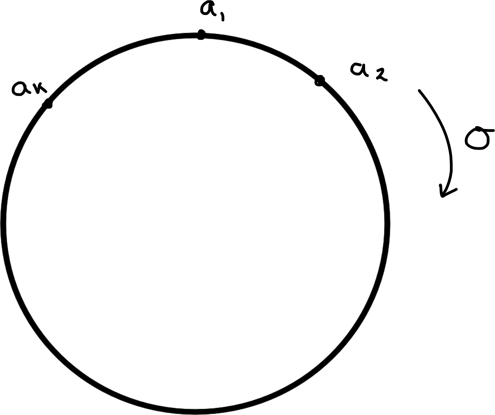

# The Dihedral and Symmetric Groups
**Lecture 2**

First note composition of functions is associative
\begin{align*}
    f, g, h: X &\to X, \text{ let } x \in X \\
    (f \circ (g \circ h))(x) &= f((g \circ h)(x)) \\
    &= f(g(h(x))) \\
    &= (f \circ g)(h(x)) \\
    &= ((f \circ g) \circ h)(x) \\
    \implies f \circ (g \circ h) &= (f \circ g) \circ h.
\end{align*} 

## Dihedral Groups
Let $P$ be a regular polygon with $n$ sides and $V$ its set of vertices.
We can assume 
\begin{align*}
    V = \{ e^{2\pi i k /n} : 0 \leq k < n \}   
\end{align*} (nth roots of unity in $\mathbb{C}$).
Then the symmetries of $P$ are the isometries (i.e. distance preserving maps of $\mathbb{C}$ that map $V$ to $V$).

We will show that:
for $n \geq 3$ the set of symmetries of $P$, under composition, form a nonabelian group of order $2n$. This group is called the *dihedral group* of order $2n$ and denoted $D_{2n}$.

*Warning* - sometimes $D_{2n}$ is denoted $D_n$

We have already met $D_6$ in Example \@ref(exm:triangle).

Consider $D_8$^[The subgroup generated by $r^2$ and $t$ includes the identity, as they are self inverses no need for inverses, and by closure $r^2t = tr^2t$ and so it is a subgroup of order 4.]
```{r 02-D8, echo = FALSE, fig.cap = "", fig.align="center"} 
knitr::include_graphics("figures/02-D8.png") 
```
\begin{align*}
    \text{Let } r: P &\to P \\
    z &\mapsto e^{2\pi i / n}z \\
    t : P &\to P \\
    z &\mapsto \overline{z}
\end{align*} 
These are both isometries

\begin{align*}
    |r(z) - r(w)| &= |e^{2\pi i / n}z -e^{2\pi i / n}w| \\
    &= |e^{2\pi i / n}||z - w| \\
    &= |z - w| \\
    |t(z) - t(w)|^2 &= |\overline{z} - \overline{w}|^2 \\
    &=(\overline{z} - \overline{w})(z - w) \\
    &= |z - w|^2 \\
    \implies |t(z) - t(w)| &= |z - w|
\end{align*} 

Note, $r^n = \operatorname{id} = \text{identity} \implies r^{-1} = r^{n - 1}$.
\begin{align*}
    \text{Note, } r^n &= \operatorname{id} = \text{identity} \\
    \implies r^{-1} &= r^{n - 1} \\
    t^2 &= \operatorname{id} \\
    \implies t^{-1} &= t \\
    tr(z) &= e^{-2\pi i / n} \overline{z} = r^{-1}t(z) \\
    \implies tr &= r^{-1}t
\end{align*} 

We show that the set of symmetries of $P$ is precisely $\{\underbrace{e, r, r^2, \ldots, r^{n-1}}_\text{rotations}, \underbrace{t, rt \ldots, r^{n-1}t}_\text{reflections} \}$.
Then this set under composition of functions gives the group $D_{2n}$.

Let $f$ be a symmetry of $P$. Then $f(1) = e^{2 \pi i k /n}$ for some $k$ ($f(1)$ is mapping to some vertex, so some element of $V$).
\begin{align*}
    \implies \underbrace{r^{-k} \circ f}_\text{$g$, symmetry of $P$ fixing $1$}(1) = 1
\end{align*} 

So, $g(e^{2 \pi i /n}) = e^{2 \pi i /n}$ or $e^{-2 \pi i /n}$. 

If $g(e^{2 \pi i /n}) = e^{2 \pi i /n}$ then $g$ fixes the points $1$ and $e^{2 \pi i / n}$.
Also $g$ interchanges the vertices of $P$ so fixes $P$'s centre of mass
\begin{align*}
    \frac{1}{n} \sum_{k=0}^{n-1} e^{2 \pi i k /n} = 0
\end{align*} 
So $g$ fixes $0, 1$ and $e^{2 \pi i / n} \implies g = \text{id} \implies f = r^{k}$.

If $g(e^{2 \pi i /n}) = e^{-2 \pi i /n}$ then $t \circ g(e^{2 \pi i / n}) = e^{2 \pi i / n}$
\begin{align*}
    && t \circ g(e^{2 \pi i / n}) &= e^{2 \pi i / n} \\
    && t \circ g (1) &= 1 \\
    && t \circ g (0) &= 0 \\
    &\implies & t \circ g &= \text{id} \\
    &\implies & t \circ r^{-k} \circ f &= \text{id} \\
    &\implies & f &= r^{k} \circ t^{-1} \\
    && &= r^k \circ t
\end{align*} 

Algebraically we write, 
\begin{align*}
    D_{2n} = \left\langle \underbrace{r,\ t}_\text{generators} | \underbrace{r^n = e,\ t^2 = e,\ trt = r^{-1}}_\text{relations} \right\rangle 
\end{align*} 

Finally, $D_2 \cong C_2$ and $D_4$ is \@ref(exm:nine) (example 1.7). 
Both are abelian.
Also $D_\infty$ exists.

## Symmetric Groups

Let $X$ be a set. 
A bijection \begin{align*}
    f: X \to X
\end{align*} is called a *permutation* of $X$.
Let $\operatorname{Sym} X$ denote the set of all permutations of $X$.

::: {.proposition}
$\operatorname{Sym} X$ is a group under composition of functions. It is called the symmetric group on $X$.
:::

::: {.proof}
\ 

- closure - See \@ref(lem:two) (Number's and Sets).

- identity, define $\iota (x) = x \; \forall \; x \in X$.

- Let $f \in \operatorname{Sym}(X)$. 
As $f$ is a bijection, $f^{-1}$ exists and is a bijection and satisfies $f \circ f^{-1} = \iota = f^{-1} \circ f$.

- composition of functions is associative.
:::

Notation: Suppose $X$ is finite, $|X| = n$.
Then we often take $X$ to be the set $\{ 1, \ldots, n \}$ and we write $S_n$ for $\operatorname{Sym} X$.
We call $S_n$ the symmetric group of degree $n$.

We'll use double row notation (for now).

If $\sigma \in S_n$ write
\begin{align*}
    G = \begin{pmatrix}
    1 & 2 & \ldots & n \\
    \sigma(1) & \sigma(2) & \ldots & \sigma(n)
    \end{pmatrix} \\
    \begin{pmatrix}
    1 & 2 & 3 \\
    2 & 3 & 1
    \end{pmatrix} \in S_3 \\
    \begin{pmatrix}
    1 & 2 & 3 & 4 & 5 \\
    2 & 3 & 1 & 4 & 5
    \end{pmatrix} \in S_5
\end{align*} 
Composition: 
\begin{align*}
    \begin{pmatrix}
    1 & 2 & 3 \\
    2 & 3 & 1
    \end{pmatrix} \circ
    \begin{pmatrix}
    1 & 2 & 3 \\
    2 & 1 & 3
    \end{pmatrix}
    &= ``\begin{pmatrix}
    1 & 2 & 3 \\
    2 & 1 & 3 \\
    3 & 2 & 1
    \end{pmatrix}" \\
    &= \begin{pmatrix}
        1 & 2 & 3 \\
        3 & 2 & 1
    \end{pmatrix}
\end{align*} 
or: 
```{r 02-symmetric-graphical, echo = FALSE, fig.cap = "", fig.align="center"} 
 
```

### Small n

\begin{align*}
    S_1 &= \left\{ \begin{pmatrix}1 \\1\end{pmatrix} \right] = \{ \iota \} \hspace{.5cm} \text{trivial group} \\
    S_2 &= \left\{ \begin{pmatrix}
    1 & 2 \\
    1 & 2
    \end{pmatrix}, \begin{pmatrix}
    1 & 2 \\
    2 & 1
    \end{pmatrix} \right\} \\
    &\cong \left( \{ \pm 1 \}, \times \right) \cong C_2 \\
    S_3 &= \left\{ \begin{pmatrix}
    1 & 2 & 3 \\
    1 & 2 & 3
    \end{pmatrix}, 
    \begin{pmatrix}
    1 & 2 & 3 \\
    2 & 3 & 1
    \end{pmatrix}, 
    \begin{pmatrix}
        1 & 2 & 3 \\
        3 & 1 & 2
    \end{pmatrix}, 
    \begin{pmatrix}
        1 & 2 & 3 \\
        1 & 3 & 2
    \end{pmatrix}, 
    \begin{pmatrix}
        1 & 2 & 3 \\
        3 & 2 & 1
    \end{pmatrix}, 
    \begin{pmatrix}
        1 & 2 & 3 \\
        2 & 1 & 3
    \end{pmatrix} \right\} \\
    & \cong D_6
\end{align*} 

::: {.remark}
\ 

i. $|S_n| = n!$

ii. For $n \geq 3$ $S_n$ is not abelian. 
Consider
\begin{align*}
    \begin{pmatrix}
    1 & 2 & 3 & 4 & \ldots & n \\
    2 & 3 & 1 & 4 & \ldots & n
    \end{pmatrix}, 
    \begin{pmatrix}
        1 & 2 & 3 & 4 & \ldots & n \\
        1 & 3 & 2 & 4 & \ldots & n
    \end{pmatrix}
\end{align*}
They don't commute in $S_3$ so they won't in $S_n$.

iii. $D_{2n}$ naturally embeds in $S_n$.
e.g. $D_8 \lesssim S_4$ (isomorphic to a subgroup)
\begin{align*}
    r = \begin{pmatrix}
    1 & 2 & 3 & 4 \\
    2 & 3 & 4 & 1
    \end{pmatrix},\ t = 
    \begin{pmatrix}
    1 & 2 & 3 & 4 \\
    4 & 3 & 2 & 1
    \end{pmatrix}
\end{align*} 
:::

'Double row notation is cumbersome and hides what's going o, we introduce cycle notation'.

::: {.definition}
Let $a_1, \ldots, a_k$ be distinct integers in $\{ 1, \ldots, n \}$.
Suppose $\sigma \in S_n$ and 
\begin{align*}
    \sigma(a_i) &= a_{i + 1} \hspace{0.5cm} 1 \leq 1 \leq k - 1 \\
    \sigma(a_k) &= a_1
\end{align*} 
and $\sigma(x) = x \; \forall \; x \in \{ 1, \ldots, n \} \setminus \{ a_1, \ldots, a_k \}$.
Then $\sigma$ is a *k-cycle* and we write $\sigma = (a_1, a_2, \ldots, a_k)$.
e.g. \begin{align*}
    \sigma = \begin{pmatrix}
    1 & 2 & 3 \\
    2 & 3 & 1
    \end{pmatrix}
\end{align*} is the 3-cycle $\begin{pmatrix}1 & 2 & 3\end{pmatrix}$.
:::

::: {.remark}
\ 

i. \begin{align*}
    (a_1, a_2, \ldots, a_k) &= (a_k, a_1, a_2, \ldots, a_{k-1}) \\
    &= \ldots
\end{align*} We usually write the smallest $a_i$ first.

ii. \begin{align*}
    (a_1, a_2, \ldots, a_k)^{-1} &= (a_1, a_k, a_{k-1}, \ldots, a_2).
\end{align*} 

iii. $o(\sigma) = k$, $\sigma$ is like the rotations of k points
```{r 02-sigma-graphical, echo = FALSE, fig.cap = "", fig.align="center", out.width="50%"} 
 
```

iv. a 2-cycle is called a *transposition*.
:::

::: {.definition}
Two cycles $\sigma = (a_1, \ldots, a_k)$ and $\tau = (b_1, \ldots, b_l)$ are *disjoint* if $\{ a_1, \ldots, a_k \} \land \{ b_1, \ldots, b_k \} = \emptyset$.
:::

::: {.lemma}
If $\sigma, \tau \in S_n$ are disjoint then $\sigma \tau = \tau \sigma$
:::

::: {.proof}
If $x \in {1, \ldots, n} \setminus \{ a_1, \ldots, a_k \} \lor \{ b_1, \ldots, b_k \}$, $(\sigma \circ \tau) (x) = \sigma \left( \tau(x) \right) = (\tau \circ \sigma)(x)$.

Suppose $1 \leq i \leq k - 1$

\begin{align*}
    (\sigma \circ \tau)(a_i) &= \sigma\left(\tau(a_i) \right) \\
    &= \sigma(a_i) = a_{i + 1} \\
    (\tau \circ \sigma)(a_i) &= \tau\left(\sigma(a_i) \right) \\
    &= \tau(a_{i + 1}) = a_{i + 1} \\
\end{align*} 
And $\sigma \circ \tau (a_k) = a_1$, $\tau \circ \sigma (a_k) = a_1$.

Similarly for $b_j$
$\tau \circ \sigma (b_j) = \sigma \circ \tau (b_j)$

Thus $\sigma \circ \tau$ and $\tau \circ \sigma$ agree everywhere $\implies \sigma \circ \tau = \tau \circ \sigma$.
:::

::: {.example}
$\begin{pmatrix}1 & 2\end{pmatrix} \begin{pmatrix}3 & 4 & 5\end{pmatrix} = \begin{pmatrix}3 & 4 & 5\end{pmatrix} \begin{pmatrix}1 & 2\end{pmatrix}$
:::

However this is not necessarily true if two cycles are not disjoint.

::: {.example}
\begin{align*}
    \sigma &= \begin{pmatrix}1 & 2 & 3\end{pmatrix},\ \tau = \begin{pmatrix}2 & 4\end{pmatrix} \\
    \sigma \circ \tau(1) &= \sigma(1) = 2 \\
    \sigma \circ \tau(2) &= \sigma(4) = 4 \\
    \sigma \circ \tau(3) &= \sigma(3) = 1 \\
    \sigma \circ \tau(4) &= \sigma(2) = 3 \\
    \sigma \circ \tau &= \begin{pmatrix}1 & 2 & 4 & 3\end{pmatrix} \\
    \text{But } \tau \circ \sigma &= \begin{pmatrix} 1 & 4 & 2 & 3 \end{pmatrix}
\end{align*} 
:::
