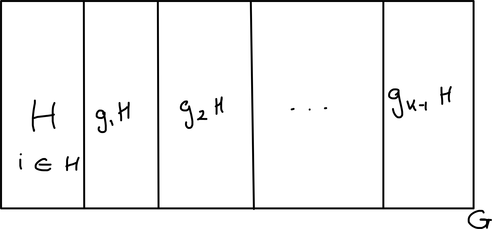

# Cosets and Lagrange

::: {.definition}
Let $H \leq G$ and $g \in G$.
The *left coset $gH$* is defined to be $\{ gh : h \in H \}$.
Similarly the *right coset* $Hg = \{ hg : h \in H \}$
:::

::: {.example}
\begin{align*}
    S_3 &= \{ e, \begin{pmatrix}1 & 2 & 3\end{pmatrix}, \begin{pmatrix}1 & 3 & 2\end{pmatrix}, \begin{pmatrix}1 & 2\end{pmatrix}, \begin{pmatrix}1 & 3\end{pmatrix}, \begin{pmatrix}2 & 3\end{pmatrix} \} \\
    H &= \{ \text{id}, \begin{pmatrix}1 & 2 & 3\end{pmatrix}, \begin{pmatrix}1 & 3 & 2\end{pmatrix} \} = A_3 \\
    \begin{pmatrix}1 & 2\end{pmatrix}H &= \left\{ \begin{pmatrix}1 & 2\end{pmatrix}, \begin{pmatrix}1 & 2\end{pmatrix}\begin{pmatrix}1 & 2 & 3\end{pmatrix}, \begin{pmatrix}1 & 2\end{pmatrix}\begin{pmatrix}1 & 3 & 2\end{pmatrix} \right\} \\
    &= \left\{ \begin{pmatrix}1 & 2\end{pmatrix}, \begin{pmatrix}2 & 3\end{pmatrix}, \begin{pmatrix}1 & 3\end{pmatrix} \right\} \\
    \begin{pmatrix}1 & 2 & 3\end{pmatrix}H &= H \ (\text{since H is a subgroup})
\end{align*} 
Note, $H \dot{\cup} \begin{pmatrix}1 & 2\end{pmatrix}H = S_3$
:::

::: {.lemma #nine}
Let $H \leq G$ and $g \in G$.
Then there is a bijection between $H$ and $gH$.
In particular if $H$ is finite then $|H| = |gH|$.
:::

::: {.proof}
Define $\theta_g : H$
\begin{align*}
    \theta_g : H &\to gH \\
    h &\mapsto gh.
\end{align*}
We show $\theta_g$ is a bijection.

Surjectivity: if $gh \in gH$ then $\theta_g(h) = gh$.

Injectivity: \begin{align*}
    \theta_g(h_1) &= \theta_g(h_2) \\
    g h_1 &= g h_2 \\
    \implies h_1 &= h_2 \ (\text{cancellation law})
\end{align*} 
:::

::: {.lemma #ten}
The left cosets of $H$ in $G$ form a partition of $G$ i.e.

i. each $g \in G$ lies in some left coset of $H$ in G.

ii. if $aH \cup bH \neq \emptyset$ (for some $a, b \in G$) $\implies aH = bH$.
:::

```{r 03-cosets, echo = FALSE, fig.cap = "", fig.align="center"} 
 
```

::: {.proof}
\ 

i. $g \in gH$ as $e \in H$

ii. Suppose $c \in aH \cup bH$. \
Claim: $aH = cH = bH$.

Now $c \in aH$ so $c = ak$ for some $k \in H$.
\begin{align*}
    \implies cH &= \{ c h : h \in H \} \\
    &= \{ a k h : h \in H \} \subseteq aH.
\end{align*} 

Similarly, $a = c k^{-1} \in cH$
\begin{align*}
    \implies aH \subseteq cH.
\end{align*} 
So $aH = cH$. \
Similarly $cH = bH$
:::

::: {.example}
$S_n = \underbrace{A_n}_\text{even elements} \dot{\cup} \underbrace{\begin{pmatrix}1 & 2\end{pmatrix} A_n}_\text{odd elements}$
:::

::: {.lemma #eleven}
Let $H \leq G$, $a, b \in G$.
Then $aH = bH \iff a^{-1} b \in H$.
:::

::: {.proof}

$(\implies)$:
\begin{align*}
    b &\in bH = aH \\
    \implies b &= ah \text{ for some } h \in H \\
    \implies a^{-1} b &= h \in H
\end{align*} 

$(\Longleftarrow)$:
\begin{align*}
    \text{Suppose } a^{-1}b &= k \in H \\
    \implies b &= ak \in aH \\
    \text{also } b &\in bH. \\
    \implies aH &= bH
\end{align*} by Lemma \@ref(lem:ten)
:::

::: {.theorem #three name="Lagrange's Theorem"}
Let $H$ be a subgroup of the finite group $G$.
Then the order of $H$ divides the order of $G$ (i.e. $|H| \bigg| |G|$).
:::

::: {.proof}
By Lemma \@ref(lem:ten) $G$ is partitioned into distinct cosets of $H$, say $G = g_1 H \dot{\cup} g_2 H \dot{\cup} \ldots \dot{\cup} g_k H$ (say $g_1 = e$).\
By Lemma \@ref(lem:nine)
\begin{align*}
    |g_i H| &= |H| \hspace{.5cm} 1 \leq i \leq k \\
    \implies |G| &= |H|k
\end{align*} 
:::
^[You would need to prove these lemma's in an exam q.]

::: {.definition #fourteen}
Let $H \leq G$.
The *index* of $H$ in $G$ is the number of left cosets of $H$ in $G$, denoted $|G : H|$.
:::

::: {.remark}
\ 

i. If $G$ is finite, $|G : H| = \frac{|G|}{|H|}$.
But we can have $|G : H|$ finite, even if $G$ and $H$ are infinite, e.g. $\mathbb{Z}$ and $n\mathbb{Z}$ where $|G : H| = n$.

ii. We write $(G : H)$ for the set of left cosets of $H$ in $G$.
:::

::: {.corollary #two name="Lagrange's Corollary"}
$G$ is a finite group, $g \in G$.
Then $o(g) \bigg| |G|$.
In particular, $g^{|G|} = e$.
:::

::: {.proof}
\begin{align*}
    \text{Note } \left\langle g\right\rangle &= \{ e, g, \ldots, g^{n-1} \} \text{ where } o(g) = n. \\
    \text{Then } o(g) &= | \left\langle g\right\rangle | \bigg| |G| \text{ by Lagrange} \\
    \implies g^{|G|} &= e \text{ by Lemma }
\end{align*} \@ref(lem:five) 
:::

::: {.corollary #three}
If $|G| = p$ for some prime $p$, then $G$ is cyclic.
:::

::: {.proof}
Let $e \neq g \in G$.
Then $\{ e \} \neq \langle g \rangle \leq G$.
By Lagrange 
\begin{align*}
    1 &\neq | \langle g \rangle | \;\bigg|\; |G| = p \\
    \implies | \langle g \rangle | &= p = |G| \\
    \implies \langle g \rangle &= G
\end{align*} 
i.e. $G$ cyclic.
:::

Euler's totient function.\
Let $n \in \mathbb{N}$ and $\phi(n) = \left| \left\{ a \leq a \leq n : \operatorname{hcf}(a, n) = 1 \right\} \right|$ so $\phi(12) = \left| \left\{ 1, 5, 7, 11 \right\} \right| = 4$.

::: {.theorem name="Fermat-Euler Theorem" #four}
Let $n \in \mathbb{N},\ a \in \mathbb{Z}$ and $\operatorname{hcf}(a, n) = 1$.\
Then $a^{\phi(n)} \equiv 1 \pmod n$.
:::


We can prove this by using Lagrange, but first we need to set it up.\
Let $n \in \mathbb{N}$,
\begin{align*}
    R_n &= \{ 0, 1, \ldots, n-1 \} \\
    R_n^* &= \{ a \in R_n : \operatorname{hcf}(a, n) = 1 \}
\end{align*}
Define $\times_n$ to be multiplication mod $n$.\
Claim: $(R_n^*, \times_n)$ is a group.
Notation, $n \in \mathbb{Z}$ then $\bar{u} \in R_n$ such that $u \equiv \bar{u} \pmod n$.

Closure:
\begin{align*}
    \operatorname{hcf}(a, n) &= 1 = \operatorname{hcf}(b, n)
    \implies \operatorname{hcf}(ab, n) = 1 \\
    \implies \operatorname{hcf}(\bar{ab}, n) = 1 \\
\end{align*} 

Identity = 1

Associativity is fine.

Inverses: Let $a \in R_n^*$, $\operatorname{hcf}(a, n) = 1$
\begin{align*}
    \implies \exists \; u, v \in \mathbb{Z} s.t. a u + v n = 1 \text{ (Bezout's Theorem)} \\
    \implies au \equiv 1 \pmod n
\end{align*} 
Then $\bar{u} \in R_n^*$ is $a^{-1}$

::: {.proof}
Note $|R_n^*| = \phi(n)$.
\begin{align*}
    a \equiv \bar{a} \pmod n,\ \bar{a} \in R_n^*
\end{align*} 
By Corollary \@ref(cor:two)
\begin{align*}
    \bar{a}^{\phi(n)} &= \bar{a}^{|R_n^*|} = 1 \in R_n^* \\
    \implies a^{\phi(n)} &\equiv 1 \pmod n
\end{align*} 
:::