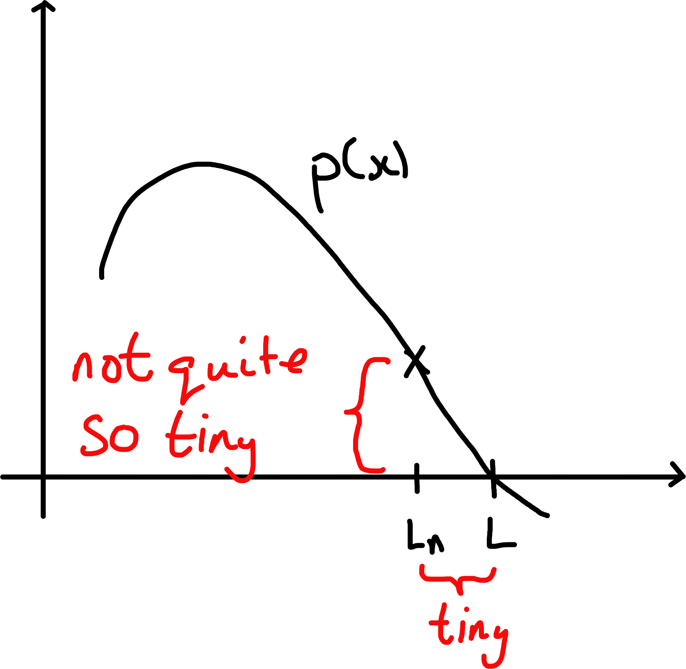

# The Reals

We have seen $\mathbb{N} \subset \mathbb{Z} \subset \mathbb{Q}$ ($\mathbb{N} \to \mathbb{Z}$ lets us subtract and $\mathbb{Z} \to \mathbb{Q}$ gives us division).
Why stop here?

::: {.proposition #t-one}
There is no rational $x$ with $x^2 = 2$.
:::

::: {.proof}
Suppose $x^2 = 2$.
Note we may assume $x > 0$ since $(-x)^2 = x^2$.
If $x$ is rational then $x = \frac{a}{b}$ for some $a, b \in \mathbb{N}$.
Thus $x^2 = \frac{a^2}{b^2} = 2$, or $a^2 = 2 b^2$.
But the exponent of $2$ in the prime factorisation of $a^2$ is even while the exponent of $2$ in the prime factorisation of $2 b^2$ is odd, contradicting the Fundamental Theorem of Arithmetic, \@ref(thm:fta).
:::

*Note*: The same proof shows that if $\exists \; x \in \mathbb{Q}$ with $x^2 = n$ for some $n \in \mathbb{N}$, then $n$ must be a square.

::: {.proof name="Alternative proof"}
Suppose $x^2 = 2$ for some $x = \frac{a}{b}$ with $a, b \in \mathbb{N}$.
Then for any $c, d \in \mathbb{Z}$, $cx + d$ is of the form $\frac{e}{b}$ for some $e \in \mathbb{Z}$.
Thus if $cx + d > 0$, then $cx + d \geq \frac{1}{b}$.
But $0 < x - 1 < 1$ as $1 < x < 2$ so if $n$ is sufficiently large, $0 < (x - 1)^n < \frac{1}{b}$.
But for any $n \in \mathbb{N}$, $(x - 1)^n$ is of the form $cx + d$ for some $c, d \in \mathbb{Z}$, since $x^2 = 2$.
This is a contradiction.
:::

So "$\mathbb{Q}$ has a gap".
How do we express the fact making reference only to $\mathbb{Q}$?

```{r 03-number-line, echo = FALSE, fig.cap = "", fig.align="center"} 
knitr::include_graphics("figures/03-number-line.png") 
```

2 is an upper bound for the set of $x$ s.t. $x^2 < 2$, but so is $1.5$, and 1.42, ... \
*Crucial point*: In $\mathbb{Q}$, there is no least upper bound.

## The Reals
The real numbers, written $\mathbb{R}$, are a set with elements $0$ and $1$ ($0 \neq 1$), equipped with operations $+$ and $\cdot$, and an ordering $<$ such that

1. $+$ is commutative and associative with identity $0$, and every $x$ has an inverse under $+$;

2. $\cdot$ is commutative and associative with identity $1$, and every $x \neq 0$ has an inverse under $\cdot$;

3. $\cdot$ is distributive over $+$, that is, $\forall \; a, b, c$
\begin{align*}
    a (b + c) = ab + ac
\end{align*} 

4. $\forall \; a, b$, exactly one of $a < b$ or $a = b$ or $b < a$ holds, and $\forall \; a, b, c$, 
\begin{align*}
    a < b \text{ and } b < c \implies a < c;
\end{align*} 

5. $\forall \; a, b, c$ 
\begin{align*}
    \forall \; a, b, c & a < b &\implies a + c < b + c \\
    \text{and } & a < b &\implies ac < bc \text{ if } c > 0.
\end{align*} 

(The above all hold for the rationals)

6. Given any set $S$ of reals that is non-empty and bounded above $S$ has a least upper bound.

6 is known as the *least upper bound axiom*

We say that a set $S$ is bounded above if $\exists \; x \in \mathbb{R}$ s.t. $x \geq y \; \forall \; y \in S$.
Such an $x$ is called an *upper bound for $S$*. 
$x$ is the *least upper bound for $S$* if $x$ is an upper bound for $S$ and every other upper bound $x'$ satisfies $x' \geq x$.\
When $x$ is a least upper bound for $S$, we may write "$\operatorname{LUB}(S) = x$" or "$\operatorname{supremum}(S) = x$" or "$\sup(S) = x$".

::: {.remark}
\ 

i. From (1) - (5), we can check, for example, that $0 < 1$ (we have just let $0$ and $1$ represent the identities).
Indeed, if not, then $1 < 0$ ($0 \neq 1$) so $0 = 1 - 1 < 0 - 1 = -1$ ($-1 > 0$) so $0 (-1) < (-1) (-1) = 1$, a contradiction.

ii. We may consider $\mathbb{Q}$ as contained in $\mathbb{R}$, by identity $\frac{a}{b} \in \mathbb{Q}$ with $a \cdot b^{-1} \in \mathbb{R}$ ($b^{-1}$ is the multiplicative inverse we have not shown that $b^{-1} = \frac{1}{b}$ yet).

iii. $\mathbb{Q}$ doesn't satisfy (6) as e.g. the set of $x$ s.t. $x^2 < 2$ does not have a supremum.

iv. In (6), the words "non-empty" and "bounded above" are crucial:\
If $S$ is empty then every $x \in \mathbb{R}$ is an upper bound for $S$, so there is no least upper bound.\
If $S$ is not bounded above, then it has no upper bound, and certainly no *least* upper bound.

v. It is possible to construct $\mathbb{R}$ "out of" $\mathbb{Q}$ and check that (1) - (6), but it takes a lot of effort.
:::

::: {.example}
$S = \{ x \in \mathbb{R} : 0 \leq x \leq \mathbb{R} \}$
```{r 03-exm-1, echo = FALSE, fig.cap = "", fig.align="center"} 
knitr::include_graphics("figures/03-exm-1.png") 
```

Is $2$ an upper bound for $S$?
Yes: $\forall \; x \in S, x \leq 2$.\
Is $\frac{3}{4}$ an upper bound for $S$?
No: $\frac{7}{8} \in S, \frac{7}{8} \leq \frac{3}{4}$.

The least upper bound of $S$ is $1$ because 

- 1 is an upper bound (as $\forall \; x \in S, x \leq 1$)

- every other upper bounds has $y \geq 1$ (as $1 \in S$).

Hence $\sup (S) = 1$

\begin{align*}
    S &= \{ x \in \mathbb{R} : 0 \leq x \leq 1 \} \\
    &= [0, 1]
\end{align*} 
:::

::: {.example}
\begin{align*}
    S &= \{ x \in \mathbb{R} : 0 < x < 1 \} \\
    &= (0, 1)
\end{align*} 

```{r 03-exm-2, echo = FALSE, fig.cap = "", fig.align="center"} 
knitr::include_graphics("figures/03-exm-2.png") 
```

Is $2$ an upper bound for $S$?
Yes: $\forall \; x \in S, x \leq 2$.\
Is $\frac{3}{4}$ an upper bound for $S$?
No: $\frac{7}{8} \in S, \frac{7}{8} \leq \frac{3}{4}$.

We have $\sup (S) = 1$ because 

- $1$ is an upper bound: $\forall \; x \in S \ x \leq 1$;

- no upper bound $c$ is s.t. $c < 1$.
Indeed, c is certainly greater than 0 (in fact $c \geq \frac{1}{2}$ since $\frac{1}{2} \in S$), so if $c < 1$, then $0 < c < 1$, so $\frac{c + 1}{2} \in S$ with $\frac{c + 1}{2} > c$ ⨳.
```{r 03-exm-2-2, echo = FALSE, fig.cap = "", fig.align="center"} 
knitr::include_graphics("figures/03-exm-2-2.png") 
```

*Warning* If $S$ has a greatest element, then $\sup (S) = \max (S) \in S$.
But $\sup (S)$ can exist when $\max (S)$ does not, in which case $\sup (S) \in S$.
:::

::: {.example #three}
\begin{align*}
    S &= \{ 1 - \frac{1}{n} : n \in \mathbb{N} \} \\
    &= \{ 0, \frac{1}{2}, \frac{2}{3}, \frac{3}{4}, \ldots \}
\end{align*} 

```{r 03-exm-3, echo = FALSE, fig.cap = "", fig.align="center"} 
knitr::include_graphics("figures/03-exm-3.png") 
```

Clearly $1$ is an upper bound.\
Is there an upper bound $< 1$?
:::

::: {.proposition #two name="Axiom of Archimedes"}
$\mathbb{N}$ is not bounded above in $\mathbb{R}$.
:::

::: {.proof}
Suppose on the contrary that $\mathbb{N}$ is bounded above.
Let $c = \sup \mathbb{N}$.\
By definition, $c - 1$ is not an upper bound for $\mathbb{N}$, so $\exists \; n \in \mathbb{N}$ s.t. $n > c - 1$.\
But then $n + 1 \in \mathbb{N}$ with $n + 1 > c$, contradicting the fact that $c$ was an upper bound.
:::

::: {.corollary #three}
For all $t > 0, \exists \; n \in \mathbb{N}$ with $\frac{1}{n} < t$.
```{r 03-corr-1, echo = FALSE, fig.cap = "", fig.align="center"} 
knitr::include_graphics("figures/03-corr-1.png") 
```
:::

::: {.proof}
Given $t > 0$, by Proposition \@ref(prp:two), $\exists \; n \in N$ s.t. $n > \frac{1}{t}$.
Hence $\frac{1}{n} < t$.
:::

A set $S$ is said to be bounded below if $\exists \; x$ s.t. $x \leq y \; \forall \; y \in S$.
Such an $x$ is called a *lower bound for $S$*.
If $S$ is non-empty and bounded below, then $-S = \{ y: y \in S \}$ is non-empty and bounded above, so it has a least upper bound, $c$ say.
Hence $-c$ is the *greatest lower bound of $S$*.
We denote it by "$\operatorname{GLB}(S)$", or "$\operatorname{infimum} (S)$", or "$\inf (S)$".

Corollary \@ref(cor:three) immediately implies that $\inf ( \{ \frac{1}{n} : n \in \mathbb{N} \}) = 0$.

Proposition \@ref(prp:two) and Corollary \@ref(cor:three) show that there are no "infinitely large" or "infinitely small" numbers in $\mathbb{R}$.

Back to Example \@ref(exm:three): we have $\sup (S) = 1$, for suppose $c < 1$ is an upper bound for $S$.
Then $1 - \frac{1}{n} < c \; \forall \; n \in \mathbb{N}$, so $0 < 1 - c < \frac{1}{n}$ contradicting Corollary \@ref(cor:three).

::: {.theorem #t-four} 
There exists $x \in \mathbb{R}$ with $x^2 = 2$.
:::

::: {.proof}
Let $S = \{ x \in \mathbb{R}: x^2 < 2 \}$.

```{r 03-thm-4, echo = FALSE, fig.cap = "", fig.align="center"} 
 
```

Note that $S$ is non-empty since e.g. $1 \in S$.
It is also bounded above e.g. by $2$.
Hence $S$ has a supremum, which we denote by $c$.

Observe that $1 < c < 2$.
We claim that $c^2 = 2$.
Suppose on the contrary that $c^2 < 2$.\
For $0 < t < 1$, have $(c + t)^2 = c^2 + 2ct + t^2 \leq c^2 + 4t + t  = c^2 + 5t < 2$ for small t (namely, $t = \frac{2 - c^2}{5}$).
But this contradicts the assumption that $c$ was an upper bound for $S$ (since $c + t \in S$).
Suppose now that $c^2 > 2$.\
For $0 < t < 1$, have $(c - t)^2 = c^2 - 2ct + t^2 \geq c^2 - 4t > 2$ for small t (namely, $t = \frac{c^2 - 2}{4}$).\
This contradicts the assumption that $c$ is the *least* upper bound for $S$ (since $c - t$ is an upper bound for $S$).
:::

::: {.remark}
The same proof shows that $x^{\frac{1}{n}}$ exists $\forall \; n \in N, \forall \; x \in \mathbb{R}, x > 0$. 
[i.e. $\forall \; n \in \mathbb{N}, \forall \; x \in \mathbb{R}, x > 0, \exists \; y \in \mathbb{R}$ s.t. $y^n = x$.]\
A real that is not rational is called *irrational*. 
E.g. $\sqrt{2}, \sqrt{3}, \sqrt{5}, \sqrt{6}$ are irrational.\
Also $2 + 3\sqrt{5}$ is irrational.
Indeed if $2 + 3\sqrt{5} = \frac{a}{b}$ with $\frac{a}{b} \in \mathbb{N}$ then $\sqrt{5} = \frac{a  - 2b}{3b} \in \mathbb{Q}$, ⨳. $\Box$
:::

The rationals are *dense* in $\mathbb{R}$, in the sense that $\forall \; a < b \in \mathbb{R}, \exists \; c \in Q$ with $a < c < b$.

::: {.proof}
Indeed, we may assume $a \geq 0$ (we can just add an integer, find the rational and subtract the integer).

By Corollary \@ref(cor:three), $\exists \; n \in \mathbb{N}$ with $\frac{1}{n} < b - a$.
By the Axiom of Archimedes \@ref(prp:two), $\exists \; N \in \mathbb{N}$ s.t. $N > b$.
Let $T = \{ k \in \mathbb{N} : \frac{k}{n} \geq b \}$,\
then $Nn \in T$, so $T \neq \emptyset$.\
By the Well-Ordering Principle, $T$ has a least element $m$.
Set $c = (m - 1) \cdot \frac{1}{n}$.
Since $m - 1 \notin T$, $c < b$.\
If $c \leq a$ then $\frac{m}{n} = c + \frac{1}{n} < a + b - a = b$, ⨳ of $m \in T$. 
Hence $a < c < b$.
:::

The irrationals are also dense in $\mathbb{R}$, i.e. $\forall \; a < b \in \mathbb{R}, \exists \; c \in \mathbb{R} \setminus \mathbb{Q}$ with $a < c < b$.\
Indeed, take a rational $c$ with $a \sqrt{2} < c < b \sqrt{2}$ then $a < \frac{c}{\sqrt{2}} < b$.

## Sequences

A *sequence* is an enumerated collection of objects in which repetitions are allowed and order matters.\
Write $a_1, a_2, a_3, \ldots$ or $(a_n)_{n = 1}^\infty$.\
What does it mean for a sequence $a_1, a_2, \ldots$ to tend to a limit $l$?\
It is *not* enough that the terms $a_n$ get closer to $l$, e.g. we would not want $\frac{1}{2}, \frac{2}{3}, \frac{3}{4}, \frac{4}{5}, \ldots$ to tend to $37$.\
And it is *not* enough that the $a_n$ get arbitrarily close to $l$, $\forall \; \epsilon > 0, \exists \; n \in \mathbb{N}$ s.t. $l - \epsilon < a_n < l + \epsilon$, e.g. we would not want $\frac{1}{2}, 10, \frac{2}{3}, 10, \frac{3}{4}, 10, \ldots$ to tend to $1$.\
We want the sequence to get *and stay* with $\epsilon$ of $l$.

We say that the *sequence $a_1, a_2, \ldots$ tends to the limit $l \in \mathbb{R}$ as $n$ tends to infinity* if, $\forall \; \epsilon > 0, \exists \; N \in \mathbb{N}$ s.t. $\forall \; n \geq N, \lambda - \epsilon < a_n < \lambda + \epsilon$.

```{r 03-limit-sequence, echo = FALSE, fig.cap = "", fig.align="center"} 
knitr::include_graphics("figures/03-limit-sequence.png") 
```

More compactly: $\forall \; \epsilon > 0, \exists \; N \in \mathbb{N}$ s.t. $\forall \; n \geq N, | a_n - l | < \epsilon$, where the *absolute value* $|x|$ of $x \in \mathbb{R}$ is defined by 
\begin{align*}
    |x| = \begin{cases}
        x & \text{if } x \geq 0 \\
        -x & \text{if } x < 0
    \end{cases}.
\end{align*} 
We think of $|a - b|$ as the "distance between $a$ and $b$ on the number line", e.g. $|2 - 9| = |9 - 2| = 7$.
It is easy to check the triangle inequality $|a - b| \leq |a- c| + |c - b|$.

When $a_n$ tends to $l$ as $n$ tends to infinity, we also write "$a_n \to l$ as $n \to \infty$" or "$\lim_{n \to \infty} a_n = l$" or "$(a_n)_{n = 1}^\infty$ converges to $l$".\
If there is a limit $l$ but it is not specified we simply say "$(a_n)_{n = 1}^\infty$ converges".

If $(a_n)_{n = 1}^\infty$ does not converge, then we say it *diverges*.

::: {.example}
\

1. $\frac{1}{2}, \frac{2}{3}, \frac{3}{4}, \frac{4}{5}, \ldots$\
$a_n = 1 - \frac{1}{n}$.\
Given $\epsilon > 0$, choose $N > \frac{1}{\epsilon}$ (by the Axiom of Archimedes, \@ref(prp:two)).
If $n \geq N$, then 
\begin{align*}
    |a_n - 1| &= |1 - \frac{1}{n} - 1| \\
    &= \frac{1}{n} \\
    &\leq \frac{1}{N} \\
    &< \epsilon.
\end{align*} 
Hence $a_n \to 1$ as $n \to \infty$.

2. $0, \frac{1}{2}, \frac{1}{4}, 0, \frac{1}{6}, \ldots$\
\begin{align*}
    a_n = \begin{cases}
        \frac{1}{n} & n \text{ even} \\
        0 & n \text{ odd}
    \end{cases} 
\end{align*} 
Given $\epsilon > 0$, pick $N > \frac{1}{\epsilon}$.\
If $n \geq N$, then 
\begin{align*}
    |a_n - 0| &\leq \frac{1}{n} \\
    &\leq \frac{1}{N} \\
    &< \epsilon.
\end{align*} 
Hence $a_n \to 0$ as $n \to \infty$.

3. $\frac{1}{2}, \frac{1}{2} + \frac{1}{4}, \frac{1}{2} + \frac{1}{4} + \frac{1}{8}, \ldots$\
$a_n = 1 - \frac{1}{2^n}$ (by induction)\
Given $\epsilon > 0$, choose $N > \frac{1}{\epsilon}$.
If $n \geq N$, then 
\begin{align*}
    |a_n - 1| &= |1 - \frac{1}{2^n} - 1| \\
    &= \frac{1}{2^n} \\
    &\leq \frac{1}{n} \\
    &\leq \frac{1}{N} \\
    &< \epsilon.
\end{align*} 
Hence $a_n \to 1$ as $n \to \infty$.

4. $-1, 1, -1, 1, -1, 1, \ldots$\
$a_n = (-1)^n$

If $a_n$ does not tend to $l$, we write "$a_n \not\to l$".
This mean $\exists \; \epsilon > 0 \; \forall \; N \in \mathbb{N} \; \exists \; n \geq N \ |a_n - l| \geq \epsilon$.\
Indeed, in 4, we show that e.g. $a_n \not\to 0$.
Let $\epsilon = 1$.
Then $|a_n - 0| = 1 \; \forall \; n \in N$.
In fact, $a_n$ does not converge to any limit $l \in \mathbb{R}$. \
For suppose $a_n \to l$ as $n \to \infty$, for some $l \in \mathbb{R}$.
Let $\epsilon = 1$.
So $\exists \; N \in \mathbb{N}$ s.t. $\forall \; n \geq N$, $|a_n - l| < 1$.
In particular, $|1 - l| < 1$ and $|-1-l| < 1$.
But then $2 = | 1 - (-1)| \leq |1 - l| + |-1 - l| < 2.$ ⨳

We have shown that $((-1)^n)_{n = 1}^\infty$ does not converge to any $l \in \mathbb{R}$, hence it is divergent (note: it does not mean "goes off to infinity").
:::

We implicitly assumed that if a limit exists, then it is unique.

```{r 03-two-limits, echo = FALSE, fig.cap = "", fig.align="center"} 
 
```

::: {.proof}
Indeed, suppose that $a_n \to l$ and $a_n \to k$ as $n \to \infty$, with $l \neq k$.
Choose $\epsilon = \frac{1}{2} |l - k|$.
Then $\exists \; N \in \mathbb{N}$ s.t. $|a_n - l| < \epsilon \; \forall \; n \geq N$ and $\exists \; M \in \mathbb{N}$ s.t. $|a_n - k| < \epsilon \; \forall \; n \geq M$.\
But then for any $n \geq \max \{N, M \}$,
\begin{align*}
    2 \epsilon = |l - k| \leq |a_n - l| + |a_n - k| < 2 \epsilon. ⨳
\end{align*}
:::

A sequence is *bounded* if there is a real number $B$ s.t. $|a_n| \leq B$ for all $n \in \mathbb{N}$.

Notice that a convergent sequence is bounded: \
for if $a_n \to l$ as $n \to \infty$, then $\exists \; N \in \mathbb{N}$ s.t. $\forall \; n \geq N$, $|a_n - l| < 1$.
Hence $|a_n| \leq \max \{ |a_1|, |a_2|, \ldots, |a_{N-1}|, |l| + 1 \}$ (bound of the entire sequence).

We say a sequence $(a_n)^\infty_{n = 1}$ is *monotonic* if it is either increasing or decreasing.
It is *increasing* if $a_{n + 1} \geq a_n \; \forall \; n \in N$.

::: {.theorem #five}
Every bounded monotonic sequence converges.^[Is this statement true in the rationals? No, consider approximations to $\sqrt{2}$, that is an bounded increasing sequence but it has no limit as $\sqrt{2}\notin \mathbb{Q}$.] 
^[An increasing sequence converges iff it is bounded.]
:::

```{r 03-bounded, echo = FALSE, fig.cap = "", fig.align="center"} 
 
```

:::{.proof}
Suppose $(a_n)$ (we will drop super and subscript from now on) is increasing.
Then the set $\{a_n : n \geq 1\}$ is non-empty and is bounded above (because $(a_n)$ is bounded), so it has a supremum $l$.
Given $\epsilon > 0$, $l - \epsilon$ is not an least upper bound for $\{a_n : N \geq 1\}$, so there is some $N \in \mathbb{N}$ s.t. $a_n > l - \epsilon \; \forall \; n \in N$. 
Thus $l - \epsilon < a_n \leq l \; \forall \; n \geq N$.
Hence for all $n \geq N, |a_n - l| < \epsilon$, so $a_n \to l$.

```{r 03-proof-bounded, echo = FALSE, fig.cap = "", fig.align="center"} 
 
```

Decreasing case is similar.
:::

::: {.remark}

\

1. Note that for an increasing sequence to converge, we only need to know that it is bounded above.

2. The sequence $(a_n)$ with $a_n = n$ is increasing but not bounded (an in fact, it diverges).

3. Theorem \@ref(thm:five) is equivalent to the least Upper Bound Axiom.

4. We can show that every sequence has a monotonic subsequence.
:::

::: {.proposition}
If $a_n \leq d \; \forall \; n$ and $a_n \to c$ as $n \to \infty$, then $c \leq d$.
:::

::: {.proof}
Suppose $c > d$, let $\epsilon = |c - d|$.
Then $\exists \; N \in \mathbb{N}$ s.t. $\forall \; n \geq N, |a_n - c| < \epsilon$.
But $|a_n - c| < \epsilon \implies a_n > d$. ⨳

```{r 03-prp-6, echo = FALSE, fig.cap = "", fig.align="center"} 
knitr::include_graphics("figures/03-prp-6.png") 
```
:::

*Warning*: If $a_n < d \; \forall \; n$ and $a_n \to c$ as $n \to \infty$, we need *not* have $c < d$.
E.g. $\frac{1}{2}, \frac{1}{2} + \frac{1}{4}, \frac{1}{2} + \frac{1}{4} + \frac{1}{8}, \ldots$
Each term is $< 1$, but $\lim_{n \to \infty} a_n = 1$.

::: {.proposition #tsix}
If $a_n \to c$ as $n \to \infty$ and $b_n \to d$ as $n \to \infty$, then $a_n + b_n \to c + d$ as $n \to \infty$.
:::

```{r 03-add-limits, echo = FALSE, fig.cap = "", fig.align="center"} 
 
```

::: {.proof}
Given $\epsilon > 0$.\
$\exists N \in \mathbb{N}$ s.t. $\forall \; n \geq N$, $|a_n - c| < \frac{\epsilon}{2}$ and $\exists M \in \mathbb{N}$ s.t. $\forall \; n \geq M$, $|b_n - d| < \frac{\epsilon}{2}$.\
Choose $N^* = \max \{M, N \}$.
\begin{align*}
    \text{Then } \forall \; n \in N, | a_n + b_n - (c + d)| &\leq |a_n - c| + |b_n - d| \\
    &\leq \frac{\epsilon}{2} + \frac{\epsilon}{2} \\
    &\leq \epsilon.
\end{align*} 
:::

## Series
In the reals, the sum of two numbers is defined, so by induction, finite sums are defined. 
But infinite sums are not!
Nevertheless e.g. $1 - \frac{1}{2} + \frac{1}{3} - \frac{1}{4} + \frac{1}{5} - \ldots = \log 2$.
Let $(a_n)$ be a sequence. 
Then $s_k = \sum_{n=1}^{k} a_n$ is the $k$th partial sum of the *series* whose $n$th terms is $a_n$.
We write $\sum_{n=1}^{\infty} a_n = \lim_{k \to \infty}$ iff the limit exists.

::: {.example #tone}
The series whose $n$th term is $a_n = r^n$ for some $|r| < 1$, is known as the *geometric series*.
\begin{align*}
    s_k &= r + r^2 + r^3 + \ldots + r^k \\
    &= r \cdot \frac{1 - r^k}{1 - r} \to \frac{r}{1 - r} \text{ as } k \to \infty \text{ since } r^k \to 0.
\end{align*}
Hence $\sum_{n=1}^{\infty} r^n = \frac{r}{1-r}$
:::

::: {.example #ttwo}
The series whose $n$th term is $a_n = \frac{1}{n}$ is known as the *harmonic series*.
\begin{align*}
    s_{2^k} &= 1 + \frac{1}{2} + \underbrace{\frac{1}{3} + \frac{1}{4}}_{\text{each } \geq \frac{1}{4}} + \underbrace{\frac{1}{5} + \frac{1}{6} + \frac{1}{7} + \frac{1}{8}}_{\text{each } \geq \frac{1}{8}} + \frac{1}{9} \ldots + \frac{1}{2^k} \\
    &\geq 1 + \frac{1}{2} + \frac{1}{4} + \frac{1}{4} + \frac{1}{8} + \frac{1}{8} + \frac{1}{8} + \frac{1}{8} + \frac{1}{16} \ldots + \frac{1}{2^k} \\
    \text{In general, } &\frac{1}{2^m + 1} + \frac{1}{2^m + 2} + \ldots + \frac{1}{2^{m + 1}} \geq 2^{m} \frac{1}{2^{m + 1}} = \frac{1}{2} \\
    \text{Hence } s_{2^k} &\geq 1 + \frac{k}{2}.
\end{align*} 
So the partial sums are increasing and unbounded, so the $\sum_{n=1}^{\infty} \frac{1}{n}$ diverges.
:::

::: {.example #tthree}
$a_n = \frac{1}{n^2}$

\begin{align*}
    s_{2^k - 1} &= 1 + \underbrace{\frac{1}{2^2} + \frac{1}{3^2}}_{\leq 2 \cdot \frac{1}{2^2}} + \underbrace{\frac{1}{4^2} + \frac{1}{5^2} + \frac{1}{6^2} + \frac{1}{7^2}}_{\leq 4 \frac{\cdot_1}{4}^2} + \ldots + \frac{1}{(2^k - 1)^2} \\
    \text{In general, } &\frac{1}{(2^m)^2} \frac{1}{(2^m + 1)^2} + \frac{1}({2^m + 2)^2} + \ldots + \frac{1}{(2^{m + 1} - 1)^2} \leq 2^{m} \frac{1}{(2^{m})^2} = \frac{1}{2^m}, \\
    \text{so } s_{2^k - 1} &\leq 1 + \frac{1}{2} + \frac{1}{2^2} + \ldots + \frac{1}{2^{k - 1}} < 2 \text{ (e.g. by example )}.
\end{align*} \@ref(exm:tone)
By Theorem \@ref(thm:five), $\sum_{n=1}^{\infty} \frac{1}{n^2}$ converges as partial sums are increasing and bounded above.
In fact $\sum_{n=1}^{\infty} \frac{1}{n^2} = \frac{\pi^2}{6}$.
:::

Examples \@ref(exm:ttwo) and \@ref(exm:tthree) are extremely important and you should understand them well.
You should not try and write down inequalities between infinite sum until you have established the limits exist using partial sums.

## Decimal expansion
Let $(d_n)$ be a sequence with $d_n \in \{0, 1, 2, \ldots, 9\}$.
Then $\sum_{n=1}^{\infty} \frac{d_n}{10^n}$ converges to some limit $r$, where $0 \leq r < 1$, because the partial sums $s_m = \sum_{n=1}^{m} \frac{d_n}{10^n}$ are increasing and bounded above by $\sum_{n=1}^{\infty} \frac{9}{10^n} = \frac{9}{10} \cdot \frac{1}{1 - \frac{1}{10}} = 1$.\
We say that $0. d_1 d_2 d_3 \ldots$ is the *decimal expansion* of $r$.

Does every $x, 0 \leq x < 1$, have a decimal expansion?

Pick $d_1 \in \mathbb{Z}$ maximal s.t. $\frac{d_1}{10} \leq x < 1$.
Then $d_1 \leq 9$ because $x < 1$ and $x - \frac{d_1}{10} < \frac{1}{10}$ because $d_1$ maximal.\
Pick $d_2 \in \mathbb{Z}$ maximal s.t. $\frac{d_2}{10^2} \leq x - \frac{d_1}{10}$.
Then $d_2 \leq 9$ because $x - \frac{d_1}{10} < \frac{1}{10}$ and $x - \frac{d_1}{10} - \frac{d_2}{10^2} < \frac{1}{10^2}$ because $d_2$ maximal.\
Inductively, pick $d_n \in \mathbb{Z}$ maximal with $\frac{d_n}{10^n} < x - \sum_{j=1}^{n - 1} \frac{d_j}{10^j}$ so $0 \leq x - \sum_{j=1}^{n - 1} \frac{d_j}{10^j} < \frac{1}{10^n}$. \
Since $\frac{1}{10^n} \to 0$ as $n \to \infty$, $x - \sum_{j=1}^{n} \frac{d_j}{10^j} \to 0$, i.e. $x = \sum_{j=1}^{\infty} \frac{d_j}{10^j} = 0.d_1 d_2 d_3 \ldots$

::: {.remark}

\

1. Decimal expansions need not be unique, e.g. $0.47999 \ldots = 0.48000 \ldots$
Suppose $0. a_1 a_2 a_3 \ldots = 0. b_1 b_2 b_3 \ldots$
We may suppose $a_j = b_j$ for $j < K$ for some $K$ and $a_K < b_K$.
Then $\sum_{j=K+1}^{\infty} \frac{a_j}{10^j} \leq \sum_{j=k+1}^{\infty} \frac{9}{10^j} = \frac{9}{10^{k + 1}} \frac{1}{1 - \frac{1}{10}} = \frac{1}{10^k}$.
Hence we must have $b_K = a_K + 1$ (if $b_K > a_K + 1$, then $0.b_1 b_2 \ldots b_K - 0.a_1 a_2 \ldots a_K > \frac{1}{10^k}$ and $\sum_{j=K+1}^{\infty} \frac{a_j}{10^j} \leq \frac{1}{10^k}$ so $0.b_1 b_2 \ldots > 0.a_1 a_2 \ldots$) and $a_j = 9, b_j = 0 \; \forall \; j > k$.

2. A decimal expansion is *periodic* if, after a finite number of terms, say $\ell$ digits, it repeats in blocks, of length $k$. 
I.e. $\exists \; \ell, k$ s.t. $d_{n + k} = d_n \; \forall \; n > \ell$. \
A periodic decimal is rational, e.g. $x = 0.7832147147147 \ldots$, $10^4 x - 7832 = 0.147147 \ldots$
\begin{align*}
    x &= 0.7832147147147 \ldots \\
    10^4 x - 7832 &= 0.147147 \ldots
    &= 147 \sum_{j=1}^{\infty} \frac{1}{10^{3j}} \\
    &= 147 \cdot \frac{1}{10^3} \cdot \frac{1}{1 - 10^3}
\end{align*} so $x \in \mathbb{Q}$. \
Conversely, if $x \in \mathbb{Q}$, then $x$ has a periodic decimal expansion.
To see this, we write $x = \frac{p}{2^a 5^b q}$ where $a, b, p, q \in \mathbb{Z}$, $a, b, q \geq 0$ and $(q, 10) = 1$.\
Then $10^{max(a, b)}x = \frac{t}{q} = n + \frac{c}{q}$, where $n, c \in \mathbb{Z}$ and $0 \leq c < 9$.
By Fermat-Euler \@ref(thm:thirteenprime), $10^{\phi(q)} \equiv 1 \mod q$, or $10^{\phi(q)} - 1 = kq$ for some $k \in \mathbb{N}$.\
Hence $\frac{c}{q} = \frac{kc}{kq} = \frac{kc}{10^{\phi(q)} - 1} = kc \sum_{j=1}^{\infty} \frac{1}{(10^{\phi(q)})^j}$.\
Since $0 \leq kc < kq$, we can write $kc$ as a $\phi(q)$-digit numbers $d_1 d_2 \ldots d_{\phi(q)}$.
Then $\frac{c}{q} = 0.d_1 d_2 \ldots d_{\phi(q)} d_1 d_2 \ldots d_{\phi(q)} \ldots$ and so $x$ is periodic.
:::

## Euler's number $e$

Define $e = 1 + \frac{1}{1!} + \underbrace{\frac{1}{2!}}_{= \frac{1}{2}} + \underbrace{\frac{1}{3!}}_{\leq \frac{1}{4}} + \underbrace{\frac{1}{4!}}_{\leq \frac{1}{8}} + \ldots$ \
Note that by Theorem \@ref(thm:five) this series converges because the partial sums are increasing and bounded above by 
\begin{align*}
    1 + 1 + \frac{1}{2} + \frac{1}{4} \ldots &= 3
\end{align*} 
If we define $0! = 1$, then $e = \sum_{j=0}^{\infty} \frac{1}{j!}$.

::: {.proposition #tseven}
$e$ is irrational
:::

::: {.proof}
Suppose $e$ were rational, i.e. $e = \frac{p}{q}$ where $p, q \in \mathbb{N}$ and $q > 1$ (since $2 < e < 3$). \
Then $q! e \in \mathbb{N}$.
\begin{align*}
    \text{But } q! e &= \underbrace{q! + \frac{q!}{1!} + \frac{q!}{2} + \frac{q!}{3!} + \ldots + \frac{q!}{q!}}_{\text{The idea is: } \in \mathbb{N}} + \underbrace{\frac{q!}{(q+1)!} + \frac{q!}{(q+2)!} + \ldots}_{\text{We want to show: } < 1} \\
    &= N + x \text{ for some $N \in \mathbb{N}$} \\
    \text{and } x &= \sum_{j=q+1}^{\infty}  \frac{q!}{j!} \\
    &= \sum_{j=1}^{\infty} \frac{q!}{(q + j)!} \\
    &= \frac{1}{q+1} + \underbrace{\frac{1}{(q + 1)(q + 2)}}_{\leq \frac{1}{(q + 1)^2}} + \underbrace{\frac{q}{(q + 1)(q + 2)(q + 3)}}_{\leq \frac{1}{(q + 1)^3}} + \ldots \\
    \text{and in general, } \frac{q!}{(q + j)!} &\leq \frac{1}{(q + 1)^j}, \\
    \text{so } x &\leq \frac{1}{q + 1} + \frac{1}{(q + 1)^2} + \frac{1}{(q + 1)^3} + \ldots = \frac{1}{q} < 1 \text{ as } q \geq 2.
\end{align*}^[Implicitly we are making the assumption that we can multiply $q!$ term by term, we can do this as we have established that the sequence converges. When the sequences tends to a limit, any constant multiple of the sequence will tend to a constant multiple of the limit.]
Hence $0 < x < 1$, contradicting that $q! e \in \mathbb{N}$, so $e$ is irrational.
:::

## Algebraic and Transcendental Numbers

We say a real number $x$ is *algebraic* if it is a root of a (non-zero) polynomial with integer coefficients (or rational coefficients - same thing!).

::: {.example}

\

1. Every rational number is algebraic: $x = \frac{p}{q} \implies qx - p = 0$.

2. $\sqrt{2}$ is algebraic: it satisfies $x^2 - 2 = 0$.
:::

A real number is *transcendental* if it is not algebraic.

::: {.theorem #nine name="Liouville 1851"}
The number $L = \sum_{n=1}^{\infty} \frac{1}{10^{n!}}$ is transcendental.
:::

We will need two facts about polynomials.

*Fact A*: For any polynomial $p, \; \exists$ constant $k$ s.t. $|p(x) - p(y)| \leq k |x - y| \; \forall \; 0 \leq x, y \leq 1$.

:::{.proof}
Indeed, suppose $p(x) = a_d x^d + a_{d-1}x^{d-1} + \ldots + a_1 x + a_0$.
\begin{align*}
    \text{Then } p(x) - p(y) &= a_d (x^d - y^d) + a_{d-1} (x^{d-1} - y^{d-1}) + \ldots + a_1 (x - y) \\
    &= (x - y) [a_d (x^{d- 1} + x^{d-2} y + \ldots + y^{d-1}) + \ldots + \ldots a_1] \\
    \text{so } |p(x) - p(y)| &\leq |x - y| | d \cdot (|a_d| + |a_{d-1} + \ldots + |a_1|) |
\end{align*} 
:::

*Fact B*: A non-zero polynomial of degree $d$ has at most $d$ roots. \

::: {.proof}
Indeed, given a polynomial $p$ of degree $d$, we may assume that the fact holds for all polynomial of degree $< d$ and that $p$ has a root $a$ (otherwise, we're done). \
By long division, we write $p(x) = (x-a) q(x)$ for some polynomial $q$ of degree $d - 1$.
So each root of $p$ is either $a$ or a root of $q$. 
But by the induction hypothesis, $q$ has at most $d - 1$ roots.
:::

:::{.proof name="Theorem \@ref(thm:nine)"}
Write $L_n = \sum_{k=0}^{n} \frac{1}{10^{k!}}$, so $L_n \to L$. (? 0)
Suppose there is a polynomial $p$ of which $L$ is a root.
Then by Fact A, there exists $k$ s.t. $|p(x) - p(y)| \leq k |x - y| \; \forall \; 0 \leq x, y \leq 1$.
```{r 03-louville, echo = FALSE, fig.cap = "", fig.align="center"} 
 
```
Note $|L - L_n| = \sum_{k=n + 1}^{\infty} \frac{1}{10^{k!}} \leq \frac{2}{10^{(n + 1)!}}$
\begin{align*}
    \text{Note } |L - L_n| = \sum_{k=n + 1}^{\infty} \frac{1}{10^{k!}} &\leq \frac{1}{10^{(n + 1)!}} (1 + \frac{1}{2} + \frac{1}{2}^2 \ldots) \\
    &= \frac{2}{10^{(n + 1)!}}
\end{align*} 
Suppose $p$ has degree $d$, i.e. $p(x) = a_d x^d + a_{d-1}x^{d-1} + \ldots + a_1 x + a_0$ with $a_i \in \mathbb{Z}$, $a_d \neq 0$. \
Notice that $L_n = s / 10^{n!}$ for some $s \in \mathbb{N}$, so $p(L_n) = t / 10^{n! d}$ for some $t \in \mathbb{Z}$ (as largest denominator is $1 / 10^{n!}$ and $1 / 10^{n! d}$ respectively).

By Fact B, for sufficiently large $n$, $L_n$ is not a root of $p$.(?)
Hence $|p(L_n)| \geq 1 / 10^{n! d}$, i.e. $|p(L_n) - p(L)| \geq 1 / 10^{n! d}$.
Therefore $1 / 10^{n! d} \leq K \frac{2}{10^{(n + 1)!}} = K \frac{2}{10^{n!} 10^{n + 1}}$, which is a contradiction for sufficiently large $n$.
:::

::: {.remark}

\

1. The same proof shows that any real number $x$ s.t. $\forall \; n \in \mathbb{N}, \; \exists$ rational $\frac{p}{q}$ with $0 < |x - \frac{p}{q}| < \frac{1}{q^n}$ is transcendental.
"$x$ has a very good rational approximation $\implies$ transcendental".

2. Such $x$ are knows are *Liouville numbers*.

3. This proof does not show that $e$ is transcendental, but in fact it is.

4. We will give another proof of the existence of transcendental numbers in Section 4.
:::

## The Complex Numbers

Some polynomials have no real roots, e.g. $x^2 + 1$.
We will try to define $x$ with $x^2 = -1$ "into existence".

The *complex numbers*, $\mathbb{C}$, consist of $\mathbb{R}^2$ (the set of all ordered pairs $(a, b)$ with $a, b \in \mathbb{R}$) together with operations $+$ and $\cdot$ defined by
\begin{align*}
    (a, b) + (c, d) &= (a + c, b + d) \\
    (a, b) \cdot (c, d) &= (ac - bd, ad + bc)
\end{align*} 
We can view $\mathbb{R}$ as contained in $\mathbb{C}$ by identifying $a \in \mathbb{R}$ with $(a, 0) \in \mathbb{C}$.
Note that $(a, 0) + (b, 0) = (a + b, 0)$ and $(a, 0) \cdot (b, 0) = (ab, 0)$.\
Now let $i = (0, 1)$.
Then $i^2 = (0, 1) \cdot (0, 1) = (-1, 0)$.
Note every $z \in \mathbb{C}$ is of the form $a + bi$ with $a, b \in \mathbb{R}$.
Indeed, $(a, b) = a (1, 0) + b (0, 1) = a + bi$.

::: {.remark}

\

1. $\mathbb{C}$ obeys all the usual rules of arithmetic.
In particular it obeys (1) - (3) as set out in [The Reals], including that $\forall \; z \neq 0, \; \exists w$ s.t. $zw = 1$. \
Indeed, given $z = a + bi$, note that
\begin{align*}
    (a + bi)(a- bi) &= a^2 + b^2 \text{ so } (a + bi) \frac{a - bi}{a^2 + b^2} = 1.
\end{align*} 
A structure obeying rules (1) - (3) is called a *field*, e.g. $\mathbb{C}, \mathbb{R}, \mathbb{Q}, \mathbb{Z}_p$ with $p$ a prime, but *not* $\mathbb{Z}$!

2. Every non-zero polynomial (even allowing complex coefficients) has a root in $\mathbb{C}$.
This is know of that Fundamental Theorem of Algebra.
:::