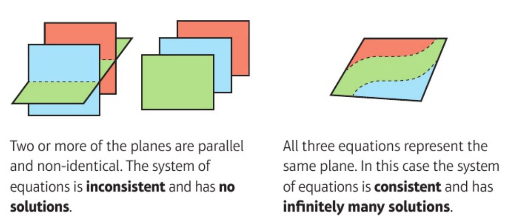
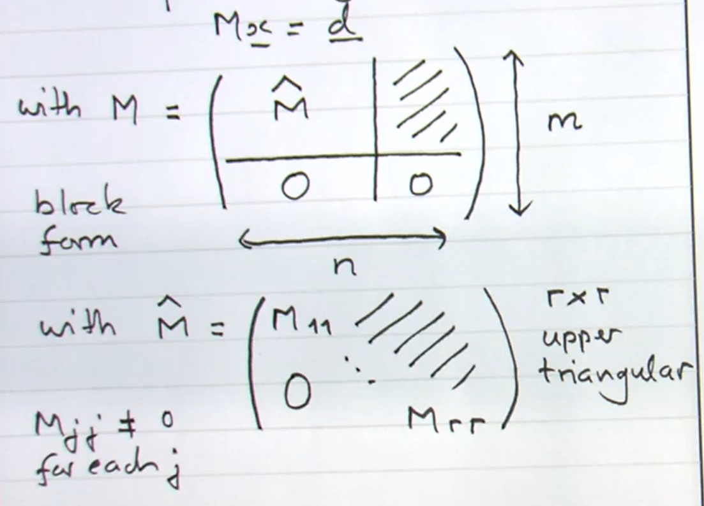

# Determinants and inverses

## Introduction

Consider a linear map 
\begin{align*}
    T : \mathbb{R}^n \to \mathbb{R}^n.
\end{align*} 
If $T$ is invertible then 
\begin{align*}
    \underbrace{\ker T = \{ \underline{0} \}}_\text{because $T$ is one-to-one} \text{ and } \underbrace{\operatorname{Im} T = \mathbb{R}^n}_\text{$T$ is onto}.
\end{align*}
These conditions are equivalent by rank-nullity theorem \@ref(thm:rank).
Conversely, if these conditions hold, then 
\begin{align*}
    \underline{e}_1' &= T(\underline{e}_1), \dots, \underline{e}_n' = T(\underline{e}_n) \\
\end{align*} is a basis (where $\{ \underline{e}_i \}$ is the standard basis) and we can define a linear map $T^{-1}$ by $T^{^-1}(\underline{e}_1') = \underline{e}_1, \dots, T^{-1}(\underline{e}_n') = \underline{e}_n$.

How can we test whether the conditions holds from matrix $M$ representing $T:$ $T(\underline{x}) = M \underline{x}$ and how can we find $M^{-1}$ when they do hold?

For any $M$ ($n \times n$) we will define a related matrix $\widetilde{M}$ ($n \times n$) and a scalar, the *determinant* $\det M$ or $| M |$ such that 
\begin{align}
    \widetilde{M} M = (\det M )I (\#eq:inverse)
\end{align}
Then if $\det M \neq 0$, $M$ is invertible with 
\begin{align*}
    M^{-1} = \frac{1}{\det M} \widetilde{M}.
\end{align*} 

*For $n = 2$* we found in [Matrix Inverses] that \@ref(eq:inverse) holds with 
\begin{align*}
    M &= \begin{pmatrix}
    M_{11} & M_{12} \\
    M_{21} & M_{22}
    \end{pmatrix} \text{ and } \widetilde{M} = \begin{pmatrix}
    M_{22} & -M_{12} \\
    -M_{21} & M_{11}
    \end{pmatrix} \\
    \det M &= \begin{vmatrix}
    M_{11} & M_{12} \\
    M_{21} & M_{22}
    \end{vmatrix} = M_{11} M_{22} - M_{12} M_{21} \\
    &= [M \underline{e}_1, M \underline{e}_2] \\
    &= [\underline{C}_1 (M), \underline{C}_2 (M)] \\
    &= \epsilon_{ijk} M_{i1} M_{j2}
\end{align*}
The factor by which areas are scaled under $M$
\begin{align*}
    \det M \neq 0 &\iff \{ M \underline{e}_1, M \underline{e}_2 \} \text{ are linearly independent} \\
    &\iff \operatorname{Im}(M) = \mathbb{R}^2
\end{align*} 

*For $n = 3$* consider similarly
\begin{align*}
    [M \underline{e}_1, M \underline{e}_2, M \underline{e}_3]& \text{ (scalar triple product)} \\
    &= [\underline{C}_1 (M), \underline{C}_2 (M), \underline{C}_3 (M)] \\
    &= \epsilon_{ijk} M_{i1} M_{j2} M_{k3} \\
    &= \det M, \text{ defn for $n = 3$}.
\end{align*} 
This is the factor by which volumes are scaled under $M$ and
\begin{align*}
    \det M \neq 0 &\iff  [M \underline{e}_1, M \underline{e}_2, M \underline{e}_3] \text{ are linearly independent} \\
    &\iff \operatorname{Im}(M) = \mathbb{R}^3
\end{align*} 

Now define $\widetilde{M}$ from $M$ using row/ column notation 
\begin{align*}
    \underline{R}_1 (\widetilde{M}) &= \underline{C}_2 (M) \wedge \underline{C}_3 (M) \\
    \underline{R}_2 (\widetilde{M}) &= \underline{C}_3 (M) \wedge \underline{C}_1 (M) \\
    \underline{R}_3 (\widetilde{M}) &= \underline{C}_1 (M) \wedge \underline{C}_2 (M) \\
    \text{and note that} \\
    (\widetilde{M} M)_{ij} &= \underline{R}_i (\widetilde{M}) \cdot \underline{C}_j (M) \\
    &= \underbrace{(\underline{C}_1 (M) \cdot \underline{C}_2 (M) \wedge \underline{C}_3 (M))}_{\det M} \delta_{ij}
\end{align*} 

::: {.example}
\begin{align*}
    M &= \begin{pmatrix}
    1 & 3 & 0 \\
    0 & -1 & 2 \\
    4 & 1 & -1
    \end{pmatrix} \\
    \underline{C}_2 \wedge \underline{C}_3 &= \begin{pmatrix}3 \\-1 \\1\end{pmatrix} \wedge \begin{pmatrix}
    0 \\
    2 \\
    -1
    \end{pmatrix} = \begin{pmatrix}
    -1 \\
    3 \\
    6
    \end{pmatrix} \\
    \underline{C}_3 \wedge \underline{C}_1 &= \begin{pmatrix}
    0 \\
    2 \\
    -1
    \end{pmatrix} \wedge \begin{pmatrix}1 \\0 \\4\end{pmatrix} = \begin{pmatrix}
    8 \\
    -1 \\
    -2
    \end{pmatrix} \\
    \underline{C}_1 \wedge \underline{C}_2 &= \begin{pmatrix}
    1 \\
    0 \\
    4
    \end{pmatrix} \wedge \begin{pmatrix}3 \\-1 \\1\end{pmatrix} = \begin{pmatrix}
    4 \\
    11 \\
    -1
    \end{pmatrix} \\
    \widetilde{M} &= \begin{pmatrix}
    -1 & 3 & 6 \\
    8 & -1 & -2 \\
    4 & 11 & -1
    \end{pmatrix} \\
    \widetilde{M} M &= (\det M) I \text{ where} \\
    \det M &= \underline{C}_1 \cdot \underline{C}_2 \wedge \underline{C}_3 = 23.
\end{align*} 
:::

## $\epsilon$ and Alternating Forms

### $\epsilon$ and Permutation

Recall: a permutation $\sigma$ on the set $\{1, 2, \dots, n \}$ is a bijection from this set to itself, specified by list $\sigma(1), \sigma(2), \sigma(n)$.
Permutation $\sigma$ form a group, the symmetric group $S_n$ of order $n!$. 
The *sign* or *signature* $\epsilon(\sigma) = (-1)^k$ where $k$ is the number of transpositions (two cycles, this is well defined).
The *alternating* or $\epsilon$ symbol in $\mathbb{R}^n$ or $\mathbb{C}^n$ is defined by
\begin{align*}
    \epsilon_{ij \dots l} &= \begin{cases}
        +1 & \text{if } i, j, \dots, l \text{ is an even permutation} \\
        -1 & \text{if } i, j, \dots, l \text{ is an odd permutation} \\
        0 & \text{else}
    \end{cases} \\
    \epsilon(\sigma) &= (-1)^k \text{ with $\sigma$ product of $k$ transpositions} \\
    &= \pm 1.
\end{align*} 
If $\sigma$ is any permutation of $1, 2, \dots, n$ then 
\begin{align*}
    \epsilon_{\sigma(1) \sigma(2) \dots \sigma(n)} &= \epsilon(\sigma).
\end{align*} 

::: {.lemma}
\begin{align*}
    \epsilon_{\sigma(i) \sigma(j) \dots \sigma(l)} = \epsilon(\sigma) \epsilon_{ij \dots l}
\end{align*} 
$\epsilon$ is totally antisymmetric.
:::

::: {.proof}
If $i, j, \dots l$ is *not* a permutation of $1, 2, \dots, n$ then $RHS = LHS = 0$. \
If $i = \rho(1), j = \rho(2), \dots, l = \rho(n)$ for some permutation $\rho$ then
\begin{align*}
    RHS &= \epsilon(\sigma) \epsilon (\rho) = \epsilon (\sigma \rho) = LHS.
\end{align*} 
:::

### Alternating Forms and Linear (In)dependence
 
Given $\underline{v}_1, \dots, \underline{v}_n \in \mathbb{R}^n$ or $\mathbb{C}^n$ (these are $n$ vectors) the *alternating form* combines them to produce a scalar, defined by 
\begin{align*}
    [\underline{v}_1, \underline{v}_2, \dots, \underline{v}_n] &= \epsilon_{ij \dots l}(\underline{v}_1)_i (\underline{v}_2)_j \dots (\underline{v}_n)_l \ \left(\sum \text{ convention}\right) \\
    &= \sum_\sigma \epsilon(\sigma) (\underline{v}_1)_{\sigma(1)} (\underline{v}_2)_{\sigma(2)} \dots (\underline{v}_n)_{\sigma(n)} \ \left[\sum_\sigma \text{ means sum over all } \sigma \in S_n \right]
\end{align*} 

#### Properties
i. *Multilinear* 
\begin{align*}
    [\underline{v}_1, \dots, \underline{v}_{p-1}, \alpha \underline{u} + \beta \underline{w}, \underline{v}_{p+1}, \underline{v}_n] &= \alpha [\underline{v}_1, \dots, \underline{v}_{p-1}, \underline{u}, \underline{v}_{p+1}, \underline{v}_n] + \beta [\underline{v}_1, \dots, \underline{w}, \underline{v}_{p+1}, \underline{v}_n]
\end{align*} 

ii. *Totally antisymmetric*
\begin{align*}
    [\underline{v}_{\sigma(1)}, \underline{v}_{\sigma(2)}, \dots \underline{v}_{\sigma(n)}] &= \epsilon (\sigma) [\underline{v}_1, \underline{v}_2, \dots, \underline{v}_n] 
\end{align*} 

iii. \begin{align*}
    [\underline{e}_1, \underline{e}_2, \dots, \underline{e}_n] = 1
\end{align*} for $\underline{e}_i$ standard basis vectors.

Properties i, ii, iii fix the alternating form, and they also imply iv

iv. If $\underline{v}_p = \underline{v}_q$ for some $p \neq q$ then 
\begin{align*}
    [\underline{v}_1, \dots, \underline{v}_p, \dots, \underline{v}_q, \dots, \underline{v}_n] &= 0
\end{align*} (from ii, exchanging $\underline{v}_p \leftrightarrow \underline{v}_q$ changes sign of alternating from).

v. If $\underline{v}_p = \sum_{i \neq p} \lambda_i \underline{v}_i$ then 
\begin{align*}
    [\underline{v}_1, \dots, \underline{v}_p, \dots, \underline{v}_n] &= 0
\end{align*} (sub in and use i and iv).

::: {.example #fone}
\begin{align*} \require{cancel}
    \text{In } \mathbb{C}^4, \underline{v}_1 &= \begin{pmatrix}i \\0 \\0 \\2\end{pmatrix}, \underline{v}_2 = \begin{pmatrix}0 \\0 \\5i \\0\end{pmatrix}, \\
    \underline{v}_3 &= \begin{pmatrix}3 \\2i \\0 \\0\end{pmatrix}, \begin{pmatrix}0 \\0 \\-i \\1\end{pmatrix} \\
    \implies [\underline{v}_1, \underline{v}_2, \underline{v}_3, \underline{v}_4] &= 5i [\underline{v}_1, \underline{e}_3, \underline{v}_3, \underline{v}_4] \\
    &= 5i [i \underline{e}_1 + \cancel{2 \underline{e}_4}, \underline{e}_3, \cancel{3 \underline{e}_1} + 2i \underline{e}_2, \cancel{-i \underline{e}_3} + \underline{e}_4] \\
    &= (5i \cdot i \cdot 2i) [\underline{e}_1, \underline{e}_3, \underline{e}_2, \underline{e}_4] \\
    &= (- 10 i) \cdot (-1) \\
    &= 10i
\end{align*} (in cancelling, we first cancel $i \underline{e}_3$ as there is another lone $\underline{e}_3$, then the $2\underline{e}_4$ and finally the $3\underline{e}_1$)
:::

Note: properties i and iii follow immediately from definition

::: {.proof name="Property ii"}
\begin{align*}
    [\underline{v}_{\sigma(1)}, \underline{v}_{\sigma(2)}, \dots \underline{v}_{\sigma(n)}] &= \sum_\rho \epsilon (\rho) \underbrace{[\underline{v}_{\sigma(1)}]_{\rho(1)} \dots [\underline{v}_{\sigma(n)}]_{\rho(n)}}_\text{each term can be re-written as: } \text{ ($\sigma$ fixed)} \\
    & [\underline{v}_1]_{\rho \sigma^{-1} (1)} \dots [\underline{v}_n]_{\rho \sigma^{-1} (n)} \\
    &= \sum_\rho \epsilon (\sigma) \epsilon(\rho') [\underline{v}_1]_{\rho'(1)} \dots [\underline{v}_n]_{\rho'(n)} \text{ where } \rho' = \rho \sigma^{-1} \\
    \text{ and } \sum_\rho &\text{ is equivalent to } \sum_{\rho'} \\
    &= \epsilon(\sigma) [\underline{v}_1, \underline{v}_2, \dots, \underline{v}_n]
\end{align*}^[Let $\sigma(x) = 1$, then $[v_{\sigma(x)}]_{\rho(x)} = [v_1]_{\rho(x)} = [v_1]_{\rho \sigma^{-1}(1)}$.]
:::

::: {.proposition}
\begin{align*}
    [\underline{v}_1, \underline{v}_2, \dots, \underline{v}_n] \neq 0 \iff \underline{v}_1, \dots, \underline{v}_n \text{ are linearly independent}.
\end{align*} 
:::

::: {.proof}
$\implies$: \
Use property v.
If $\underline{v}_1, \dots \underline{v}_n$ are linearly dependent then $\sum \alpha_i \underline{v}_i = \underline{0}$ where not all coefficients are zero.
Suppose wlog that $\alpha_p \neq 0$, then express $\underline{v}_p$ as a linear combination of $\underline{v}_i (i \neq p)$ and so
\begin{align*}
    [\underline{v}_1, \underline{v}_2, \dots, \underline{v}_n] = 0.
\end{align*} 

$\Longleftarrow$: \
Note that $\underline{v}_1, \dots, \underline{v}_n$ being linearly independent means that they span (in $\mathbb{R}^n$ or $\mathbb{C}^n$) so we can write the standard basis vectors as 
\begin{align*}
    \underline{e}_i &= A_{ai} \underline{v}_a \text{ for some } A_{ai} \in \mathbb{R} \text{ or } \mathbb{C}. \\
    \text{But then} & \\
    [\underline{e_1}, \dots, \underline{e}_n] &= [A_{a1} \underline{v}_a, A_{b2} \underline{v}_b, \dots, A_{cn} \underline{v}_c] \\
    &= A_{a1} A_{b2} \dots A_{cn} [\underline{v}_a, \underline{v}_b, \dots, \underline{v}_c] \\
    &= A_{a1} A_{b2} \dots A_{cn} \epsilon_{ab \dots c} [\underline{v}_1, \underline{v}_2, \dots, \underline{v}_n] \text{ from property ii} \\
    LHS &= 1 \implies [\underline{v}_1, \underline{v}_2, \dots, \underline{v}_n] \neq 0.
\end{align*}
:::

Example \@ref(exm:fone) are linearly independent.

## Determinants in $\mathbb{R}^n$ and $\mathbb{C}^n$

### Definition

:::{.definition name="Determinant"}
For an $n \times n$ matrix $M$ with columns
\begin{align*}
    \underline{C}_a &= M \underline{e}_a
\end{align*} 
the *determinant* $\det M$ or $|M| \in \mathbb{R}$ or $\mathbb{C}$ is defined by 
\begin{align*}
    \det M &= [\underline{C}_1, \underline{C}_2, \dots, \underline{C}_n] \\
    &= [M \underline{e}_1, M \underline{e}_2, \dots, M \underline{e}_n] \\
    &= \epsilon_{ij \dots l} M_{i1} M_{j2} \dots M_{ln} \\
    &= \sum_\sigma \epsilon(\sigma) M_{\sigma(1) 1} M_{\sigma(2) 2} \dots M_{\sigma(n) n}
\end{align*} 
:::

::: {.proposition name="Transpose Property"}
\begin{align*}
    \det M &= \det M^T \\
    \text{so } \det M &= [\underline{R}_1, \underline{R}_2, \dots, \underline{R}_n] \\
    &= \epsilon_{ij \dots l} M_{1i} M_{2j} \dots M_{nl} \\
    &= \sum_\sigma \epsilon(\sigma) M_{1 \sigma(1)} M_{2 \sigma(2)} \dots M_{n \sigma(n)}
\end{align*} 
:::

::: {.example}
In $\mathbb{R}^3$ or $\mathbb{C}^3$
\begin{align*}
    \det M &= \epsilon_{ijk} M_{i1} M_{j2} M_{k3} \\
    &= M_{11} \begin{vmatrix}
    M_{22} & M_{23} \\
    M_{32} & M_{33}
    \end{vmatrix} - M_{21} \begin{vmatrix}
    M_{12} & M_{13} \\
    M_{32} & M_{33}
    \end{vmatrix} + M_{31} \begin{vmatrix}
    M_{12} & M_{13} \\
    M_{22} & M_{23}
    \end{vmatrix}
\end{align*} 
:::

::: {.properties}
$\det M$ is a function of rows or columns of $M$ that is 

i. multilinear

ii. totally anti-symmetric (or alternating)

iii. $\det I = 1$
:::

::: {.theorem}
\begin{align*}
    \det M \neq 0 &\iff \text{ columns of $M$ are linearly independent} \\
    &\iff \text{ row of $M$ are linearly independent} \\
    &\iff \operatorname{rank} M = n \quad (M \text{ is } n \times n) \\
    &\iff \ker M = \{ \underline{0} \} \\
    &\iff M^{-1} \text{ exists}
\end{align*} 
:::

::: {.proof}
All equivalences follow immediately from earlier results including the discussion in [Introduction].
:::

::: {.proof name="Transpose property"}
Suffices to show 
\begin{align*}
    \sum_\sigma \epsilon(\sigma) M_{\sigma(1) 1} \dots M_{\sigma(n) n} &= \sum_\sigma \epsilon(\sigma) M_{1 \sigma(1)} \dots M_{n \sigma(n)}
\end{align*}
But in a given term on LHS
\begin{align*}
    M_{\sigma(1) 1} \dots M_{\sigma(n) n} &= M_{1 \rho(1)} \dots M_{n \rho(n)}
\end{align*} by reordering factors, where $\rho = \sigma^{-1}$.
Then $\epsilon(\sigma) = \epsilon(\rho)$ and $\sum_\sigma$ is equivalent to $\sum_\rho$, so result follows.
:::

### Evaluating determinants: expanding by rows or columns

For $M$, $n \times n$, for each entry $M_{ia}$ define the *minor* $M^{ia}$ to be the determinant of $(n - 1) \times (n - 1)$ matrix obtained from deleting row $i$ and column $a$ from $M$.

::: {.proposition}
\begin{align*}
    \det M &= \sum_i (-1)^{i + a} M_{ia} M^{ia} \hspace{.5cm} a \text{ fixed} \\
    &= \sum_a (-1)^{i + a} M_{ia} M^{ia} \hspace{.5cm} i \text{ fixed}
\end{align*} called expanding by (or about) column $a$ or row $i$ respectively.
:::

::: {.proof}
See [Cofactors and Determinants].
:::

::: {.example}
\begin{align*}
    M &= \begin{pmatrix}
    i & 0 & 3 & 0 \\
    0 & 0 & 2i & 0 \\
    0 & 5i & 0 & -i \\
    2 & 0 & 0 & 1
    \end{pmatrix}.
\end{align*} Expand by row $3$ to find 
\begin{align*}
    \det M &= \sum_a (-1)^{3 + a} M_{3a} M^{3a} \\
    M_{31} &= M_{33} = 0 \\
    M_{32} &= 5i,\ M^{32} = \begin{vmatrix}
    i & 3 & 0 \\
    0 & 2i & 0 \\
    2 & 0 & 1
    \end{vmatrix} \\
    M_{34} &= -i, M^{34} = \begin{vmatrix}
    i & 0 & 3 \\
    0 & 0 & 2i \\
    2 & 0 & 0
    \end{vmatrix} \\
    M^{32} &= i \begin{vmatrix}2i & 0 \\0 & 1\end{vmatrix} - 3 \begin{vmatrix}
    0 & 0 \\
    2 & 1
    \end{vmatrix} \text{ (row 1)} \\
    &= i (2i) \\
    &= -2 \\
    M_{34} &= i \begin{vmatrix}
    0 & 2i \\
    0 & 0
    \end{vmatrix} + 3 \begin{vmatrix}
    0 & 0 \\
    2 & 0
    \end{vmatrix} \text{ (row 1)}\\
    &= 0 \\
    \det M &= (-1)^{3 + 2} 5i (-2) \\
    &= 10i \\
    \textit{or } \text{expand by column 2}: \\
    \det M &= \sum_i (-1)^{2 + i} M_{i2} M^{i2} \\
    &= (-1)^{2 + 3} M_{32} M^{32} \\
    &= 10i.
\end{align*} 
(Calculated this previously as example of alternating form in $\mathbb{C}^4$)
:::

::: {.lemma #block}
If $M = \left(
    \begin{array}{c|c} 
      A & O \\ 
      \hline 
      O & I 
    \end{array} \right)$ 
block form with $A$ a $r \times r$ matrix; $I \ (n - r) \times (n - r)$ identity, then $\det M = \det A$.
:::

::: {.proof}
For $r = n - 1$, result follows by expanding about column $n$ or row $n$, and for $r < n - 1$, continue process.
:::

### Simplifying determinants: Row and Column Operations:

From the definitions of $\det M$ in terms of columns (a) or rows (i) and the properties above (including [Alternating Forms and Linear (In)dependence]) we note the following

#### Row or column Scalings

If $\underline{R}_i \mapsto \lambda \underline{R}_i$ for some (fixed) $i$ \
or $\underline{C}_i \mapsto \lambda \underline{C}_i$ for some (fixed) $a$ \
then $\det M \mapsto \lambda \det M$.

If *all* rows or columns are scaled
\begin{align*}
    M &\mapsto \lambda M, \\
    \text{then } \det M &\mapsto \lambda^n \det M
\end{align*} 

#### Row or column Operations

If $\underline{R}_i \mapsto \underline{R}_i + \lambda \underline{R}_j$ for $i \neq j$ \
or $\underline{C}_a \mapsto \underline{C}_a + \lambda \underline{C}_b$ for $a \neq b$ \
then $\det M \mapsto \det M$ as we can use multilinearity and then we have two rows being the same in one term so its 0.

#### Row or Column Exchanges

\begin{align*}
    \text{If } \underline{R}_i &\leftrightarrow \underline{R}_j \hspace{0.5cm} \text{for } i \neq j \\
    \text{If } \underline{C}_a &\leftrightarrow \underline{C}_b \hspace{0.5cm} \text{for } a \neq b \\
    \text{then } \det M &\mapsto -\det M.
\end{align*} 

::: {.example #exchanges}
\begin{align*}
    A &= \begin{pmatrix}
    1 & 1 & a \\
    a & 1 & 1 \\
    1 & a & 1
    \end{pmatrix},\ a \in \mathbb{C} \\
    \underline{C}_1 &\mapsto \underline{C}_1 - \underline{C}_3 \\
    \det A &= \det \begin{pmatrix}
    1 - a & 1 & a \\
    a - 1 & 1 & 1 \\
    0 & a & 1
    \end{pmatrix} \\
    &= (1 - a) \det \begin{pmatrix}
    1 & 1 & a \\
    -1 & 1 & 1 \\
    0 & a & 1
    \end{pmatrix} \\
    \underline{C}_2 &\mapsto \underline{C}_2 - \underline{C}_3 \\
    \det A &= (1 - a) \det \begin{pmatrix}
    1 & 1-a & a \\
    -1 & 0 & 1 \\
    0 & a-1 & 1
    \end{pmatrix} \\
    &= (1 - a)^2 \det \begin{pmatrix}
    1 & 1 & a \\
    -1 & 0 & 1 \\
    0 & -1 & 1
    \end{pmatrix} \\
    \underline{R}_1 &\mapsto \underline{R}_1 + \underline{R}_2 + \underline{R}_3 \\
    \det A &= (1 - a)^2 \det \begin{pmatrix}
    0 & 0 & a + 2 \\
    -1 & 0 & 1 \\
    0 & -1 & 1
    \end{pmatrix} \\
    &= (1 - a)^2 (a + 2) \begin{vmatrix}
    -1 & 0 \\
    0 & -1
    \end{vmatrix} \\
    &= (1 - a)^2 (a + 2)
\end{align*} 
:::

### Multiplicative Property

::: {.theorem}
For $n \times n$ matrices $M$ and $N$
\begin{align*}
    \det (MN) = \det M \det N
\end{align*}  
This is based on the following lemma
:::

::: {.lemma}
\begin{align*}
    \epsilon_{i_1 \dots i_n} M_{i_1 a_1} \dots M_{i_n a_n} &= (\det M) \epsilon_{a_1 \dots a_n}
\end{align*} 
:::

:::{.proof name="Proof of Theorem"}
\begin{align*}
    \det (MN) &= \epsilon_{i_1 \dots i_n} (MN)_{i_1 1} \dots (MN)_{i_n n} \\ 
    &= \epsilon_{i_1 \dots i_n} M_{i_1 k_1} N_{k_1 1} \dots  M_{i_n k_n} N_{k_n n} \\ 
    &= \epsilon_{i_1 \dots i_n} M_{i_1 k_1} \dots  M_{i_n k_n} N_{k_1 1} \dots N_{k_n n} \\ 
    &= (\det M)  \epsilon_{k_1 \dots k_n} N_{k_1 1} \dots N_{k_n n} \text{by lemma } \\
    &= (\det M) (\det N)
\end{align*}  
:::

:::{.proof name="Proof of Lemma"}
Use total antisymmetry of LHS and RHS and then check taking $a_1 = 1, \dots, a_n = n$.
:::

::: {.example}

\

i. If $M = \left(
    \begin{array}{c|c} 
      A & O \\ 
      \hline 
      O & B 
    \end{array} \right)$ 
block form, with $A$ $r \times r$ and $B$ $(n - r) \times (n - r)$ then $\det M = \det A \det B$.
Since $\left(
    \begin{array}{c|c} 
      A & O \\ 
      \hline 
      O & B 
    \end{array} \right) = \left(
    \begin{array}{c|c} 
        A & O \\ 
        \hline 
        O & I 
    \end{array} \right) \left(
    \begin{array}{c|c} 
        I & O \\ 
        \hline 
        O & B 
    \end{array} \right)$
and we can use Lemma \@ref(lem:block) above.

ii. \begin{align*}
    M^{-1}M &= I \implies \det(M^{-1}) \det M = \det I = 1 \\
    \text{so } \det(M^{-1}) &= (\det M)^{-1}
\end{align*} 

iii. For $R$ real and orthogonal,
\begin{align*}
    R^T R &= I \implies \det(R^T) \det R = (\det R)^2 = 1 \\
    \implies \det R &= \pm 1
\end{align*} 

iv. For $U$ complex and unitary,
\begin{align*}
    U^\dagger U = I &\implies \det(U^\dagger) \det U \\
    &= \overline{\det(U)} \det(U) \\
    &= |\det U|^2 = 1 \\
    \implies |\det U| &= 1.
\end{align*} 
:::

## Minors, Cofactors and Inverses

### Cofactors and Determinants

Consider column $\underline{C}_a$ of matrix $M$ ($a$ fixed) and write $\underline{C}_a = \sum_i M_{ia} \underline{e}_i$ in definition of $\det$:
\begin{align*}
    \det M &= [\underline{C}_1, \dots, \underline{C}_{a - 1}, \underline{C}_a, \underline{C}_{a + 1}, \dots, \underline{C}_n] \\
    &= [\underline{C}_1, \dots, \underline{C}_{a - 1}, \sum_i M_{ia} \underline{e}_i, \underline{C}_{a + 1}, \dots, \underline{C}_n] \\
    &= \sum_i M_{ia} \Delta_{ia} \hspace{0.5cm} \text{(no sum over $a$)} \\
    \text{where the } &\textit{cofactor } \Delta_{ia} \text{ is defined by} \\
    \Delta_{ia} &= [\underline{C}_1, \underline{C}_2, \dots, \underline{C}_{a- 1}, \underline{e}_i, \underline{C}_{a + 1}, \dots, \underline{C}_n] \\
    &= \det \left( \begin{array}{c|c|c} 
        A & \begin{array}{c} 
            0 \\  
            \vdots \\
            0
        \end{array} & B \\ 
        \hline 
        \begin{array}{ccc} 
            0 & \dots & 0
        \end{array} & 1 & \begin{array}{ccc} 
            0 & \dots & 0
        \end{array} \\
        \hline
        C & \begin{array}{c} 
            0 \\  
            \vdots \\
            0
        \end{array} & D
    \end{array} \right) \\
    &= (-1)^{n - a} (-1)^{n - i} \det 
    \left(
    \begin{array}{c|c} 
        \begin{array}{c|c} 
            A & B \\ 
            \hline 
            C & D 
        \end{array} & \begin{array}{c} 
            0 \\  
            \vdots \\
            0
        \end{array} \\ 
        \hline 
        \begin{array}{ccc} 
            0 & \dots & 0
        \end{array} & 1
    \end{array} \right) \\
    &= (-1)^{a + i} M^{i a} \\
    \text{where } M^{ia} &= \det \left( \begin{array}{c|c} 
        A & B \\ 
        \hline 
        C & D 
    \end{array} \right) \text{by lemma } \\
    \therefore \det M &= \sum_i M_{ia} \Delta_{ia} \\
    &= \sum_i M_{ia} (-1)^{i + a} M^{ia}
\end{align*}[Similarly, considering row $i$, find other expression]. \@ref(lem:block).
To get $\Delta_{ia}$ we subtract column $a$ with all other columns to get the row $i$ as shown.

### Adjugates and Inverses

Reasoning as in [Cofactors and Determinants] with $\underline{C}_b = \sum_i M_{ib} \underline{e}_i$
\begin{align*}
    [\underline{C}_1, \dots, \underline{C}_{a - 1}, \underline{C}_b, C_\underline{a + 1}, \dots, \underline{C_n}] &= \sum_i M_{ib} \Delta_{ia} \\
    &= \begin{cases}
        \det M & \text{if } a = b \\
        0 & \text{if } a \neq b
    \end{cases} \\
    \text{Hence } \sum_i M_{ib} \Delta_{ia} &= \delta_{ab} \det M \\
    \text{And similarly} \sum_a M_{ja} \Delta_{ia} &= \delta_{ij} \det M.
\end{align*} 
Let $\Delta$ be the *matrix* of cofactors with entries $\Delta_{ia}$, and define the *adjugate* $\widetilde{M} = \operatorname{adj}(M) = \Delta^T$.
Then the relations above become
\begin{align*}
    \Delta_{ia} M_{ib} &= (\Delta^T)_{ai} M_{ib} \\
    &= (\Delta^T M)_{ab} \\
    &= (\widetilde{M} M)_{ab} \\
    &= \delta_{ab} \det M \\
    M_{ja} \Delta_{ia} &= (\widetilde{M} M)_{ji} \\
    &= \delta_{ij} \det M.
\end{align*} 
This justifies \@ref(eq:inverse) with
\begin{align*}
    \widetilde{M} &= \Delta^T \\
    \Delta_{ia} &= (-1)^{i + a} M^{ia} \\
    \text{we have } \widetilde{M}M &= M \widetilde{M} = (\det M) I.
\end{align*}^[Would probably be guided through this proof in an exam and even then probably wouldn't come up.]

Hence if $\det M \neq 0$ then $M$ is invertible and 
\begin{align*}
    M^{-1} = \frac{1}{\det M} \widetilde{M}.
\end{align*} 

::: {.example #inverse}
Consider \begin{align*}
    A &= \begin{pmatrix}
    1 & 1 & a \\
    a & 1 & 1 \\
    1 & a & 1
    \end{pmatrix},\ a \in \mathbb{C}, \\
\end{align*} previously found in Example \@ref(exm:exchanges) $\det A = (1 - a)^2 (a + 2)$.
Hence $A^{-1}$ exists if $a \neq 1$, $a \neq - 2$.

Matrix of cofactors is \begin{align*}
    \Delta &= \begin{pmatrix}
    1 - a & 1 - a & a^2 - 1 \\
    a^2 -1 & 1 - a & 1 - a \\
    1 - a & a^2 - 1 & 1 - a
    \end{pmatrix} \\
    \text{e.g. } A^{12} &= \begin{vmatrix}
    a & 1 \\
    1 & 1
    \end{vmatrix} \\
    &= a - 1 \\
    \Delta_{12} &= (-1)^{1 + 2} A^{12} \\
    &= 1 - a \\
    \widetilde{A} &= \Delta^T \\
    A^{-1} &= \frac{1}{\det A} \widetilde{A} \\
    &= \frac{1}{(1 -a) ( a + 2)} \begin{pmatrix}
    1 & -(1 + a) & 1 \\
    1 & 1 & - (1 + a) \\
    - (1 + a) & 1 & 1
    \end{pmatrix}.
\end{align*} 
:::

## System of Linear Equations

### Introduction and Nature of Solutions

Consider a system of $n$ linear equations in $n$ unknowns $x_i$ written in vector/ matrix form
\begin{align*}
    A \underline{x} &= \underline{b}, \hspace{0.5cm} \underline{x}, \underline{b} \in \mathbb{R}^n \text{ and } A \ n \times n \text{ matrix} \\
    \text{i.e. } A_{11} x_1 + \dots + A_{1n} x_n &= b_1 \\
    &\;\;\vdots \\
    A_{n1} x_1 + \dots + A_{nn} x_n &= b_n
\end{align*} 

There are three possibilities:

i. $\det A \neq 0 \implies A^{-1}$ exists $\implies$ unique solution, $\underline{x} = A^{-1} \underline{b}$

ii. $\det A = 0$ and $\underline{b} \notin \operatorname{Im} A \implies$ no solution.

iii. $\det A = 0$ and $\underline{b} \in \operatorname{Im} A \implies \infty$ many solutions. 

*Elaboration*: a solution exists iff $A \underline{x}_0 = \underline{b}$ for some $\underline{x}_0 \iff \underline{b} \in \operatorname{Im} A$.
Then $\underline{x}$ is also a solution iff $\underline{u} = \underline{x} - \underline{x}_0$ satisfies
\begin{align*}
    A \underline{u} &= \underline{0} \textit{ homogenous problem}. \\
    \text{Now } \det A \neq 0 &\iff \operatorname{Im} A = \mathbb{R}^n \\
    &\iff \ker A = \{ \underline{0} \}.
\end{align*} 
So in (i) there is a unique solutions and it can be found using $A^{-1}$.
\begin{align*}
    \text{But } \det A = 0 &\iff \operatorname{rank} A < n \\
    &\iff \operatorname{null} A > 0
\end{align*} 
and then either $\underline{b} \notin \operatorname{Im} A$ as in case (ii) or $\underline{b} \in \operatorname{Im} A$ as in case (iii).
If $\underline{u}_1, \dots, \underline{u}_k$ is a basis for $\ker A$ then general solution of homogenous problem is $\underline{u} = \sum_{i=1}^{k} \lambda_i \underline{u}_i$.

::: {.example}
$A \underline{x} = \underline{b}$ with $A$ as in Example \@ref(exm:inverse) and $\underline{b} = \begin{pmatrix}1 \\c \\1\end{pmatrix}$, $a, c \in \mathbb{R}$.

- $a \neq 1, -2$ \
Then $A^{-1}$ exists and we have a solutions for any $c$:
\begin{align*}
    \underline{x} &= A^{-1} \underline{b} \\
    &= \frac{1}{(1- a)(a + 2)} \begin{pmatrix}2 - c - ca \\c - a \\c - a \end{pmatrix}
\end{align*} 

- $a = 1$,
\begin{align*}
    A &= \begin{pmatrix}1 & 1 & 1 \\1 & 1 & 1 \\1 & 1 & 1\end{pmatrix} \\
    \operatorname{Im} A &= \left\{ \lambda \begin{pmatrix}1 \\1 \\1\end{pmatrix} \right\} \\
    \ker A &= \operatorname{span} \left\{ \begin{pmatrix}-1 \\1 \\0\end{pmatrix}, \begin{pmatrix}-1 \\0 \\1\end{pmatrix} \right\} \\
    b &\in \operatorname{Im} A \iff c = 1; \\
    \text{particular solution } \underline{x}_0 &= \begin{pmatrix}1 \\0 \\0\end{pmatrix} \\
    \text{general solution } \underline{x} &= \underline{x}_0 + \underline{u} \\
    &= \begin{pmatrix}1 - \lambda - \mu \\ \lambda \\ \mu \end{pmatrix} \\
\end{align*} This is case (iii), and forms a plane of solutions.
For $a = 1, c \neq 1$ we have no solutions - case (ii).

- $a = -2$
\begin{align*}
    A &= \begin{pmatrix}
    1 & 1 & -2 \\
    -2 & 1 & 1 \\
    1 & -2 & 1
    \end{pmatrix} \\
    \operatorname{Im} A &= \operatorname{span} \left\{ \begin{pmatrix}1 \\-2 \\1\end{pmatrix}, \begin{pmatrix}1 \\1 \\-2\end{pmatrix} \right\} \\
    \ker A &= \left \{ \lambda \begin{pmatrix}1 \\1 \\1\end{pmatrix} \right \} \\
    \underline{b} &\in \operatorname{Im} A \iff c = 2, \text{ (case (iii))} \\
    \text{particular solution } \underline{x}_0 &= \begin{pmatrix}1 \\0 \\0\end{pmatrix} \\
    \text{general solution } \underline{x} &= \underline{x}_0 + \underline{u} \\
    &= \begin{pmatrix}1 + \lambda \\ \lambda \\ \lambda \end{pmatrix} \\
\end{align*} If $c \neq 2$, no solution, case (ii).
:::

### Geometric Interpretation in $\mathbb{R}^3$

Let $\underline{R}_1, \underline{R}_2, \underline{R}_3$ be rows of $A$ ($3 \times 3$).

\begin{align*}
    A \underline{u} = \underline{0} \iff \begin{cases}
        \underline{R}_1 \cdot \underline{u} = 0 \\
        \underline{R}_2 \cdot \underline{u} = 0 \\
        \underline{R}_3 \cdot \underline{u} = 0 
    \end{cases} \text{planes through $\underline{0}$, normals $\underline{R}_i (\neq \underline{0})$}
\end{align*} 
So solutions of homogenous problem (finding $\ker A$) is given by intersection of these planes.

- $\operatorname{rank}(A) = 3 \implies$ normals are linearly independent and planes intersect in $\underline{0}$.

- $\operatorname{rank}(A) = 2 \implies$ normals span a plane and planes intersect in a line and $\dim \ker A = 1$.
```{r 05-sheaf, echo = FALSE, fig.cap = "looking *along* line of intersection of planes. LEFT: The line comes out of the image.", fig.align="center", out.height="300"} 
 
```

- $\operatorname{rank}(A) = 1 \implies$ normals are parallel and planes coincide and $\dim \ker A = 2$
```{r 05-rank-1, echo = FALSE, fig.cap = "Three identical planes", fig.align="center", out.width="500"} 
 
```

Now consider instead 
\begin{align*}
    A \underline{x} &= \underline{b} \iff \begin{cases}
        \underline{R}_1 \cdot \underline{x} = b_1 \\
        \underline{R}_2 \cdot \underline{x} = b_2 \\
        \underline{R}_3 \cdot \underline{x} = b_3 
    \end{cases}
\end{align*} planes with normals $\underline{R}_i$ but not passing through $\underline{0}$ unless $b_i = 0$.

- $\operatorname{rank}(A) = 3 \iff \det A \neq 0$, normals are linearly independent; planes intersect in a point and get unique solution for any $b$.

- $\operatorname{rank}(A) = 2 \implies$ planes may intersect in a line (as in homogenous case) *but* they may not:
```{r 05-prism, echo = FALSE, fig.cap = "No solutions", fig.align="center", out.height="300"} 
knitr::include_graphics("figures/05-prism.png") 
```

- $\operatorname{rank}(A) = 1 \implies$ planes may coincide (as in homogenous case) *but* they may not:
```{r 05-parallel, echo = FALSE, fig.cap = "Three parallel or two identical and another parallel", fig.align="center", out.height="300"} 
 
```

```{r 05-R3-solutions-1, echo = FALSE, fig.cap = "", fig.align="center", out.height="300"} 
knitr::include_graphics("figures/05-R3-solutions-1.png") 
```

```{r 05-R3-solutions-2, echo = FALSE, fig.cap = "", fig.align="center", out.height="300"} 
 
```

### Gaussian Elimination and Echelon Form

Consider $A \underline{x} = \underline{b}$ with $\underline{x} \in \mathbb{R}^n$, $\underline{b} \in R^m$ and $A \ m \times n$ matrix.\
Gaussian elimination is a direct approach to solving system of equations:
\begin{align*}
    A_{11} x_1 + \dots + A_{1n} x_n &= b_1 \\
    &\;\;\vdots \\
    A_{m1} x_1 + \dots + A_{mn} x_n &= b_m
\end{align*} 

*Example*

\begin{align*} 
    3 x_1 + 2 x_2 + x_3 &= b_1 (\#eq:gauss-1) \\
    6 x_1 + 3 x_2 + 3 x_3 &= b_2 (\#eq:gauss-2) \\
    6 x_1 + 2 x_2 + 4 x_3 &= b_3 (\#eq:gauss-3)
\end{align*} 

Steps

1. subtract multiples of \@ref(eq:gauss-1) from \@ref(eq:gauss-2) and \@ref(eq:gauss-3) to eliminate $x_1$
\begin{align*}
    0 - x_2 + x_3 &= b_2 - 2 b_1 (\#eq:gauss-22) \\
    0 - 2 x_2 + 2 x_3 &= b_3 - 2 b_1 (\#eq:gauss-32)
\end{align*} 

2. repeat this using \@ref(eq:gauss-22) to eliminate $x_2$ from \@ref(eq:gauss-32):
\begin{align*}
    0 + 0 + 0 &= b_3 - 2 b_2 + 2 b_1 (\#eq:gauss-33)
\end{align*} 
Now consider new system \@ref(eq:gauss-1), \@ref(eq:gauss-22), \@ref(eq:gauss-33).

- $b_3 - 2 b_2 + 2 b_1 \neq 0 \implies$ no solutions

- $b_3 - 2 b_2 + 2 b_1 = 0 \implies \infty$ solutions, $x_3$ is arbitrary and then $x_2$ and $x_1$ determined from \@ref(eq:gauss-1), \@ref(eq:gauss-22).

In general case we aim to carry out steps as in example until we obtain an equivalent system
```{r 05-replace, echo = FALSE, fig.cap = "", fig.align="center", out.width="500"} 
 
```
$M$ is obtained from $A$ by row operations including row exchanges and column exchanges which relabel variables $x_i$.

Note $x_{r + 1}, \dots, x_n$ are undetermined \
$d_{r + 1}, \dots, d_m = 0$ else no solution \
and if this is satisfied then $x_1, \dots, x_r$ can be determined successively.\
$r = \operatorname{rank} M = \operatorname{rank} A$.\
If $n = m$ then $\det A = \pm det M$ and if $r = n = m$ then $\det M = M_{11} \dots M_{rr} \neq 0 \implies A$ and $M$ are invertible. \
$M$ as above is an example of *echelon form*.