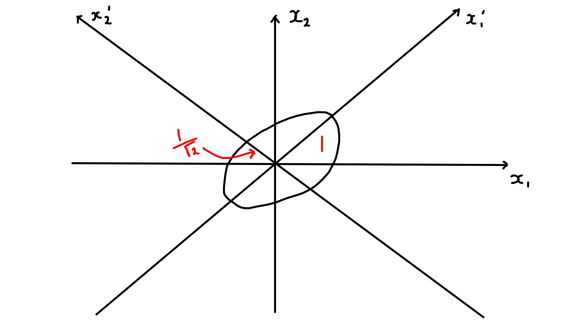

# Eigenvalues and Eigenvectors

## Introduction

### Definitions

::: {.definition name="Eigenvector and eigenvalue"}
For a linear map $T : V \to V$ ($V$ a real vector or complex vector space) a vector $\underline{v} \in V$ with $\underline{v} \neq \underline{0}$ is an *eigenvector* of $T$ with eigenvalue $\lambda$ if \begin{align*}
    T(\underline{v}) = \lambda \underline{v}.
\end{align*}
:::

If $V = \mathbb{R}^n$ or $\mathbb{C}^n$ and $T$ is given by an $n \times n$ matrix $A$ then
\begin{align*}
    A \underline{v} = \lambda \underline{v} \iff  (A - \lambda I) \underline{v} = \underline{0}
\end{align*} and for a given $\lambda$ this holds for some $\underline{v} \neq 0 \iff \det(A - \lambda I) = 0$, the *characteristic equation*, i.e. $\lambda$ is an eigenvalue iff it is a root of $\chi_A (t) = \det (A - tI)$, the *characteristic polynomial*.
$\chi_A (t)$ is a polynomial of degree $n$ for $A$ ($n \times n$).
We find eigenvalues as roots of the characteristic equation/ polynomial and then determine corresponding eigenvectors.

### Examples

::: {.example}
\begin{align*}
    V &= \mathbb{C}^2 \text{ and } A = \begin{pmatrix}
    2 & i \\
    -i & 2
    \end{pmatrix} \\
    \det (A - \lambda I) &= \begin{vmatrix}
    2 - \lambda & i \\
    -i & 2 - \lambda
    \end{vmatrix} \\
    &= (2 - \lambda)^2 - 1 \\
    &= 0 \iff \lambda = 1 \text{ or } 3.
\end{align*}
To find eigenvectors $\underline{v} = \begin{pmatrix}v_1 \\v_2\end{pmatrix}$:

- $\lambda = 1$:
\begin{align*}
    (A - I) \underline{v} &= \begin{pmatrix}
        1 & i \\
        -i & 1
        \end{pmatrix} \begin{pmatrix}v_1 \\v_2\end{pmatrix} = \underline{0} \\
    \implies \underline{v} &= \alpha \begin{pmatrix}1 \\i\end{pmatrix} \text{ any } \alpha \neq 0
\end{align*}

- $\lambda = 3$:
\begin{align*}
    (A - 3I) \underline{v} &= \begin{pmatrix}
        -1 & i \\
        -i & -1
        \end{pmatrix} \begin{pmatrix}v_1 \\v_2\end{pmatrix} = \underline{0} \\
    \implies \underline{v} &= \beta \begin{pmatrix}1 \\ -i\end{pmatrix} \text{ any } \beta \neq 0
\end{align*}
:::

::: {.example}
\begin{align*}
    V &= \mathbb{R}^2 \text{ and } A = \begin{pmatrix}
    1 & 1 \\
    0 & 1
    \end{pmatrix} \\
    \det (A - \lambda I) &= \begin{vmatrix}
    1 - \lambda & 1 \\
    0 & 1 - \lambda
    \end{vmatrix} \\
    &= (1 - \lambda)^2\\
    &= 0 \iff \lambda = 1.
\end{align*}
To find eigenvectors $\underline{v} = \begin{pmatrix}v_1 \\v_2\end{pmatrix}$:

\begin{align*}
    (A - I) \underline{v} &= \begin{pmatrix}
        0 & 1 \\
        0 & 0
        \end{pmatrix} \begin{pmatrix}v_1 \\v_2\end{pmatrix} = \underline{0} \\
    \implies \underline{v} &= \alpha \begin{pmatrix}1 \\ 0\end{pmatrix} \text{ any } \alpha \neq 0
\end{align*}
:::

::: {.example #sone}
\begin{align*}
    V &= \mathbb{R}^2 \text{ or } \mathbb{C}^2\\
    U &= \begin{pmatrix}
    \cos \theta & - \sin \theta \\
    \sin \theta & \cos \theta
    \end{pmatrix} \\
    \chi_U (t) &= \det (U - t I) \\
    &= t^2 - 2t \cos \theta + 1 \\
    \implies \lambda &= e^{\pm i \theta} \\
    \implies \underline{v} &= \theta \begin{pmatrix}1 \\ \mp i\end{pmatrix} \ (\alpha \neq 0 )
\end{align*}
:::

### Deductions involving $\chi_A(t)$

For $A$ $n \times n$, characteristic polynomial has degree $n$
\begin{align*}
    \chi_A(t) &= \det \begin{pmatrix}
    A_{11} - t & A_{12} & \dots & A_{1n} \\
    A_{21} & A_{22} - t & \dots & A_{2n} \\
    \vdots & \vdots & \ddots & \vdots \\
    A_{n1} & A_{n2} & \dots & A_{nn} - t
    \end{pmatrix} \\
    &= \sum_{j=0}^{n} c_j t^j, \text{ for some } c_j \in \mathbb{C} \\
    &= (-1)^n (t - \lambda_1) \dots (t - \lambda_n)
\end{align*}^[$(-1)^n$ factor appears as $t_n$ has coefficient $(-1)^n$ in $\chi_A(t)$ as you only get $t^n$ from $(-t)^n$.]

i. $\exists$ at least one eigenvalue (one root of $\chi_A$); in fact $\exists$ $n$ roots counted with multiplicity (FTA).

ii. $\operatorname{tr}(A) = A_{ii} = \sum_i \lambda_i$, sum of eigenvalues, by comparing terms of order $n - 1$ in $t$.^[To get a $t^{n - 1}$ we need $n - 1$ terms on the diagonal, but the last term needs to be a different row and column to the rest by definition of the determinant, so it will be the remaining element on the diagonal.]

iii. $\det A = \chi_A(0) = \Pi_i \lambda_i$, product of eigenvalues.

iv. If $A$ is diagonal:
\begin{align*}
    A = \begin{pmatrix}
    \lambda_1 & & \\
    & \ddots & \\
    & & \lambda_n
    \end{pmatrix}
\end{align*} with the diagonal entries being the eigenvalues; (ii) and (iii) are then immediate.

v. If $A$ is real, then coefficients $c_j$ are real and $\chi_A(\lambda) = 0 \iff \chi_A(\overline{\lambda}) = 0$: non-real roots occur in conjugate pairs.

## Eigenspaces and Multiplicities

### Definitions

::: {.definition name="Eigenspace"}
For an eigenvalue $\lambda$ of matrix $A$, define the *eigenspace*
\begin{align*}
    E_\lambda = \{ \underline{v} : A \underline{v} = \lambda \underline{v}\} = \ker (A - \lambda I),
\end{align*} this is the subspace consisting of the eigenvectors and $\underline{0}$.
:::

::: {.definition name="Geometric multiplicity"}
The *geometric multiplicity*
\begin{align*}
    m_\lambda = \dim E_\lambda = \operatorname{null}(A - \lambda I),
\end{align*} the number of linearly independent eigenvectors with eigenvalue $\lambda$.
:::

::: {.definition name="Algebraic multiplicity"}
The *algebraic multiplicity* $M_\lambda$ is the multiplicity of $\lambda$ as a root of $\chi_A$, i.e. $\chi_A(t) = (t-\lambda)^{M_\lambda} f(t)$ (with $f(\lambda) \neq 0$).
:::

::: {.proposition}
\begin{align*}
    M_\lambda \geq m_\lambda
\end{align*}
Further discussion in 6.3.
:::

### Examples

:::{.example}

\

i. \begin{align*}
    A &= \begin{pmatrix}
    -2 & 2 & -3 \\
    2 & 1 & -6 \\
    -1 & -2 & 0
    \end{pmatrix} \\
    \chi_A(t) &= \det (A - tI) \\
    &= (5 - t) (t + 3)^2 \\
    \text{roots } \lambda &= 5, - 3 \\
    M_5 &= 1, M_{-3} = 2. \\ \\
    \underline{\lambda = 5:} \\
    (A - 5I)\underline{x} &= \begin{pmatrix}
    -7 & 2 & -3 \\
    2 & -4 & -6 \\
    -1 & -2 & -5
    \end{pmatrix}\begin{pmatrix}x_1 \\x_2 \\x_3\end{pmatrix} = \underline{0} \\
    \implies E_5 &= \left\{ \alpha \begin{pmatrix}1 \\2 \\-1\end{pmatrix} \right\} \\ \\
    \underline{\lambda = -3:} \\
    (A + 3I)\underline{x} &= \begin{pmatrix}
    1 & 2 & -3 \\
    2 & 4 & -6 \\
    -1 & -2 & 3
    \end{pmatrix}\begin{pmatrix}x_1 \\x_2 \\x_3\end{pmatrix} = \underline{0} \\
    \text{Solve to find} \\
    \underline{x} &= \begin{pmatrix}-2 x_1 + 3 x_3 \\x_2 \\x_3\end{pmatrix} \\
    \implies E_{-3} &= \left\{ \alpha \begin{pmatrix}-2 \\1 \\0\end{pmatrix} + \beta \begin{pmatrix}3 \\0 \\1\end{pmatrix} \right\} \\ \\
    m_5 &= \dim E_5 = 1 = M_5 \\
    m_{-3} &= \dim E_{-3} = 2 = M_{-3}
\end{align*}

ii. \begin{align*}
    A &= \begin{pmatrix}
    -3 & -1 & 1 \\
    -1 & -3 & 1 \\
    -2 & -2 & 0
    \end{pmatrix} \\
    \chi_A(t) &= \det (A - tI) \\
    &= - (t + 2)^3 \\
    \text{root } \lambda &= -2 \\
    M_{-2} &= 3 \\
    \text{To find eigenvectors:} \\
    (A + 2I)\underline{x} &= \begin{pmatrix}
    -1 & -1 & 1 \\
    -1 & -1 & 1 \\
    -2 & -2 & 2
    \end{pmatrix} \begin{pmatrix}x_1 \\x_2 \\x_3\end{pmatrix} = \underline{0} \\
    \implies \underline{x} &= \begin{pmatrix}- x_2 + x_3 \\ x_2\\ x_3\end{pmatrix} \\
    \implies E_{-2} &= \left\{ \alpha \begin{pmatrix}-1 \\1 \\0\end{pmatrix} + \beta \begin{pmatrix}1 \\0 \\1\end{pmatrix} \right\} \\
    m_{-2} &= \dim E_{-2} = 2 \\
    \text{but } M_{-2} &= 3
\end{align*}
:::

### Linear Independence of Eigenvectors

::: {.proposition #sone}

\

i. Let $\underline{v}_1, \dots, \underline{v}_r$ be eigenvectors of matrix $A$ ($n \times n$) with eigenvalues $\lambda_1, \dots, \lambda_r$.
If the eigenvalues are distinct, $\lambda_i \neq \lambda_j$ for $i \neq j$, then the eigenvectors are linearly independent.

ii. With conditions as in (i), let $\mathcal{B}_{\lambda_i}$ be a basis for $E_{\lambda_i}$, then
\begin{align*}
    \mathcal{B}_{\lambda_1} \cup \mathcal{B}_{\lambda_2} \cup \dots \cup \mathcal{B}_{\lambda_r}
\end{align*} is linearly independent.
:::

::: {.proof}

\

i.
\begin{align*}
    \text{Note } \underline{w} &= \sum_{j=1}^{r} \alpha_j \underline{v}_j \\
    \implies (A - \lambda I) \underline{w} &= \sum_{j=1}^{r} \alpha_j (\lambda_j - \lambda) \underline{v}_j, \text{ as } A \underline{v}_j = \lambda_j \underline{v}_j
\end{align*}

First, suppose the eigenvectors are linear dependent, so $\exists$ linear relations $\underline{w} = 0$ with a number of non-zero coefficients $p \geq 2$.
Pick a $\underline{w}$ for which $p$ is least and assume (wlog) $\alpha_1 \neq 0$.
Then $(A - \lambda_1 I) \underline{w} = \sum_{j>1} \alpha_j (\lambda_j - \lambda_1) \underline{v}_j = \underline{0}$^[$\alpha_1 (\lambda_1 - \lambda_1) = 0$ so $j > 1$.] is a linear relation with $p - 1$ non-zero coefficients ⨳.

Or secondly,
\begin{align*}
    \underline{w} = \underline{0} \implies &\Pi_{j \neq k} (A - \lambda_j I) \underline{w} \text{ for some chosen } k \\
    &= \alpha_k \left[ \Pi_{j \neq k} (\lambda_k - \lambda_j) \right] \underline{v}_k = \underline{0}, \\
    \implies \alpha_k &= 0
\end{align*} hence eigenvectors are linearly independent.

ii. It suffices to show that if $\underline{w} = \underline{w}_1 + \underline{w}_2 + \dots + \underline{w}_r = \underline{0}$ with $\underline{w}_i \in E_{\lambda_i}$
\begin{align*}
    \implies \underline{w}_i = \underline{0}.
\end{align*}
This follows by same arguments as in (i).
:::

## Diagonalisability and Similarity

### Introduction

::: {.proposition}
For a $n \times n$ matrix $A$ acting on $V = \mathbb{R}^n$ or $\mathbb{C}^n$, the following conditions are equivalent:

i. There exists a basis of eigenvectors for $V$, $\underline{v}_1, \underline{v}_2, \dots, \underline{v}_n$ with $A \underline{v}_i = \lambda_i \underline{v}_i$ (not summation notation and $\lambda_i$ need not be distinct).

ii. There exists an $n \times n$ invertible matrix $P$ with
\begin{align*}
    P^{-1} A P = D = \begin{pmatrix}
    \lambda_1 &  &  \\
     & \ddots &  \\
     &  & \lambda_n
    \end{pmatrix}
\end{align*}

If either of these conditions holds, $A$ is *diagonalisable*.
:::

::: {.proof}
Note that for any matrix $P$, $AP$ has columns $A \underline{C}_i(P)$ and $PD$ has columns $\lambda_i \underline{C}_i(P)$ for each $i$.
Then (i) and (ii) are related by
\begin{align*}
    \underline{v}_i &= \underline{C}_i(P): \\
    P^{-1} A P &= D \iff AP = PD \iff A \underline{v}_i = \lambda_i \underline{v}_i.
\end{align*}
:::

::: {.example}
Refer to \@ref(exm:sone):
Eigenvalues $e^{\pm i \theta}$ and eigenvectors $\begin{pmatrix}1 \\ \mp i\end{pmatrix}$, the eigenvectors are linearly independent over $\mathbb{C}$.
\begin{align*}
    P &= \begin{pmatrix}
    1 & 1 \\
    -i & i
    \end{pmatrix} \implies P^{-1} = \frac{1}{2} \begin{pmatrix}
    1 & i \\
    1 & -i
    \end{pmatrix} \\
    P^{-1} U P &= \begin{pmatrix}
    e^{i\theta} & 0 \\
    0 & e^{-i \theta}
    \end{pmatrix}
\end{align*}
$U$ is diagonalisable over $\mathbb{C}$ but not over $\mathbb{R}$.
:::

### Criteria for Diagonalisability

::: {.theorem}
Let $A$ be a $n \times n$ matrix and $\lambda_1, \dots, \lambda_r$ all its distinct eigenvalues.

i. A necessary and sufficient condition:
$A$ is diagonalisable iff
\begin{align*}
    M_{\lambda_i} = m_{\lambda_i} \text{ for } i = 1, \dots, r
\end{align*}

ii. A sufficient condition:
$A$ is diagonalisable if there are $n$ distinct eigenvalues, i.e. $r = n$.
:::

::: {.proof}
Use Proposition \@ref(prp:sone)

ii. If $r = n$ we have $n$ distinct eigenvalues and hence $n$ linearly independent eigenvectors, which form a basis (for $\mathbb{R}^n$ or $\mathbb{C}^n$).

i\. Choosing bases $\mathcal{B}_{\lambda_i}$ for each eigenspace,
\begin{align*}
    \mathcal{B}_{\lambda_1} \cup \mathcal{B}_{\lambda_2} \cup \dots \cup \mathcal{B}_{\lambda_r}
\end{align*} is a linearly independent set of $m_{\lambda_1} + m_{\lambda_2} + \dots + m_{\lambda_r}$ vectors.
It is a basis (for $\mathbb{R}^n$ or $\mathbb{C}^n$) iff we have $n$ vectors.
But
\begin{align*}
    m_{\lambda_i} &\leq M_{\lambda_i} \\
    \text{and } M_{\lambda_1} + M_{\lambda_2} + \dots + M_{\lambda_r} &= n. \text{ (as there are n roots)}
\end{align*}
Hence we have a basis iff
\begin{align*}
    M_{\lambda_i} = m_{\lambda_i} \text{ for each } i.
\end{align*}
:::

::: {.examples}
Refer to [Examples]
i. \begin{align*}
    A &= \begin{pmatrix}
    -2 & 2 & -3 \\
    2 & 1 & -6 \\
    -1 & -2 & 0
    \end{pmatrix} \\
    \lambda &= 5, - 3 \\
    m_5 &= 1 = M_5 \\
    m_{-3} &= 2 = M_{-3} \\
    \implies A &\text{ is diagonalisable} \\
    P &= \begin{pmatrix}
    1 & -2 & 3 \\
    2 & 1 & 0 \\
    -1 & 0 & 1
    \end{pmatrix}, P^{-1} = \frac{1}{8} \begin{pmatrix}
    1 & 2 & -3 \\
    -2 & 4 & 6 \\
    1 & 2 & 5
    \end{pmatrix} \\
    P^{-1} A P &= \begin{pmatrix}
    5 & 0 & 0 \\
    0 & -3 & 0 \\
    0 & 0 & -3
    \end{pmatrix} \text{ as expected}.
\end{align*}

ii. \begin{align*}
    A &= \begin{pmatrix}
    -3 & -1 & 1 \\
    -1 & -3 & 1 \\
    -2 & -2 & 0
    \end{pmatrix} \\
    \lambda &= -2 \\
    M_{-2} &= 3 > m_{-2} = 2 \\
    \implies A &\text{ is not diagonalisable} \\
    \text{Check: if it was } &P^{-1} A P = - 2 I \\
    \implies A &= P (-2 I) P^{-1} = - 2I ⨳.
\end{align*}
:::

### Similarity

Matrices $A$ and $B$ ($n \times n$) are *similar* if
\begin{align*}
    B = P^{-1} A P
\end{align*} for some invertible $P$ ($n \times n$).
This is an equivalence relation.

::: {.proposition}
If $A$ and $B$ are similar, then

i. $B^r = P^{-1} A^r P$ for $r \geq 0$

ii. $B^{-1} = P^{-1} A^{-1} P$ (if either $A$ or $B$ is invertible, so is the other)

iii. $\operatorname{tr}(B) = \operatorname{tr}(A)$

iv. $\det B = \det A$

v. $\chi_B(t) = \chi_A(t)$
:::

::: {.proof}

\

(i) is immediate.

ii. is immediate.

(iii) \begin{align*}
    \operatorname{tr}(B) &= \operatorname{tr}(P^{-1} A P) \\
    &= \operatorname{tr}(APP^{-1}) \\
    &= \operatorname{tr}(A).
\end{align*}

(iv) \begin{align*}
    \det(B) &= \det(P^{-1} A P) \\
    &= \det(P^{-1}) \det(A) \det(P) \\
    &= \det A.
\end{align*}

(v) \begin{align*}
    \det(B - tI) &= \det(P^{-1}AP - tI) \\
    &= \det(P^{-1} (A - tI) P) \\
    &= \det(A - tI) \text{ as in (iv)}.
\end{align*}
:::

## Hermitian and Symmetric Matrices

### Real Eigenvalues and Orthogonal Eigenvectors

Recall: matrix $A$ ($n \times n$) is hermitian if
\begin{align*}
    A^\dagger = \overline{A}^T = A \text{ or } A_{ij} = \overline{A}_{ji}
\end{align*}
special case: $A$ is real and symmetric
\begin{align*}
    \overline{A} = A \text{ and } A^T = A \text{ or } \begin{cases}
        A_{ij} = \overline{A}_{ij} \\
        A_{ij} = A_{ji}
    \end{cases}.
\end{align*}
Recall: complex inner-product for $\underline{v}, \underline{w} \in \mathbb{C}^n$ is
\begin{align*}
    \underline{v}^\dagger \underline{w} &= \sum_i \overline{v}_i w_i
\end{align*} and for $\underline{v}, \underline{w} \in \mathbb{R}^n$ this reduces to
\begin{align*}
    \underline{v}^T \underline{w} = \underline{v} \cdot \underline{w} = \sum_i v_i w_i
\end{align*}
*Observation*: If $A$ is hermitian then
\begin{align*}
    (A \underline{v})^\dagger \underline{w} &= \underline{v}^\dagger (A \underline{w}) \ \forall \; \underline{v}, \underline{w} \in \mathbb{C}^n
\end{align*}

::: {.proof}
\begin{align*}
    (A \underline{v})^\dagger \underline{w} &= (\underline{v}^\dagger A^\dagger) \underline{w} \\
    &= \underline{v}^\dagger A \underline{w} \\
    &= \underline{v}^\dagger (A \underline{w})
\end{align*}
:::

::: {.theorem}
For a matrix $A$ ($n \times n$) that is hermitian

i. Every eigenvalue $\lambda$ is real

ii. Eigenvectors $\underline{v}, \underline{w}$ with distinct eigenvalues $\lambda, \mu$ respectively ($\lambda \neq \mu$) are orthogonal
\begin{align*}
    \underline{v}^\dagger \underline{w} = 0
\end{align*}

iii. If $A$ is real and symmetric then for each $\lambda$ in (i) we can choose a real eigenvector $\underline{v}$ and (ii) becomes
\begin{align*}
    \underline{v}^T \underline{w} = \underline{v} \cdot \underline{w} = 0
\end{align*}
:::

::: {.proof}

\

i. \begin{align*}
    \underline{v}^\dagger (A \underline{v}) &= (A \underline{v})^\dagger \underline{v} \\
    \implies \underline{v}^\dagger (\lambda \underline{v}) &= (\lambda \underline{v})^\dagger \underline{v} \\
    \implies \lambda \underline{v}^\dagger \underline{v} &= \overline{\lambda} \underline{v}^\dagger \underline{v}
\end{align*}
for $\underline{v}$ an eigenvector with eigenvalue $\lambda$.
But $\underline{v} \neq 0$ so $\underline{v}^\dagger \underline{v} \neq 0$ and so $\lambda = \overline{\lambda}$.

ii. \begin{align*}
    \underline{v}^\dagger (A \underline{w}) &= (A \underline{v})^\dagger \underline{w} \\
    \implies \underline{v}^\dagger (\mu \underline{w}) &= (\lambda \underline{v})^\dagger \underline{w} \\
    \implies \mu \underline{v}^\dagger \underline{w} &= \overline{\lambda} \underline{v}^\dagger \underline{w} \\
    &= \lambda \underline{v}^\dagger \underline{w} \text{ (from (i))}
\end{align*}
But $\mu \neq \lambda$ so $\underline{v}^\dagger \underline{w} = 0$.

iii. Given $A \underline{v} = \lambda \underline{v}$ with $\underline{v} \in \mathbb{C}^n$ and $A, \lambda$ real, let $\underline{v} = \underline{u} + i \underline{u'}$ with $\underline{u}, \underline{u'} \in \mathbb{R}^n$.
Then $A \underline{u} = \lambda \underline{u}$ and $A \underline{u'} = \lambda \underline{u'}$ but $\underline{v} \neq \underline{0} \implies$ one of $\underline{u}, \underline{u'} \neq 0$ so there is at least one real eigenvector.
:::

### Unitary and Orthogonal Diagonalisation

::: {.theorem}
Any $n \times n$ hermitian matrix $A$ is diagonalisable (as in [Introduction])

i. $\exists$ a basis of eigenvectors $\underline{u}_1, \dots, \underline{u}_n \in \mathbb{C}^n$ with $A \underline{u}_i = \lambda_i \underline{u}_i$; equivalently

ii. $\exists \; n \times n$ invertible matrix $P$ with $P^{-1} A P = D = \begin{pmatrix}\lambda_1 &  &  \\ & \ddots &  \\ &  & \lambda_n\end{pmatrix}$; columns of $P$ are eigenvectors $\underline{u}_i$.

In addition: these eigenvectors $\underline{u}_i$ can be chosen to be orthonormal $\underline{u}_i^\dagger \underline{u}_j = \delta_{ij}$; equivalently the matrix $P$ can be chosen to be unitary $P^\dagger = P^{-1}$ so $P^\dagger A P = D$.

Special case: for $n \times n$ real symmetric $A$, can choose eigenvectors $\underline{u}_1, \dots, \underline{u}_n \in \mathbb{R}^n$ with $\underline{u}_i^T \underline{u}_j = \underline{u}_i \underline{u}_j = \delta_{ij}$; equivalently the matrix $P$ can be chosen to be orthogonal $P^T = P^{-1}$ so $P^T A P = D$.
:::

Proof of diagonalisability is *not examinable* and remaining statements follow by combining results of [Eigenspaces and Multiplicities] and [Diagonalisability and Similarity] and choosing *orthonormal* basis for each eigenspace.

::: {.example #stwo}

\

1. $A = \begin{pmatrix}2 & i \\-i & 2\end{pmatrix}, A^\dagger = A$ so hermitian (as in [Examples]).
$\lambda_1 = 1, \lambda_2 = 3$ and choose
\begin{align*}
    \underline{u}_1 = \frac{1}{\sqrt{2}} \begin{pmatrix}1 \\i\end{pmatrix}, \underline{u}_2 = \frac{1}{\sqrt{2}} \begin{pmatrix}1 \\-i\end{pmatrix}
\end{align*} to ensure $\underline{u}_1^\dagger \underline{u}_1 = \underline{u}_2^\dagger \underline{u}_1 = 1$ and note $\underline{u}_1^\dagger \underline{u}_2 = \frac{1}{2} (1 - i) \begin{pmatrix}1 \\-i\end{pmatrix} = 0$.
Let $P = \frac{1}{\sqrt{2}} \begin{pmatrix}1 & 1 \\i & -i\end{pmatrix}$ then $P^\dagger = P^{-1}$ so unitary and $P^\dagger A P = \begin{pmatrix}1 & 0 \\0 & 3\end{pmatrix}$.

2. $A = \begin{pmatrix}0 & 1 & 1 \\1 & 0 & 1 \\1 & 1 & 0\end{pmatrix}, A^T = A$ so real and symmetric.
$\lambda_1 = \lambda_2 = -1, \lambda_3 = 2$ and can choose
\begin{align*}
    \underline{u}_1 = \frac{1}{\sqrt{2}}  \begin{pmatrix}1 \\-1 \\0\end{pmatrix}, \underline{u}_2 = \frac{1}{\sqrt{6}} \begin{pmatrix}1 \\1 \\-2\end{pmatrix}, \underline{u}_3 = \frac{1}{\sqrt{3}} \begin{pmatrix}1 \\1 \\1\end{pmatrix}.
\end{align*}^[For symmetric $3 \times 3$ matrices, we may guess that $\begin{pmatrix}1 & 1 & 1\end{pmatrix}^T$ is an eigenvector.]
Let $P$ be the matrix with columns $\underline{u}_1, \underline{u}_2, \underline{u}_3$ then $P^T = P^{-1}$ so $P$ is orthogonal and $P^T A P = \begin{pmatrix}-1 & 0 & 0 \\0 & -1 & 0 \\0 & 0 & 2\end{pmatrix}$.
:::

## Quadratic Forms
Consider $\mathcal{F} : \mathbb{R}^2 \to \mathbb{R}$ defined by $\mathcal{F}(\underline{x}) = 2 x_1^2 - 4 x_1 x_2 + 5 x_2^2$.
This can be expressed as $\mathcal{F}(\underline{x}) = x_1'^2 + 6 x_2'^2$ where
\begin{align*}
    x_1' &= \frac{1}{\sqrt{5}} (2 x_1 + x_2) \\
    x_2' &= \frac{1}{\sqrt{5}} (- x_1 + 2 x_2)
\end{align*} with $x_1'^2 + x_2'^2 = x_1^2 + x_2^2$.
To understand this better, note $\mathcal{F}(\underline{x}) = \underline{x}^T A \underline{x}$ where $A = \begin{pmatrix}2 & -2 \\-2 & 5\end{pmatrix}$ and we can diagonalise $A$: $\lambda_1 = 1, \lambda_2 = 6$ and orthonormal eigenvectors
\begin{align*}
    \underline{u}_1 &= \frac{1}{\sqrt{5}} \begin{pmatrix}2 \\1\end{pmatrix}, \underline{u}_2 = \frac{1}{\sqrt{5}} \begin{pmatrix}-1 \\2\end{pmatrix} \\
    \text{Then } x_1' &= \underline{u}_1 \cdot \underline{x} \\
    x_2' &= \underline{u}_2 \cdot \underline{x}
\end{align*} give the simplified form for $\mathcal{F}$.

In general, a *quadratic form* is a function
\begin{align*}
    \mathcal{F} : \mathbb{R}^n &\to \mathbb{R} \\
    \underline{x} &\mapsto \underline{x}^T A \underline{x} = x_i A_{ij} x_j
\end{align*} where $A$ is a $n \times n$ real symmetric matrix.
From [Hermitian and Symmetric Matrices] \begin{align*}
    P^T A P &= D = \begin{pmatrix}\lambda_1 &  &  \\ & \ddots &  \\ &  & \lambda_n\end{pmatrix}
\end{align*} where $\lambda_i$ are the eigenvalues of $A$ and $P$ is orthogonal with columns $\underline{u}_i$, the orthonormal eigenvectors. \
Let $\underline{x}' = P^T \underline{x}$ or $\underline{x} = P \underline{x}'$, then
\begin{align*}
    \mathcal{F}(\underline{x}) &= \underline{x}^T A \underline{x} \\
    &= (P \underline{x}')^T A (P \underline{x}') \\
    &= (\underline{x}')^T (P^T A P) \underline{x}' \\
    &=  (\underline{x}')^T D \underline{x}' \\
    &= \sum_i \lambda_i x_i'^2 \\
    &= \lambda_1 x_1'^2 + \dots + \lambda_n x_n'^2.
\end{align*}
$\mathcal{F}$ has been *diagonalised*.
\begin{align*}
    \text{Now } \underline{x}' &= x_1' \underline{e}_1 + \dots + x_n' \underline{e}_n \\
    \underline{x} &= x_1 \underline{e}_1 + \dots + x_n  \underline{e}_n \\
    &= x_1' \underline{u}_1 + \dots + x_n' \underline{u}_n \\
    \text{since } x_i' &= \underline{u}_i \cdot \underline{x} \iff \underline{x}' = P^T \underline{x}
\end{align*}
Thus, $x_i'$ are coordinates w.r.t new axes given by orthonormal basis vectors $\underline{u}_i$, these are called the *principal axes* of $\mathcal{F}$.
Relation to original axes along standard basis vectors $\underline{e}_i$ and coordinates $x_i$ is given by an orthogonal transformations
\begin{align*}
    |\underline{x}|^2 &= x_i x_i = x_i' x_i'.
\end{align*}

### Examples in $\mathbb{R}^2$ and $\mathbb{R}^3$

#### In $\mathbb{R}^2$
\begin{align*}
    \mathcal{F}(\underline{x}) &= \underline{x}^T A \underline{x} \\
    \text{with } A &= \begin{pmatrix}\alpha & \beta \\\beta & \alpha\end{pmatrix} \\
    \text{Eigenvalues: } \lambda_1 &= \alpha + \beta, \lambda_2 = \alpha - \beta \\
    \text{Eigenvectors: } \underline{u}_1 &= \frac{1}{\sqrt{2}} \begin{pmatrix}1 \\1\end{pmatrix}, \underline{u}_2 = \frac{1}{\sqrt{2}} \begin{pmatrix}-1 \\1\end{pmatrix} \\
    \mathcal{F}(\underline{x}) &= \alpha x_1^2 + 2 \beta x_1 x_2 + \alpha x_2^2 \\
    &= (\alpha + \beta) x_1'^2 + (\alpha - \beta) x_2'^2 \\
    \text{with } x_1' &= \frac{1}{\sqrt{2}} (x_1 + x_2) \\
    x_2' &= \frac{1}{\sqrt{2}} (-x_1 + x_2)
\end{align*}

i.
\begin{align*}
    \alpha &= \frac{3}{2}, \beta = - \frac{1}{2} \\
    \implies \lambda_1 &= 1, \lambda_2 = 2 \\
    \mathcal{F}(x) &= x_1'^2 + 2 x_2'^2 = 1
\end{align*} defines an ellipse
```{r 06-quadratic-R2-1, echo = FALSE, fig.cap = "", fig.align="center", out.width="500"}

```

ii. \begin{align*}
    \alpha &= -\frac{1}{2}, \beta = \frac{3}{2} \\
    \implies \lambda_1 &= 1, \lambda_2 = - 2 \\
    \mathcal{F}(x) &= x_1'^2 - 2 x_2'^2 = 1
\end{align*} defines an hyperbola
```{r 06-quadratic-R2-2, echo = FALSE, fig.cap = "", fig.align="center", out.width="500"}

```

#### In $\mathbb{R}^3$
$\mathcal{F}(x) = \underline{x}^T A \underline{x} = \lambda_1 x_1'^2 + \lambda_2 x_2'^2 + \lambda_3 x_3'^2$ after diagonalisation.

i. If $A$ has eigenvalues $\lambda_1, \lambda_2, \lambda_3 > 0$ then $\mathcal{F} = 1$ defines an ellipsoid.

ii. $A = \begin{pmatrix}0 & 1 & 1 \\1 & 0 & 1 \\1 & 1 & 0\end{pmatrix}$ (from example \@ref(exm:stwo)), $\lambda_1 = \lambda_2 = -1, \lambda_3 = 2$.
Hence
\begin{align*}
    \mathcal{F} &= 2 x_1 x_2 + 2 x_2 x_3 + 2 x_3 x_1 \\
    &= - x_1'^2 - x_2'^2 + 2 x_3'^2 \\
    \mathcal{F} &= 1 \iff 2 x_3'^2 = 1 + x_1'^2 + x_2'^2
\end{align*} defines a hyperboloid (2 sheeted)

```{r 06-hyperboloid-1, echo = FALSE, fig.cap = "", fig.align="center", out.width="500"}
knitr::include_graphics("figures/06-hyperboloid-1.png")
```

$\mathcal{F} = -1 \iff x_1'^2 + x_2'^2 = 1 + 2 x_3'^2$ defined a hyperboloid (2 sheeted).

```{r 06-hyperboloid-2, echo = FALSE, fig.cap = "", fig.align="center", out.width="500"}

```

## Cayley-Hamilton Theorem

If $A$ is a $n \times n$ complex matrix and
$f(t) = c_0 + c_1 t + \dots + c_k t^k$ is a poly of degree k, then
\begin{align*}
    f(A) = c_0 I + c_1 A + \dots + c_k A^k.
\end{align*}
We can also define power series of matrices subject to convergence
\begin{align*}
    \text{e.g. } \exp A = I + A + \dots + \frac{1}{r!} A^r + \dots
\end{align*} converges for any $A$. \
Note

i. If $D = \begin{pmatrix}\lambda_1 &  &  \\ & \ddots &  \\ &  & \lambda_n\end{pmatrix}$ is diagonal then $D^r = \begin{pmatrix}\lambda_1^r &  &  \\ & \ddots &  \\ &  & \lambda_n^r\end{pmatrix}$ and $f(D) = \begin{pmatrix}f(\lambda_1) &  &  \\ & \ddots &  \\ &  & f(\lambda_n)\end{pmatrix}$.

ii. If $B = P^{-1} A P$ for invertible $P$, i.e. $A$ and $B$ are similar then $B^r = P^{-1} A^r P$ and $f(B) = f(P^{-1} A P) = P^{-1} f(A) P$. \
Recall the characteristic polynomial is $\chi_A(t) = \det (A - tI) = c_0 + c_1 t + \dots + c_n t^n$ where $c_0 = \det A$ and $c_n = (-1)^n$, [Deductions involving $\chi_A(t)$].

::: {.theorem name="Cayley-Hamilton" #CH}
\begin{align*}
    \chi_A(A) &= c_0 I + c_1 A + \dots + c_n A^n = 0
\end{align*}
"a matrix satisfies its own characteristic equation"
:::
Note Cayley-Hamilton, \@ref(thm:CH), implies
\begin{align*}
    c_0 I = - A \left(c_1 I + \dots + c_n A^{n-1} \right)
\end{align*} and if $c_0 = \det A \neq 0$ then
\begin{align*}
    A^{-1} &= - \frac{1}{c_0} \left(c_1 I + \dots + c_n A^{n-1} \right)
\end{align*}

::: {.proof}

\

i. General $2 \times 2$ matrix
\begin{align*}
    A = \begin{pmatrix}a & b \\c & d\end{pmatrix} \implies \chi_A(t) = t^2 - (a + d)t + (ad - bc)
\end{align*} then check by substitution that $\chi_A(A) = 0$. (Sheet 4)

ii. Diagonalisable $n \times n$ matrix: consider $A$ with evals $\lambda_i$ and invertible $P$ s.t.
\begin{align*}
    PAP^{-1} &= D = \begin{pmatrix}\lambda_1 &  &  \\ & \ddots &  \\ &  & \lambda_n\end{pmatrix}.\\
    \text{Now } \chi_A(D) &= \begin{pmatrix}\chi_A(\lambda_1) &  & \\ & \ddots & \\ &  & \chi_A(\lambda_n) \end{pmatrix} = 0 \quad \text{since $\chi_A$ is poly and $\lambda_i$ evals} \\
    \text{Then } \chi_A(A) &= \chi_A(P^{-1} D P) \\
    &= P^{-1} \chi_A(D) P \\
    &= 0
\end{align*}
:::
