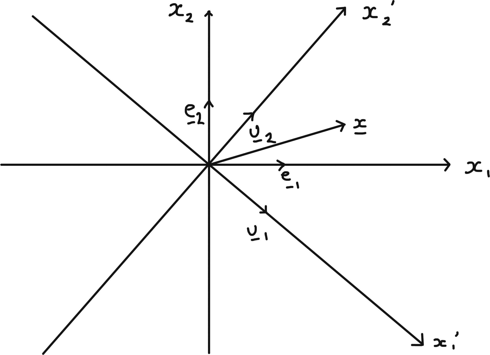

# Changing Bases, Canonical Forms and Symmetries

## Changing Bases in General

### Definition and Proposition

Recall [Matrices for Linear Maps in General] given linear map $T : V \to W$ (real or complex vector spaces) and choice of bases
\begin{align*}
    \{\underline{e}_i\} \hspace{0.5cm} i &= 1, \dots, n \text{ for } V \\
    \{\underline{f}_a\} \hspace{0.5cm} a &= 1, \dots, m \text{ for } W
\end{align*} the matrix $A$ ($m \times n$) w.r.t these bases is defined by 
\begin{align*}
    T(\underline{e}_i) &= \sum_a \underline{f}_a A_{ai}.
\end{align*} 

This definition is chosen to ensure
\begin{align*}
    \underline{y} = T(\underline{x}) \iff y_a &= \sum_i A_{ai} x_i \\
    &= A_{ai} x_i \ (\sum \text{ convention}) \\
    \text{where } \underline{x} = \sum_i x_i \underline{e}_i,\ \underline{y} &= \sum_a y_a \underline{f}_a \\
    \text{which holds since } T\left(\sum_i x_i \underline{e}_i \right) &= \sum_i x_i T(\underline{e}_i) \\
    &= \sum_i x_i \left( \sum_a \underline{f}_a A_{ai} \right) \\
    &= \sum_a \underbrace{\left( \sum_i A_{ai} x_i \right)}_{y_a} \underline{f}_a.
\end{align*} 
The same linear map $T$ has matrix $A'$ w.r.t bases
\begin{align*}
    \{\underline{e}'_i\} \hspace{0.5cm} i &= 1, \dots, n \text{ for } V \\
    \{\underline{f}'_a\} \hspace{0.5cm} a &= 1, \dots, m \text{ for } W
\end{align*} 
defined by 
\begin{align*}
    T(\underline{e}'_i) &= \sum_a \underline{f}'_a A'_{ai}.
\end{align*} 
To relate $A$ and $A'$ we need to say how bases are related, and *change of base* matrices $P$ ($n \times n$) and $Q$ ($m \times m$) are defined by
\begin{align*}
    \underline{e}'_i &= \sum_j \underline{e}_j P_{ji},\ \underline{f}'_a = \sum_b \underline{f}_b Q_{ba}
\end{align*} 
Note: $P$ and $Q$ are invertible; in relation above we can exchange $\underline{e}_i$ and $\underline{e}'_i$ with $P \to P^{-1}$ and similarly for $Q$.

::: {.proposition}
With definitions as above
\begin{align*}
    A' = Q^{-1} A P
\end{align*}  which is the change of basis formula for matrix of a linear map.
:::

::: {.example}
$n = 2,\ m = 3$
\begin{align*}
    T(\underline{e}_1) &= \underline{f_1} + 2 \underline{f}_2 - \underline{f}_3 = \sum_a \underline{f}_a A_{a 1} \\
    T(\underline{e}_2) &= -\underline{f_1} + 2 \underline{f}_2 + \underline{f}_3 = \sum_a \underline{f}_a A_{a 2} \\
    \implies A &= \begin{pmatrix}1 & -1 \\2 & 2 \\-1 & 1\end{pmatrix}
\end{align*} 
New basis for $V$
\begin{align*}
    \underline{e}'_1 &= \underline{e}_1 - \underline{e}_2 = \sum_i \underline{e}_i P_{i 1} \\
    \underline{e}'_2 &= \underline{e}_1 + \underline{e}_2 = \sum_i \underline{e}_i P_{i 2} \\
    \implies P &= \begin{pmatrix}1 & 1 \\-1 & 1\end{pmatrix}
\end{align*} 
New basis for $W$
\begin{align*}
    \underline{f}'_1 &= \underline{f}_1 - \underline{f}_3 = \sum_i \underline{e}_i P_{i 1} \\
    \underline{f}'_2 &= \underline{f}_2 = \sum_i \underline{e}_i P_{i 2} \\
    \underline{f}'_3 &= \underline{f}_1 + \underline{f}_3 = \sum_i \underline{e}_i P_{i 3} \\
    \implies Q &= \begin{pmatrix}
    1 & 0 & 1 \\
    0 & 1 & 0 \\
    -1 & 0 & 1
    \end{pmatrix}
\end{align*} 
Change of basis formula:
\begin{align*}
    A' &= Q^{-1} A P \\
    &= \begin{pmatrix}
    \frac{1}{2} & 0 & -\frac{1}{2} \\
    0 & 1 & 0 \\
    \frac{1}{2} & 0 & \frac{1}{2}
    \end{pmatrix} \begin{pmatrix}1 & -1 \\2 & 2 \\-1 & 1\end{pmatrix} \begin{pmatrix}1 & 1 \\-1 & 1\end{pmatrix} \\
    &= \begin{pmatrix}2 & 0 \\4 & 0 \\0 & 0\end{pmatrix}.
\end{align*} 
Direct check:
\begin{align*}
    T(\underline{e}'_1) &= 2 \underline{f}'_1 \\
    T(\underline{e}'_2) &= 4 \underline{f}'_2 \ \checkmark.
\end{align*} 
:::

### Proof of proposition

::: {.proof}
\begin{align*}
    T(\underline{e}'_i) &= T\left( \sum_j \underline{e}_j P_{ji} \right) \ \text{ definition of $P$} \\
    &= \sum_j T(\underline{e}_j) P_{ji} \ \text{ linearity of $T$} \\
    &= \sum_j \sum_a \underline{f}_a A_{aj} P_{ji} \ \text{ definition of $A$} \\
    T(\underline{e}'_i) &= \sum_b \underline{f}'_b A'_{bi} \ \text{definition of $A'$} \\
    &= \sum_b \sum_a \underline{f}_a Q_{ab} A'_{bi} \ \text{ definition of $Q$}
\end{align*} 
Comparing coefficients of $\underline{f}_a$ as it is a basis
\begin{align*}
    \sum_j A_{aj} P_{ji} = \sum_b Q_{ab} A'_{bi} \\
    \text{or } AP = QA'.
\end{align*} 
:::

### Approach using vector components

Consider 
\begin{align*}
    \underline{x} &= \sum_j x_j \underline{e}_j \\
    &= \sum_i x'_i \underline{e}'_i \\
    &= \sum_j \left( \sum_i P_{ji} x'_i \right) \underline{e}_j \\
    \implies x_j &= P_{ji} x'_i \\
    \text{Write } X &= \begin{pmatrix}x_1 \\\vdots \\x_n\end{pmatrix},\ X' = \begin{pmatrix}x'_1 \\ \vdots \\ x'_n \end{pmatrix} \\
    \text{then } X &= PX' \text{ or } X' = P^{-1} X
\end{align*} 
Note: some care needed if $V = \mathbb{R}^n$, e.g. $n = 2$ with $\underline{e}_1 = \begin{pmatrix}1 \\1\end{pmatrix},\ \underline{e}_2 = \begin{pmatrix}1 \\-1\end{pmatrix}$ then $\underline{x} = \begin{pmatrix}5 \\1\end{pmatrix} \in \mathbb{R}^2$ has $\underline{x} = 3 \underline{e}_1 + 2 \underline{e}_2$ so $X = \begin{pmatrix}3 \\2\end{pmatrix}$. \
Similarly
\begin{align*}
    \underline{y} &= \sum_b y_j \underline{f}_b \\
    &= \sum_a y'_a \underline{f}'_a \\
    \implies y_b &= Q_{ba} y'_a \\
    \text{Then } Y &= QY' \text{ or } Y' = Q^{-1} Y \\
    \text{where } Y &= \begin{pmatrix}y_1 \\\vdots \\y_m \end{pmatrix},\ Y' = \begin{pmatrix}y'_1 \\ \vdots \\ y'_m \end{pmatrix}
\end{align*} 
Now, matrices $A, A'$ are defined to ensure $Y = AX$ and $Y' = A' X'$.

\begin{align*}
    \text{But } Y' &= Q^{-1} Y = Q^{-1} A X \\
    &= (Q^{-1} A P) X' \\
    &= A' X'
\end{align*} which is true $\forall \; \underline{x}$, so $A' = Q^{-1} A P$. 

### Comments

i. Definition of matrix $A$ for $T : V \to W$ w.r.t. bases $\{ \underline{e}_i \}$ and $\{ \underline{f}_a \}$ can be expressed: column $i$ of $A$ consists of components of $T(\underline{e}_i)$ w.r.t. basis $\{ \underline{f}_a \}$ [For $T : \mathbb{R}^n \to \mathbb{R}^m$ with standard bases, columns of $A$ are images of standard basis vectors]. \
Similarly, definitions of $P$ and $Q$ say: columns consist of components of new basis vectors w.r.t. old.

ii. With $V = W$ and same bases and $\underline{e}_i = \underline{f}_i,\ \underline{e}'_i = \underline{f}'_i$ we have $P = Q$ and $A' = P^{-1} A P$.
Matrices representing the same linear map w.r.t. different bases are similar; conversely if $A$ and $A'$ are similar then we can regard them as representing the same linear map with $P$ defining the change of basis. \
In [Diagonalisability and Similarity] we observed
\begin{align*}
    \operatorname{tr}(A') &= \operatorname{tr}(A) \\
    \det(A') &= \det A \\
    \chi_{A'}(t) &= \chi_A(t) 
\end{align*} so these are properties of the linear map.

iii. $V = W = \mathbb{R}^n$ or $\mathbb{C}^n$, with $\underline{e}_i$ the standard basis - matrix $A$ is diagonalisable iff $\exists$ basis of eigenvectors $\underline{e}'_i = \underline{v}_i$ with $A \underline{v}_i = \lambda_i \underline{v}_i$ (not $\sum$) and then $A' = P^{-1} A P = D = \begin{pmatrix}\lambda_1 &  &  \\ & \ddots &  \\ &  & \lambda_n\end{pmatrix}$ and $\underline{v}_i = \sum_j \underline{e}_j P_{ji}$ so the eigenvectors are the columns of $P$. \
Specialising further $A^\dagger = A \implies \exists$ basis of orthonormal eigenvectors $\underline{e}'_i = \underline{u}_i$ and $P^\dagger = P^{-1}$.

## Jordan Canonical/ Normal Form

This results classifies $n \times n$ complex matrices up to similarity.

::: {.proposition}
Any $2 \times 2$ complex matrix $A$ is similar to one of the following:

i. $A' = \begin{pmatrix}\lambda_1 & 0 \\0 & \lambda_2\end{pmatrix}$ with $\lambda_1 \neq \lambda_2,\ \chi_A = (t - \lambda_1) (t - \lambda_2)$.

ii. $A' = \begin{pmatrix}\lambda & 0 \\0 & \lambda\end{pmatrix}$ with $\chi_A = (t - \lambda)^2$.

iii. $A' = \begin{pmatrix}\lambda & 1 \\0 & \lambda\end{pmatrix}$ with $\chi_A = (t - \lambda)^2$.
:::

::: {.proof}
$\chi_A(t)$ has 2 roots over $\mathbb{C}$.

i. For distinct roots/ evals $\lambda_1, \lambda_2$ we have $M_1 = m_1 = M_2 = m_2 = 1$ and eigenvectors $\underline{v}_1, \underline{v}_2$ provide a basis.
Hence $A' = P^{-1} A P$ where eigenvectors are columns of $P$.

ii. For repeated root/ eval $\lambda$, if $M_\lambda = m_\lambda = 2$, then same argument applies.

iii. For repeated root/ eval $\lambda$, with $M_\lambda = 2$ and $m_\lambda = 1$, let $\underline{v}$ be an eigenvector for $\lambda$ and $\underline{w}$ any linearly independent vector.
Then \begin{align*}
    A \underline{v} &= \lambda \underline{v} \\
    A \underline{w} &= \alpha \underline{v} + \beta \underline{w}.
\end{align*} 
Matrix of map w.r.t basis $\{\underline{v}, \underline{w}\}$ is \begin{align*}
    \begin{pmatrix}\lambda & \alpha \\0 & \beta\end{pmatrix}.
\end{align*} 
But $\beta = \lambda$ (otherwise we get case (i) with evals $\lambda, \beta$) and $\alpha \neq 0$ (otherwise case (ii)).
Now set $\underline{u} = \alpha \underline{v}$ and note
\begin{align*}
    A \underline{u} = \lambda \underline{u} \\
    A \underline{w} = \underline{u} + \lambda \underline{w}
\end{align*} so w.r.t. basis $\{ \underline{u}, \underline{w}\}$ matrix is 
\begin{align*}
    A' = \begin{pmatrix}\lambda & 1 \\0 & \lambda\end{pmatrix}.
\end{align*} 
:::

::: {.example name="(using a slightly different approach)"}
\begin{align*}
    A &= \begin{pmatrix}1 & 4 \\-1 & 5\end{pmatrix} \\
    \implies \chi_A(t) &= (t - 3)^2 \\
    A - 3 I &= \begin{pmatrix}-2 & 4 \\-1 & 2\end{pmatrix}.
\end{align*} 
Choose $\underline{w} = \begin{pmatrix}1 \\0\end{pmatrix}$ which is *not* an eigenvector and then $\underline{u} = (A - 3I) \underline{w} = \begin{pmatrix}-2 \\-1\end{pmatrix}$.
But $(A - 3I)^2 = 0$ by Cayley-Hamilton Theorem, \@ref(thm:CH), so $(A - 3I)^2 \underline{w} = (A - 3I) \underline{u} = 0$ so
\begin{align*}
    A \underline{u} &= 3 \underline{u} \\
    A \underline{w} &= \underline{u} + 3 \underline{w}
\end{align*} 
so basis $\{ \underline{u}, \underline{w}\}$ gives Jordan Canonical Form.
Check: $P = \begin{pmatrix}-2 & 1 \\-1 & 0\end{pmatrix} \implies P^{-1} = \begin{pmatrix}0 & -1 \\1 & -2\end{pmatrix}$ so $P^{-1} A P = \begin{pmatrix}3 & 1 \\0 & 3\end{pmatrix}$.
:::

Generalisation to larger matrices can be considered, starting with $N = \begin{pmatrix}0 & 1 &  &  \\ & 0 & \ddots &  \\ &  & \ddots & 1 \\ &  &  & 0\end{pmatrix}$ ($n \times n$) when applied to standard basis vectors gives $\underline{e}_n \mapsto \underline{e}_{n-1} \mapsto \dots \mapsto \underline{e}_1 \mapsto \underline{0}$.
Note $J = \lambda I + N$ then $\chi_J(t) = (\lambda - t)^n$ but $m_\lambda = 1$ ($M_\lambda = n$).

::: {.theorem}
Any $n \times n$ complex matrix $A$ is similar to a matrix $A'$ with block form 
\begin{align*}
    A' &= \begin{pmatrix}
    \boxed{J_{n_1}(\lambda_1)} &  &  &  \\
     & \boxed{J_{n_2}(\lambda_2)} &  &  \\
     &  & \ddots &  \\
     &  &  & \boxed{J_{n_r}(\lambda_r)}
    \end{pmatrix}
\end{align*} where each diagonal block is a *Jordan block* with form 
\begin{align*}
    J_p(\lambda) &= \begin{pmatrix}
    \lambda & 1 &  &  &  \\
     & \lambda & 1 &  &  \\
     &  & \lambda & \ddots &  \\
     &  &  & \ddots & 1 \\
     &  &  &  & \lambda
    \end{pmatrix}
\end{align*} ($p \times p$) with $n_1 + n_2 + \dots + n_r = n$, $\lambda_1, \lambda_2, \dots, \lambda_r$ are the eigenvalues of $A$ and $A'$ (same eigenvalue may appear in more than one block).

$A$ is diagonalisable iff $A'$ consists of $1 \times 1$ *Jordan blocks* only.
:::

::: {.proof}
See Linear Algebra and GRM in Part IB.
:::

## Conics and Quadrics

### Quadrics in General

::: {.definition name="Quadric"}
A quadric in $\mathbb{R}^n$ is a hypersurface defined by 
\begin{align*}
    Q(\underline{x}) = \underline{x}^T A \underline{x} + \underline{b}^T \underline{x} + c = 0
\end{align*} for some $A$, $n \times n$ real symmetric, non-zero matrix, $\underline{b} \in \mathbb{R}^n$, $c \in \mathbb{R}$.
So $Q(\underline{x}) = A_{ij} x_i x_j + b_i x_i + c = 0$.
:::

Consider classifying solutions up to geometrical equivalence : no distinction between solutions related by *isometries* in $\mathbb{R}^n$, i.e. related by 

1. translation - change in origin
2. orthogonal transformation about origin - change in the axes

If $A$ is invertible (no zero eigenvalues) then by setting $\underline{y} = \underline{x} + \frac{1}{2} A^{-1} \underline{b}$ we have
\begin{align*}
    \underline{y}^T A \underline{y} &= (\underline{x} + \frac{1}{2}A^{-1} \underline{b})^T A (\underline{x} + \frac{1}{2}A^{-1} \underline{b}) \\
    &= \underline{x}^T A \underline{x} + \underline{b}^T \underline{x} + \frac{1}{4} \underline{b}^T A^{-1} \underline{b} 
\end{align*} since $(A^{-1} \underline{b})^T = \underline{b} A^{-1}$ as $A$ is symmetric so $\frac{1}{2} (A^{-1} \underline{b})^T A \frac{1}{2} (A^{-1} \underline{b})$ is the last term.

Then $Q(\underline{x}) = 0 \iff \mathcal{F}(\underline{y}) = k$ with $\mathcal{F}(\underline{y}) = \underline{y}^T A \underline{y}$ (a quadratic form w.r.t. new origin $\underline{y} = 0$) and $k = \frac{1}{4} \underline{b}^T A^{-1} \underline{b} - c$.
Diagonalise $\mathcal{F}$ as in [Quadratic Forms]: orthonormal eigenvectors give principal axes; eigenvalues of $A$ and value of $k$ determine nature of this quadric.

Examples in $\mathbb{R}^3$ given in [In $\mathbb{R}^3$]

1. eigenvalues $> 0$ and $k > 0$ give ellipsoid

2. eigenvalues have different signs and $k \neq 0$ gives a hyperboloid.

If $A$ has one or more zero eigenvalues then analysis changes and simplest standard form may have both linear and quadratic terms.

### Conics

Quadrics in $\mathbb{R}^2$ are curves, *conics.

- If $\det A \neq 0$ \
By completing the square and diagonalising we get a standard form 
\begin{align*}
    \lambda_1 x_1'^2 + \lambda_2 x_2'^2 &= k
\end{align*} 

    - $\lambda_1, \lambda_2 > 0 \implies$ ellipse for $k > 0$, point for $k = 0$ and no soln for $k < 0$.

    - $\lambda_1 > 0, \lambda_2 < 0 \implies$ hyperbola for $k > 0$ or $k < 0$ and a pair of lines for $k = 0$. \
e.g. $x_1'^2 - x_2'^2 = (x_1 - x_2) (x_1 + x_2) = 0$.

- If $\det A = 0$ \
Suppose $\lambda_1 > 0$ and $\lambda_2 = 0$; diagonalise $A$ in original formula to get 
\begin{align*}
    \lambda_1 x_1'^2 + b_1' x_1' + b_2' x_2' + c &= 0 \\
    \iff \lambda_1 x_1''^2 + b_2' x_2' + c' &= 0
\end{align*} where $x_1'' = x_1' + \frac{1}{2 \lambda_1} b_1'$ and $c' = c - \frac{b_1'^2}{4 \lambda_1^2}$

    - If $b_2' = 0$ we get a pair of lines for $c' < 0$, a single line for $c' = 0$ and no soln for $c' > 0$

    - If $b_2' \neq 0$ equations becomes $\lambda_1 x_1''^2 + b_2 x_2'' = 0$, a parabola, where $x_2'' = x_2 + \frac{1}{b_2'}c'$.

## Symmetries and Transformation Groups.

### Orthogonal Transformations and Rotations in $\mathbb{R}^n$

\begin{align*}
    \underset{n \times n}{R} \text{ is orthogonal} &\iff R^T R = R R^T = I \\
    &\iff (R \underline{x}) \cdot (R \underline{y}) = \underline{x} \cdot \underline{y} \ \forall \; \underline{x}, \underline{y} \\
    &\iff \text{ cols or rows of $R$ are orthonormal vectors}.
\end{align*} 
The set of such matrices forms the *orthogonal group* $O(n)$.
\begin{align*}
    R \in O(n) \implies \det R = \pm 1.
\end{align*} ($\det (R^T) \det R = (\det R)^2 = 1$). \
$SO(n) = \{R \in O(n) : \det R = + 1\}$ is a subgroup, the *special orthogonal group*.
$R \in O(n) \implies$ R preserves lengths and |n-dim volume|.
$R \in SO(n) \implies$ R also preserves orientation. 
$SO(n)$ consists of all rotations in $\mathbb{R}^n$

Reflections belong to $O(n)$ but not $SO(n)$.
For a specific $H \in O(n) \setminus SO(n)$, any element of $O(n)$ is of teh form $R$ or $RH$ with $R \in SO(n)$, e.g. if $n$ is odd, we can choose $H = -I$.

#### Active and Passive points of View

For a rotation $R$ (matrix), the transformation
\begin{align*}
    x_i' = R_{ij} x_j
\end{align*} can be viewed in two ways.

*Active view point*: rotation transforms vectors, i.e. $x_i'$ are the components of the new vector so $\underline{x}' = R \underline{x}$ w.r.t. standard basis $\{ \underline{e}_i \}$.

::: {.example name="$\mathbb{R}^2$"}
```{r 07-active, echo = FALSE, fig.cap = "", fig.align="center", out.width="500"} 
 
```
:::

$|\underline{x}'|^2 = |\underline{x}|^2$

*Passive view point*: rotation changes basis, i.e. $x_i'$ are the components of same vector $\underline{x}$ but w.r.t. new basis $\{\underline{u}_i\}$.

::: {.example name="$\mathbb{R}^2$"}
```{r 07-passive, echo = FALSE, fig.cap = "", fig.align="center", out.width="500"} 
 
```
:::

\begin{align*}
    \underline{u}_i &= \sum_j R_{ij} \underline{e}_j \\
    &= \sum_J \underline{e}_j (R^T)_{ji} \\
    &= \sum_J \underline{e}_j (R^{-1})_{ji}
\end{align*} (compare to [Quadratic Forms] : $P = R^{-1}$).

### 2d Minkowski Space and Lorentz Transformations

Define a new "inner product" on $\mathbb{R}^2$ by
\begin{align*}
    (\underline{x}, \underline{y}) = \underline{x}^T J \underline{y} \quad \text{where } J = \begin{pmatrix}1 & 0 \\0 & -1\end{pmatrix} \\
    \therefore \left( \begin{pmatrix}
        x_0 \\ x_1
    \end{pmatrix}, \begin{pmatrix}
        y_0 \\ y_1
    \end{pmatrix} \right) = x_0 y_0 - x_1 y_1
\end{align*} 
This is not positive definite since $(\underline{x}, \underline{x}) = \underline{x}^T J \underline{x} = x_0^2 - x_1^2$ but still bilinear and symmetric.
Standard basis vectors are "orthonormal" in generalised sense 
\begin{align*}
    \underline{e}_0 = \begin{pmatrix}1 \\0\end{pmatrix} &\text{ and } \underline{e}_1 = \begin{pmatrix}0 \\1\end{pmatrix} \\
    \text{obey } (\underline{e}_0, \underline{e}_0) &= 1 \\
    (\underline{e}_1, \underline{e}_1) &= -1 \\
    (\underline{e}_0, \underline{e}_0) &= 0
\end{align*} 
This new inner product is called the *Minkowski* metric and $\mathbb{R}^2$ equipped with it is called *Minkowski space*.

Consider $M = \begin{pmatrix}M_{00} & M_{01} \\M_{10} & M_{11}\end{pmatrix}$ giving a linear map $\mathbb{R}^2 \to \mathbb{R}^2$.
This preserves the Minkowski metric iff
\begin{align*}
    (M \underline{x}, M \underline{y}) &= (\underline{x}, \underline{y}) \quad \forall \; x, y \in \mathbb{R}^2 \\
    \iff (M \underline{x})^T J (M \underline{y}) &= \underline{x}^T (M^T J M) \underline{y} \\
    &= \underline{x}^T J \underline{y} \quad \forall \; \underline{x}, \underline{y} \in \mathbb{R}^2 \\
    \iff M^T J M &= J.
\end{align*} 
The set of such matrices form a group.
Now \begin{align*}
    \det (M^T J M) &= \det (M^T) \det J \det M \\
    &= \det J \\
    \implies (\det M)^2 &= 1 \implies \det M = \pm 1
\end{align*} 
Furthermore, $|M_{00}| \geq 1$, so $M_{00} \geq 1$ or $M_{00} \leq -1$.
The subgroup with $\det M = + 1$ and $M_{00} \geq 1$ is the *Lorentz group* in 2d.

*General form for $M$*: require cols $M \underline{e}_0, M \underline{e}_1$ to be orthonormal w.r.t Minkowski metric, like $\underline{e}_0, \underline{e}_1$.

\begin{align*}
    (M \underline{e_0}, M \underline{e_0}) = M_{00}^2 - M_{10}^2 = (\underline{e_0}, \underline{e_0}) = 1 \quad (\text{hence } |M_{00}|^2 \geq 1)
\end{align*} 

Taking \(M_{00} \geq 1\), we can write
\begin{align*}
    M \underline{e_0} = \begin{pmatrix}
		\cosh \theta \\ \sinh \theta
	\end{pmatrix}
\end{align*} for some real value \(\theta\).
For the other column,
\begin{align*}
    (M \underline{e_0}, M \underline{e_1}) = 0;\; (M \underline{e_1}, M \underline{e_1}) = -1 \implies M \underline{e_1} = \pm \begin{pmatrix}
		\sinh \theta \\
		\cosh \theta
	\end{pmatrix}
\end{align*}^[for standard inner product to get normal vector swap $x$ and $y$ values and make one negative, here we don't need to make one component negative.]
The sign is fixed to be positive by the condition that $\det M = +1$.
\begin{align*}
    M(\theta) = \begin{pmatrix}
		\cosh \theta & \sinh \theta \\
		\sinh \theta & \cosh \theta
	\end{pmatrix}
\end{align*} 
For such matrices
\begin{align*}
    M(\theta_1) M(\theta_2) &= M(\theta_1 + M \theta_2).
\end{align*}
This confirms that they form a group.

```{r 07-lorentz, echo = FALSE, fig.cap = "", fig.align="center", out.width="500"} 
knitr::include_graphics("figures/07-lorentz.png") 
```

The curves defined by $(\underline{x}, \underline{x}) = k$ where $k$ is a constant are hyperbolas, as shown.
This is analogous to how the curves defined by $\underline{x} \cdot \underline{x} = k$ are circles.
So applying $M$ to any vector on a given branch of a hyperbola, the resultant vector remains on the hyperbola.
Allowing $|M_{00}| \geq 1$ we would get transformations that could map $\underline{x}$ to the dotted branch below.

### Application to special relativity
Set \begin{align*}
    M(\theta) &= \gamma(v) \begin{pmatrix}
		1 & v \\ v & 1
	\end{pmatrix} \\
    v &= \tanh \theta,\quad |v| < 1 \\
    \gamma(v) &= (1 - v^2)^{-\frac{1}{2}}
\end{align*} 
We will rename $x_0 \to t$, which is now our time coordinate.
$x_1 \to x$, our one-dimensional space coordinate.
Then,
\[
	\underline{x}' = M \underline{x} \iff \begin{cases}
		t' & = \gamma(v) (t + vx) \\
		x' & = \gamma(v) (x + vt)
	\end{cases}
\]
This is a *Lorentz transformation* or *boost* relating the time and space coordinates for observers moving with relative velocity $v$ in Special Relativity, in units where the speed of light $c$ is taken to be 1.
The factor $\gamma$ gives rise to effects such as time dilation and length contraction.

The group property \(M(\theta_3) = M(\theta_1)M(\theta_2)\) with \(\theta_3 = \theta_1 + \theta_2\) corresponds to the velocities
\[
	v_i = \tanh \theta_i \implies v_3 = \frac{v_1 + v_2}{1 + v_1 v_2}
\]
This is consistent with the fact that all velocities are less than the speed of light, 1.